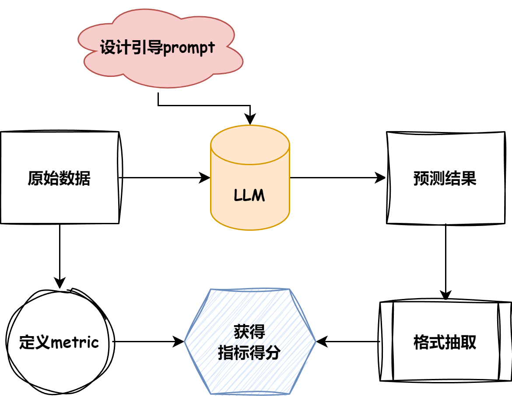

    
    <h1><strong>大模型白盒子构建指南</strong></h1>

&emsp;&emsp;本项目是一个从原理出发、以“白盒”为导向、围绕大模型全链路的“手搓”大模型指南，旨在帮助有传统深度学习基础的读者从底层原理出发，“纯手搓”搭建一个清晰、可用的大模型系统，包括大模型本身、RAG 框架、Agent 系统及大模型评估体系。本项目将从基础原理出发，深入剖析每一个技术点并附以完整的代码实现，以细致讲解和代码注释帮助读者独立复现大模型核心部分，并在复现中实现对大模型的深入理解与掌握。

&emsp;&emsp;本项目旨在为广大学习者搭建一个清晰的、可用的、可复现的大模型世界，帮助每一位有兴趣的学习者纯手工独立搭建自己的 **Tiny LLM Universe**。

&emsp;&emsp;本项目的主要内容包括：
1. 深入剖析大模型原理——Qwen Blog
2. 如何评估你的大模型——Tiny Eval
3. 纯手工搭建 RAG 框架——Tiny RAG
4. 手搓一个最小的 Agent 系统——Tiny Agent
5. 深入理解大模型基础——Tiny Transformer

## 项目意义

&emsp;&emsp;随着百模大战的经久不衰，开源或是闭源的大模型正不断刷新着模型能力上限，逼近 AGI 的宏伟未来。随着大模型能力的不断增强，基于大模型进行二次微调、应用开发的门槛也不断降低，大模型正在不断深入各行各业，为生产生活赋予智能力量。飞速成熟的大模型生态正不断带来更多的开源或闭源框架、API，层出不穷的各式教程让更多的开发者可以快速、便捷地实现大模型的应用。但生态愈是成熟，深入理解框架之内的细节，实现独立于框架的开发、应用能力愈是关键。只有从核心原理出发，尽可能地脱离框架，实现大模型系统的“纯手搓”，才能真正理解模型的核心能力、关键部分，也才能够对框架实现自由的修改应用，随心所欲地将大模型应用到各行各业各类任务。

&emsp;&emsp;目前，大部分教程目标在于指导开发者如何基于高度封装的 API、开源框架实现便捷、快速的开发和训练，有利于初学者入门，却忽视了掌握模型原理、框架内部细节的重要性。不管是大模型本身，还是基于大模型的赋能系统 RAG 或者是 Agent，又或者是开发应用大模型的必备组件评估体系，都有丰富的基于工具包的使用教程，使很多学习者“知其然而不知其所以然”，只能机械地使用工具包而无法从原理出发进行自由的魔改。本项目旨在抛弃高度封装的工具包与 API，从底层（Pytorch 层）出发，“纯手搓”一个大模型系统，完成大模型的 RAG 、 Agent 、Eval 任务，帮助具备一定的大模型基础的学习者进一步掌握大模型原理，拥抱更自由、更丰富也更精彩的大模型世界。

## 项目受众

&emsp;本项目适合以下学习者：

- 掌握了大模型的基本应用，想要学习原理，但不知从何开始
- 好奇心旺盛、求知欲强的同学，具备一定的学习热情的同学
- 对大模型的RAG、Agent、Eval任务感兴趣，并想要从原理层面了解
- 喜欢动手实践写代码，想要从零开始手写大模型的RAG、Agent、Eval任务
- 想要了解大模型的底层原理，提升自己的大模型技术水平

&emsp;&emsp;***我们希望本项目能为广大学习者提供一个可以看得见、够得着、跟得上的大模型实践机会。让大家在实践中学习，不断提升自己的技术水平。***

&emsp;&emsp;***我们希望为更多学习者打开 LLM 的神奇世界，以“知其然更知其所以然”的心态，搭建属于自己的“Tiny LLM Universe”。***

## 项目亮点

- 本项目旨在全流程 **从零手搓**   
- 本项目包含LLM全流程，从Model，到RAG，Agent，Eval，打造LLM **全栈教程**  
- 区别于大型的算法包,我们的项目代码对初级开发者更 **简洁清晰** ，更"白盒子"  
- 后续会持续迭代更新项目，如动手训练一个 **Tiny-llama3** ，动手制作 **垂直领域数据集** 等等。
- 欢迎大家参与贡献哦，一起打造一个更好的LLM生态！

## *News*
- ***2024.6.26：增加选修内容——高考数学评测，使TinyEval接入高考题目评测！！***

- ***2024.5.20：增加选修内容——Tiny Transformer，纯手工搭建 Transformer 模型***

- ***2024.5.1：发布 Tiny-Universe V1 版本，劳动节帕鲁献礼！***

## 项目结构

### [*Qwen-Blog*](./content/Qwen-blog/) ([对应讲解视频](https://meeting.tencent.com/v2/cloud-record/share?id=0be29bb2-0648-4aeb-9baa-c9dc91dfc7a6&from=3&is-single=false&record_type=2))

&emsp;&emsp;初学者在学习LLM时，往往对庞大的代码与各种封装的功能"谈码色变"~  

&emsp;&emsp;但其实,LLM的网络架构并没有想象的那么复杂! 本项目以Qwen2为例，带大家深入LLM模型结构内部，以输入tensor为第一视角，带大家经过Model的各个操作块，点亮LLM的"黑匣子"。

&emsp;&emsp;***项目内除了Model内容外，也添加了嵌入模型内部的GQA，ROPE与Attention Mask等机制的细致讲解，促进大家对LLM的全面理解！***

    

### [*TinyRAG*](./content/TinyRAG/)([对应讲解视频](https://meeting.tencent.com/v2/cloud-record/share?id=4306b90c-d772-4faa-baeb-1f4e0bf4569f&from=3&is-single=false&record_type=2))

&emsp;&emsp;LLM会产生误导性的 “幻觉”，依赖的信息可能过时，处理特定知识时效率不高，缺乏专业领域的深度洞察，同时在推理能力上也有所欠缺。

&emsp;&emsp;正是在这样的背景下，检索增强生成技术（Retrieval-Augmented Generation，RAG）应时而生，成为 AI 时代的一大趋势。

&emsp;&emsp;RAG 通过在语言模型生成答案之前，先从广泛的文档数据库中检索相关信息，然后利用这些信息来引导生成过程，极大地提升了内容的准确性和相关性。RAG 有效地缓解了幻觉问题，提高了知识更新的速度，并增强了内容生成的可追溯性，使得大型语言模型在实际应用中变得更加实用和可信。

&emsp;&emsp;***RAG 已经成为 LLM 应用的重要组成部分，但其他RAG项目都基于封装框架提供完整服务，虽然易于使用，却隐藏了 RAG 的底层原理，也难以随心所欲地魔改升级。本项目抛弃高度封装的 RAG 框架，手搓一个从零开始的RAG项目，帮助学习者更好地理解RAG的原理。***

> *镜像地址：https://www.codewithgpu.com/i/datawhalechina/tiny-universe/tiny-universe-tiny-rag*

    

### [*TinyAgent*](./content/TinyAgent/)(暂无录播，Datawhale视频号搜索“动手搭建一个最小Agent系统”)

&emsp;&emsp;大模型具有出人意料的强大能力，却也有其固定缺陷，在逻辑推理、现实事件、高度垂直领域等方面仍然存在薄弱之处。因此，通过针对性的工具来为大模型赋能，给大模型一个抓手，让大模型和现实世界发生的事情对齐颗粒度，从而打造一个更智能、更专业、更全面的大模型应用，是大模型未来的重要发展方向。Agent 就基于这样的理念，将 LLM 打造为能自主理解、规划决策、执行复杂任务的智能体，给予其丰富的专业工具，从而真正让大模型走入现实生活，为未来赋能。

&emsp;&emsp;***本项目基于 React 的方式，手动制作了一个最小的 Agent 结构（其实更多的是调用工具），通过一步一步手写`Agent`，让读者对`Agent`的构成和运作更加的了解，也让后续自由地搭建个性化的 Agent 系统成为可能。暑假的时候我们会尝试将 React 结构修改为 SOP 结构，欢迎大家一起加入进来啊~！***

    

### [*TinyEval*](./content/TinyEval)([对应讲解视频](https://meeting.tencent.com/v2/cloud-record/share?id=8b9cf6ca-add6-477b-affe-5b62e2d8f27e&from=3))

&emsp;&emsp;随着LLM的推广，越来越多的小伙伴已经熟悉了模型sft微调流程，但是对于微调的结果，尤其是如何判断各大模型在当前数据集上的表现，仍然是一个待解决的问题。并且，对于选择式、判别式、生成式等不同的生成任务，如何才能够客观地评价模型生成质量，仍是一个需要明确的问题。  

&emsp;&emsp;***基于上述问题，我们搭建了一个完善的评测体系介绍，让大家能够学会根据自身的任务量身定做合适的评测指标，并使用该指标进行客观评测，为模型能力提供准确可量化的数据支持！***

    

### [*TinyTransformer*](./content/TinyTransformer)

&emsp;&emsp;目前，所有 LLM 几乎都以 Transformer 提出的 Attention 机制作为基础，要深入理解 LLM 的原理和结构，深入、全面地理解 Transformer 是必经之路。  

&emsp;&emsp;***基于 Transformer 经典论文《Attention is All You Need》，我们在 pytorch 层手工搭建了一个完整、可复现、可运行的 Transformer 模型，帮助学习者更深入地理解 Transformer 原理结构，打牢 LLM 基础。***

## 致谢

#### 核心贡献者

- [肖鸿儒-项目负责人](https://github.com/Hongru0306)(Datawhale成员-同济大学)
- [宋志学-项目负责人](https://github.com/KMnO4-zx)(Datawhale成员-河南理工大学)
- [邹雨衡-项目负责人](https://github.com/logan-zou)(Datawhale成员-对外经济贸易大学)

#### 其他

- 特别感谢[@Sm1les](https://github.com/Sm1les)对本项目的帮助与支持
- 如果有任何想法可以联系我们 DataWhale 也欢迎大家多多提出 issue
- 特别感谢以下为教程做出贡献的同学！

  

## 关注我们

扫描下方二维码关注公众号：Datawhale

&emsp;&emsp;Datawhale，一个专注于AI领域的学习圈子。初衷是for the learner，和学习者一起成长。目前加入学习社群的人数已经数千人，组织了机器学习，深度学习，数据分析，数据挖掘，爬虫，编程，统计学，Mysql，数据竞赛等多个领域的内容学习，微信搜索公众号Datawhale可以加入我们。

## LICENSE

 本作品采用<a rel="license" href="http://creativecommons.org/licenses/by-nc-sa/4.0/">知识共享署名-非商业性使用-相同方式共享 4.0 国际许可协议</a>进行许可。

*注：默认使用CC 4.0协议，也可根据自身项目情况选用其他协议*
