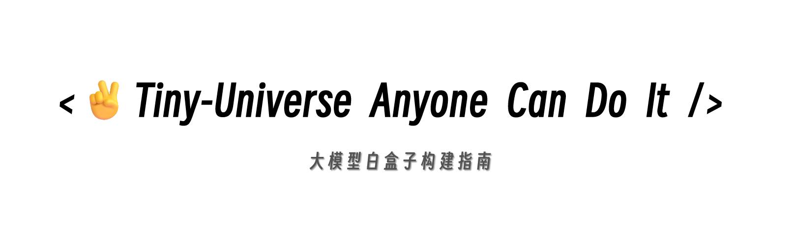

    
    <h1><strong>大模型白盒子构建指南</strong></h1>

&emsp;&emsp;大模型是当下深度学习领域的热点，但现有的大部分大模型教程只在与教给大家如何调用api完成大模型的应用，而很少有人能够从原理层面讲清楚模型结构、RAG、Agent 以及 Eval。所以本仓库会提供全部手写，不采用调用api的形式，完成大模型的 RAG 、 Agent 、Eval 任务。

## 项目受众

&emsp;本项目适合以下学习者：

- 掌握了大模型的基本应用，但不知道从何开始
- 好奇心旺盛、求知欲强的同学，具备一定的学习热情的同学
- 对大模型的RAG、Agent、Eval任务感兴趣，并想要从原理层面了解
- 喜欢动手实践写代码，想要从零开始手写大模型的RAG、Agent、Eval任务
- 想要了解大模型的底层原理，提升自己的大模型技术水平

&emsp;&emsp;***我们希望本项目能为广大学习者提供一个可以看得见、够得着、跟得上的大模型实践机会，让大家在实践中学习，不断提升自己的技术水平。***

&emsp;&emsp;***我们希望成为 LLM 与普罗大众的阶梯，以自由、平等的开源精神，拥抱更恢弘而辽阔的 LLM 世界。***

## 项目亮点

&emsp;&emsp;本项目旨在全流程 **从零手搓**   
&emsp;&emsp;本项目包含LLM全流程，从Model，到RAG，Agent，Eval，打造LLM **全栈教程**  
&emsp;&emsp;区别于大型的算法包,我们的项目代码对初级开发者更 **简洁清晰** ，更"白盒子"  

## 项目结构

### [*Qwen-Blog*](./content/Qwen-blog/)

&emsp;&emsp;初学者在学习LLM时，往往对庞大的代码与各种封装的功能"谈码色变"~  

&emsp;&emsp;但其实,LLM的网络架构并没有想象的那么复杂! 本项目以Qwen2为例，带大家深入LLM模型结构内部，以输入tensor为第一视角，带大家经过Model的各个操作块，点亮LLM的"黑匣子"。

&emsp;&emsp;***项目内除了Model内容外，也添加了嵌入模型内部的GQA，ROPE与Attention Mask等机制的细致讲解，促进大家对LLM的全面理解！***

    

### [*TinyRAG*](./content/TinyRAG/)

&emsp;&emsp;LLM会产生误导性的 “幻觉”，依赖的信息可能过时，处理特定知识时效率不高，缺乏专业领域的深度洞察，同时在推理能力上也有所欠缺。

&emsp;&emsp;正是在这样的背景下，检索增强生成技术（Retrieval-Augmented Generation，RAG）应时而生，成为 AI 时代的一大趋势。

&emsp;&emsp;RAG 通过在语言模型生成答案之前，先从广泛的文档数据库中检索相关信息，然后利用这些信息来引导生成过程，极大地提升了内容的准确性和相关性。RAG 有效地缓解了幻觉问题，提高了知识更新的速度，并增强了内容生成的可追溯性，使得大型语言模型在实际应用中变得更加实用和可信。

&emsp;&emsp;***鉴于其他RAG项目都是提供完整的一套服务，虽然可以用的很好，当我们在用的时候不会太关注RAG的底层原理，所以本项目提供给大家一个从零开始的RAG项目，让大家可以更好的理解RAG的原理。***

    

### [*TinyAgent*](./content/TinyAgent/)

&emsp;&emsp;在 ChatGPT 横空出世，夺走 Bert 的桂冠之后，大模型愈发的火热，国内各种模型层出不穷，史称“百模大战”。大模型的能力是毋庸置疑的，但大模型在一些实时的问题上，或是某些专有领域的问题上，可能会显得有些力不从心。因此，我们需要一些工具来为大模型赋能，给大模型一个抓手，让大模型和现实世界发生的事情对齐颗粒度，这样我们就获得了一个更好的用的大模型。

&emsp;&emsp;***这里基于 React 的方式，我们手动制作了一个最小的 Agent 结构（其实更多的是调用工具），暑假的时候会尝试将 React 结构修改为 SOP 结构，欢迎大家一起加入进来啊~！一步一步手写`Agent`，可以让我们对`Agent`的构成和运作更加的了解！！！***

    

### [*TinyEval*](./content/TinyEval)

&emsp;&emsp;随着LLM的推广，越来越多的小伙伴已经熟悉了模型sft微调流程，但是对于微调的结果，尤其是如何判断各大模型在当前数据集上的表现，仍然是一个待解决的问题。并且，对于选则式、判别式、生成式等不同的生成任务，如何才能够客观地评价模型生成质量，仍是一个需要明确的问题。  

&emsp;&emsp;***基于上述问题，我们搭建了一个完善的评测体系介绍，让大家能够学会根据自身的任务量身定做合适的评测指标，并使用该指标进行客观评测，为模型能力提供准确可量化的数据支持！***

    

## 致谢

#### 核心贡献者

- [肖鸿儒-项目负责人](https://github.com/Hongru0306)(Datawhale成员-同济大学)
- [宋志学-项目负责人](https://github.com/KMnO4-zx)(Datawhale成员-河南理工大学)
- [邹雨衡-项目负责人](https://github.com/logan-zou)(Datawhale成员-对外经济贸易大学)

#### 其他

- 特别感谢[@Sm1les](https://github.com/Sm1les)对本项目的帮助与支持
- 如果有任何想法可以联系我们 DataWhale 也欢迎大家多多提出 issue
- 特别感谢以下为教程做出贡献的同学！

  

## 关注我们

扫描下方二维码关注公众号：Datawhale

&emsp;&emsp;Datawhale，一个专注于AI领域的学习圈子。初衷是for the learner，和学习者一起成长。目前加入学习社群的人数已经数千人，组织了机器学习，深度学习，数据分析，数据挖掘，爬虫，编程，统计学，Mysql，数据竞赛等多个领域的内容学习，微信搜索公众号Datawhale可以加入我们。

## LICENSE

 本作品采用<a rel="license" href="http://creativecommons.org/licenses/by-nc-sa/4.0/">知识共享署名-非商业性使用-相同方式共享 4.0 国际许可协议</a>进行许可。

*注：默认使用CC 4.0协议，也可根据自身项目情况选用其他协议*
