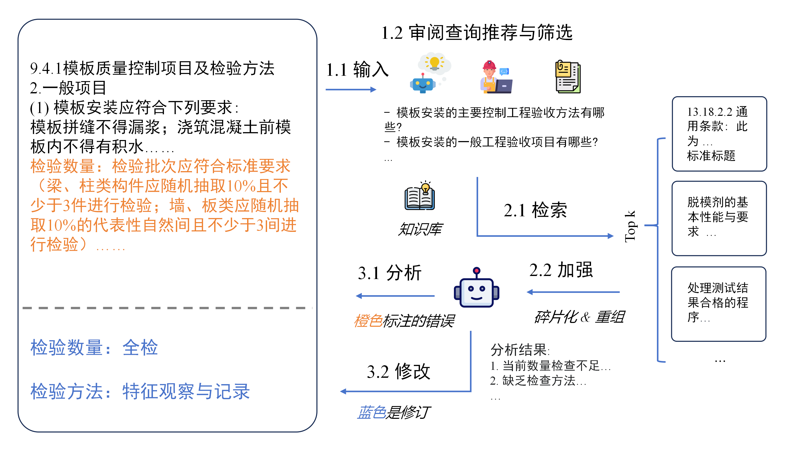
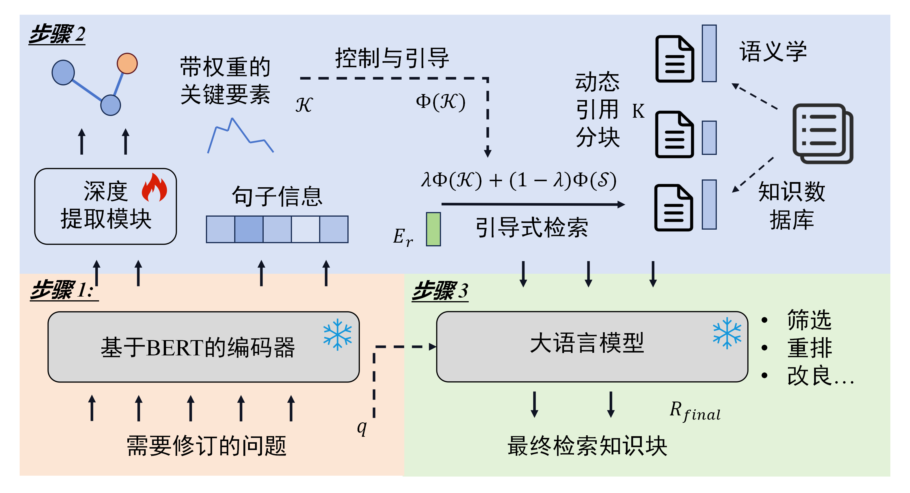
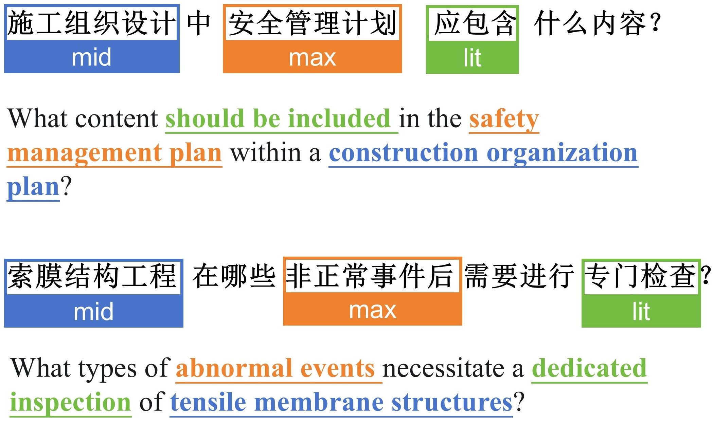

# 建筑文档智能RAG审查系统

一个从零开始实现的建筑文档智能审查系统，旨在帮助开发者理解知识引导检索在专业领域文档审查中的核心原理和实现细节。

## 项目动机

建筑施工交底文档的合规性审查是保障施工项目安全性、经济性的关键环节。在施工项目全周期中，各项操作必须符合相关规范条文要求，才能确保建设项目的安全性与可持续性。然而，相关查询参考往往分散在各个项目文件中，传统基于人工的审查方法难以处理庞大复杂的建筑条文，其审查过程需要基于审查人员的经验与专业知识，具有主观性强，耗时长且易出错等弊端。

随着大语言模型技术的发展，LLM为自动化建筑文档审查带来了新的希望。然而，大语言模型通常使用通用语料进行训练，缺乏建筑相关背景知识，在处理建造背景下的复杂推理问题中会产生严重的幻觉现象。通过使用基于向量相似匹配的RAG方法，可以为LLMs提供初步的相似参考知识，从而减轻基于人工或规则的审查方法难以处理庞大建筑文本所带来的错误率高的问题。

然而，传统RAG方法在建筑专业文档审查中存在关键局限：由于固定的分块设计，使得文本块之间面临知识信息缺失问题；在检索过程中，使用整句问询嵌入的方法进行相似性匹配，缺少对问询细粒度特征的识别与考量，检索效率低下。在建筑施工交底文档中，这类文档详细阐述了施工工艺特点和方法、质量规格、操作程序以及安全协议，包含大量知识细节且专业性极强。因此需要一个能够精准理解和检索建筑领域专业知识的智能系统。

因此，本项目提出了一个生成式知识引导的建筑文档审查系统，旨在提升审查的可靠性和准确性。系统具有两大核心创新：首先提出动态语义知识分块策略，构建具有更优语义连贯性和完整性的知识库；其次基于增强的知识表示，提出生成式知识引导检索框架，在语义嵌入检索过程中增强对细粒度信息的关注，从而提高知识参考检索的准确性和建筑文档审查任务中修正的可靠性。

需要注意的是，由于篇幅限制，我们无法展示完整的整个实现过程，但是，我们将在文档中讲解每个必要的实现步骤以及背后的思考，您可以通过这些内容快速理解如何实现一个建筑文档智能审查系统。

## 前置实现

接下来，我们将带领大家，从0开始，实现一个建筑文档智能审查系统。首先，我们将完成一些基本的准备过程。

### 1. 实现 LLM 模块

首先我们需要实现 LLM 模块，这是系统中最基本的模块，我们将利用大模型完成文档的清洗，信息提取等工作，可以说本系统的一部分精髓即为使用大模型预先处理文档信息，方便后续进行检索，这里我们使用 DeepSeek 的 api 来实现。

```python
from abc import ABC, abstractmethod
from typing import Any, Optional

class BaseLLM(ABC):
    """Interface for large language models."""

    def __init__(
        self,
        model_name: str,
        model_params: Optional[dict[str, Any]] = None,
        **kwargs: Any,
    ):
        self.model_name = model_name
        self.model_params = model_params or {}

    @abstractmethod
    def predict(self, input: str) -> str:
        """Sends a text input to the LLM and retrieves a response."""
```

如上是一个调用大模型的抽象接口，这可以帮助我们统一调用大模型的格式，我们继承这个基类，实现调用大模型的接口。

```python
from openai import OpenAI
from typing import Any, Optional
from .base import BaseLLM

class DeepSeekLLM(BaseLLM):
    """Implementation of the BaseLLM interface using DeepSeek API."""

    def __init__(
        self,
        model_name: str,
        api_key: str,
        base_url: str = "https://api.deepseek.com/v1",
        model_params: Optional[dict[str, Any]] = None,
        **kwargs: Any,
    ):
        super().__init__(model_name, model_params, **kwargs)
        self.client = OpenAI(api_key=api_key, base_url=base_url)

    def predict(self, input: str) -> str:
        response = self.client.chat.completions.create(
            model=self.model_name,
            messages=[{"role": "user", "content": input}],
        )
        return response.choices[0].message.content
```

完成搭建后，我们可以通过尝试调用 predict 方法来测试是否成功。

```python
llm = DeepSeekLLM(
    model_name="deepseek-chat", 
    api_key="your-api-key-here",
    base_url="https://api.deepseek.com/v1"
)
print(llm.predict("你好，你能帮助我进行建筑文档审查吗？"))
```

当观察到 LLM 正确回复后，我们这一模块的构建就完成了。

### 2. 实现 Embedding 模块

除了调用大模型，我们还需要实现 Embedding 模块，Embedding 模块用于将文本转换为向量，我们将使用向量来表示文档中的信息，这样的好处是，我们可以通过向量的相似度来衡量文档与查询之间的相似度，从而召回对回复用户问题最有帮助的文档。

构建 Embedding 模块的方法与构建 LLM 模块类似。

```python
from abc import ABC, abstractmethod
from typing import List, Any, Optional

class BaseEmb(ABC):
    def __init__(
        self,
        model_name: str,
        model_params: Optional[dict[str, Any]] = None,
        **kwargs: Any,
    ):
        self.model_name = model_name
        self.model_params = model_params or {}

    @abstractmethod
    def get_emb(self, input: str) -> List[float]:
        """Sends a text input to the embedding model and retrieves the embedding."""
        pass

from llama_index.embeddings.huggingface import HuggingFaceEmbedding
from .base import BaseEmb

class BGEEmbedding(BaseEmb):
    def __init__(self, model_name: str = "BAAI/bge-m3", **kwargs):
        super().__init__(model_name=model_name, **kwargs)
        self.embed_model = HuggingFaceEmbedding(
            model_name=model_name,
            trust_remote_code=True,
            cache_folder="./model_cache"
        )

    def get_emb(self, text: str) -> List[float]:
        embedding = self.embed_model.get_text_embedding(text)
        return embedding
```

完成搭建后，我们可以通过尝试调用 get_emb 方法来测试是否成功。

```python
emb = BGEEmbedding(model_name="BAAI/bge-m3")
print(emb.get_emb("建筑结构的安全性检查包括哪些方面？"))
```

当观察到 Embedding 正确给出了编码后的向量，我们这一模块的构建就完成了。

### 3. 实现文档预处理模块

为了处理建筑文档，我们需要预先准备好文档读取模块。本系统假设所有建筑规范和标准已经转换为Markdown格式，便于后续的文本处理和分析。

```python
import os
from pathlib import Path
from typing import Dict, List

class DocumentProcessor:
    def __init__(self):
        pass
    
    def load_documents(self, directory_path: str) -> List[str]:
        documents = []
        
        for file_path in Path(directory_path).rglob('*.md'):
            try:
                with open(file_path, 'r', encoding='utf-8') as f:
                    content = f.read()
                    documents.append(content)
            except Exception as e:
                print(f"Error reading {file_path}: {e}")
                    
        return documents
```

完成文档预处理模块的设置后，我们就可以采用下面的方法来加载建筑规范文档了。

```python
processor = DocumentProcessor()
documents = processor.load_documents("./construction_standards")
print(f"加载了 {len(documents)} 个建筑规范文档")
```

## 核心实现

建筑文档审查系统的主要流程如下。首先，让我们来梳理一下建筑文档审查的工作流程，系统的一个核心思想在于，我们需要把用户提供的文档内容通过智能化的问询生成和知识引导检索来识别潜在的合规性问题。与传统RAG方法不同，我们的系统专门针对建筑领域的专业特点进行了优化，能够更准确地理解建筑规范要求，提供更可靠的审查建议。

### 动态语义知识分块

在传统RAG流程中，文本通过设置固定的token数量划分文本区块。然而，固定token数量会在句子中间截断，导致信息缺失。为此，本系统使用基于建筑文本语义动态划分的方式，通过双重语义聚类的方式，完成考虑建筑语义连贯性的知识chunk划分。

首先，将整个文档内容处理成单独句子序列 $S = \{s_0, s_1, \ldots, s_a\}$。通过计算相邻句子间的语义差异度来识别潜在的语义边界：

$$\gamma_i = 1 - \frac{s_{i-1} \cdot s_i}{\|s_{i-1}\| \|s_i\|}$$

基于语义差异度分布自动确定动态阈值：

$$\psi = \text{Quantile}(\Gamma, \frac{a-p}{a})$$

确保最终的分块既保持语义连贯性又满足长度约束：

$$\mathbb{E}[\gamma_{\text{intra}}] < \mathbb{E}[\gamma_{\text{inter}}]$$

```python
import re
import numpy as np
from typing import List, Dict, Tuple
from sentence_transformers import SentenceTransformer
from sklearn.metrics.pairwise import cosine_similarity

class DynamicSemanticChunker:
    def __init__(self, 
                 embedding_model: str = "BAAI/bge-m3",
                 max_chunk_length: int = 512,
                 min_chunk_length: int = 50):
        self.embedding_model = SentenceTransformer(embedding_model)
        self.max_chunk_length = max_chunk_length
        self.min_chunk_length = min_chunk_length
    
    def split_text(self, text: str) -> Dict[str, str]:
        sentences = self._split_into_sentences(text)
        if len(sentences) == 0:
            return {}
        
        sentence_embeddings = self.embedding_model.encode(sentences)
        gamma_values = self._compute_semantic_discrepancy(sentence_embeddings)
        
        total_tokens = sum(len(s.split()) for s in sentences)
        baseline_chunks = max(1, total_tokens // self.max_chunk_length)
        alpha = max(0.1, (len(sentences) - baseline_chunks) / len(sentences))
        threshold = np.quantile(gamma_values, alpha) if len(gamma_values) > 0 else 0.5
        
        boundaries = self._identify_boundaries(gamma_values, threshold)
        initial_chunks = self._create_initial_chunks(sentences, boundaries)
        final_chunks = self._enforce_length_constraints(initial_chunks)
        
        chunks_dict = {}
        for i, chunk in enumerate(final_chunks):
            chunk_id = f"chunk-{i+1:03d}"
            chunks_dict[chunk_id] = chunk
        
        return chunks_dict
    
    def _split_into_sentences(self, text: str) -> List[str]:
        sentence_pattern = r'[。！？；\n]+'
        sentences = re.split(sentence_pattern, text)
        
        cleaned_sentences = []
        for sentence in sentences:
            sentence = sentence.strip()
            if len(sentence) > 5:
                cleaned_sentences.append(sentence)
        
        return cleaned_sentences
    
    def _compute_semantic_discrepancy(self, embeddings: np.ndarray) -> List[float]:
        gamma_values = []
        
        for i in range(1, len(embeddings)):
            similarity = cosine_similarity(
                embeddings[i-1].reshape(1, -1),
                embeddings[i].reshape(1, -1)
            )[0][0]
            
            gamma = 1 - similarity
            gamma_values.append(gamma)
        
        return gamma_values
    
    def _identify_boundaries(self, gamma_values: List[float], threshold: float) -> List[int]:
        boundaries = [0]
        
        for i, gamma in enumerate(gamma_values):
            if gamma > threshold:
                boundaries.append(i + 1)
        
        boundaries.append(len(gamma_values) + 1)
        return sorted(set(boundaries))
    
    def _create_initial_chunks(self, sentences: List[str], boundaries: List[int]) -> List[str]:
        chunks = []
        
        for i in range(len(boundaries) - 1):
            start = boundaries[i]
            end = boundaries[i + 1]
            
            chunk_sentences = sentences[start:end]
            chunk_text = ' '.join(chunk_sentences)
            chunks.append(chunk_text)
        
        return chunks
    
    def _enforce_length_constraints(self, chunks: List[str]) -> List[str]:
        final_chunks = []
        
        for chunk in chunks:
            chunk_length = len(chunk.split())
            
            if chunk_length <= self.max_chunk_length:
                if chunk_length >= self.min_chunk_length:
                    final_chunks.append(chunk)
            else:
                sub_chunks = self._split_long_chunk(chunk)
                final_chunks.extend(sub_chunks)
        
        return final_chunks
    
    def _split_long_chunk(self, chunk: str) -> List[str]:
        sentences = chunk.split('。')
        sub_chunks = []
        current_chunk = ""
        
        for sentence in sentences:
            if sentence.strip():
                test_chunk = current_chunk + sentence + "。"
                if len(test_chunk.split()) <= self.max_chunk_length:
                    current_chunk = test_chunk
                else:
                    if current_chunk:
                        sub_chunks.append(current_chunk.strip())
                    current_chunk = sentence + "。"
        
        if current_chunk:
            sub_chunks.append(current_chunk.strip())
        
        return sub_chunks
```

### 建筑文档审查系统

整体的审查过程如下图所示。系统获取需要审查的区域后，依据提示生成审查问题推荐，此部分也可供工程师进行相关问题输入或推荐问题选择，生成待审查问题。随后，系统通过生成式知识引导检索框架，依据审查问题在所建文本知识库中检索出相应的知识参考。最终，依据检索的部分与审查原文，进行问题分析与审查修正，完成最终的审查流程。



#### 审查问题生成

在文档审查流程中，系统引入了双阶段Prompt工程驱动的智能化问询生成机制，旨在对建筑施工交底文档进行预见性分析与风险挖掘，实现对文档潜在问题的高效、精准定位。

阶段1为待查文档主旨目标解构，模型被指示从文本中提炼核心事件、关键技术、工艺流程等要素，结构化地总结文档的核心内容，由此界定本次审查的靶向目标，为后续的精细化问询奠定基础。阶段2为多维度风险探测与定制化问询生成，基于第一阶段提炼的核心要素，通过few-shot等方式引导 LLM 从合规性、安全性、可操作性等多维度对文档进行风险探测。Prompt 指示模型围绕潜在的限制条件、操作流程、以及可能存在的合规性隐患等方面，进行细粒度、多角度的审查提问。

```python
import re

CORE_COMPONENTS_PROMPT = """
Task: Your task involves the extraction of crucial information components from a designated text segment. The purpose of this extraction is to assist in uncovering hidden descriptions indicative of regulatory non-compliance. Key information components encompass, but are not limited to, core descriptive events, essential construction techniques, technologies, and associated limitations and restrictions.

Input: {document_chunk}
Answer:
"""

REVIEW_QUERIES_PROMPT = """
Task: Your task is to generate relevant search queries based on the text under review and provided core descriptive references. These queries should target potential areas of non-compliance within the text, facilitating the subsequent retrieval of original regulatory documents for detailed examination.

Input: {document_chunk}
Core components: {core_components}
Queries:
"""

def generate_review_queries(llm, document_chunk: str) -> List[str]:
    core_prompt = CORE_COMPONENTS_PROMPT.format(document_chunk=document_chunk)
    core_response = llm.predict(core_prompt)
    
    # 生成审查查询
    queries_prompt = REVIEW_QUERIES_PROMPT.format(
        document_chunk=document_chunk,
        core_components=core_response
    )
    queries_response = llm.predict(queries_prompt)
    
    # 从响应中提取查询列表
    queries = re.findall(r"'([^']*)'", queries_response)
    
    return queries[:5]
```

#### 知识引导生成式检索

系统的核心创新在于知识引导的检索框架，整个过程分为三个关键步骤。步骤1为句子级编码，主要负责输入查询句子的初始表示学习，计算查询与知识库chunks间的句子级相似度分数。步骤2为知识引导检索，进一步从查询中提取关键信息，利用这些信息结合文档长度自适应加权等机制，对每个知识库chunk进行更详细的评分。步骤3为重排序与增强，使用大语言模型对步骤2检索的结果进行进一步重排序，并利用精炼的知识来增强原始查询。


首先建立专门针对建筑领域文本分析的深度提取模块，集成领域预训练BERT进行上下文编码，结合双向LSTM进行建筑法规依赖建模。建立三级重要性分类层次：max（最高）、mid（中等）、lit（字面）优先级。本项目直接通过大语言模型进行关键信息提取，如果需要更精准的效果，可以自行训练BERT模型进行专门的关键信息提取。


```python
import re
from typing import Dict, Tuple, List

KEY_INFO_EXTRACTION_PROMPT = """
Your task is to extract key information from the query with three different priority levels:

Maximum priority (max): The most important core concepts or entities
Medium priority (mid): Important modifiers or qualifying conditions  
Literal priority (lit): Specific values, standards or specifications

Query: {query}
max:
mid:
lit:
"""

class KeyInfoExtractor:
    def __init__(self, llm):
        self.llm = llm

    def extract_key_info(self, query: str) -> Dict[str, Tuple[str, float]]:
        prompt = KEY_INFO_EXTRACTION_PROMPT.format(query=query)
        response = self.llm.predict(prompt)
        
        lines = response.strip().split('\n')
        key_info = {}
        weights = {'max': 0.5, 'mid': 0.3, 'lit': 0.2}
        
        for line in lines:
            if line.startswith('max:'):
                key_info['max'] = (line[4:].strip(), weights['max'])
            elif line.startswith('mid:'):
                key_info['mid'] = (line[4:].strip(), weights['mid'])
            elif line.startswith('lit:'):
                key_info['lit'] = (line[4:].strip(), weights['lit'])
        
        return key_info
```

#### 文档长度自适应因子

在知识引导检索过程中，文档长度自适应因子用于调整不同长度文档的权重分配，确保长短文档都能得到公平的评分机会。该因子的计算考虑了当前文档chunk的长度与平均文档长度的关系。

$$\Lambda_{\text{DL}} = \frac{\overline{|k|} + |k_j|}{2\overline{|k|}}$$

其中 $|k_j|$ 表示当前文档chunk的长度，$\overline{|k|}$ 表示平均文档长度。通过这种归一化处理，可以避免因文档长度差异导致的评分偏差。

```python
def compute_document_length_factor(chunk_length: int, avg_length: int = 100) -> float:
    lambda_dl = (avg_length + chunk_length) / (2 * avg_length)
    return lambda_dl
```

#### 术语重要性计算

术语重要性指标衡量术语在文档中的显著程度，结合术语频率和文档长度自适应因子，能够更准确地评估术语在当前文档中的重要性。计算公式考虑了术语频率的非线性增长特性。

$$\text{Sign}(t_{e_i}^\tau, k_j) = \frac{2 \cdot f(t_{e_i}^\tau, k_j) \cdot \Lambda_{\text{DL}}}{f(t_{e_i}^\tau, k_j) + 1}$$

其中 $f(t_{e_i}^\tau, k_j)$ 表示术语在文档chunk中的出现频率，$\Lambda_{\text{DL}}$ 为文档长度自适应因子。这种计算方式能够防止高频术语过度影响评分。

```python
def compute_term_significance(term_freq: int, doc_length_factor: float) -> float:
    significance = (2 * term_freq * doc_length_factor) / (term_freq + 1)
    return significance
```

#### 术语稀有度计算

术语稀有度用于衡量术语在整个知识库中的稀缺程度，稀有度越高的术语在检索中的权重越大。计算采用了改进的IDF公式，增加了平滑处理以避免零除问题。

$\text{Rarity}(t_{e_i}^\tau) = \log\left(\frac{D - \text{df}(t_{e_i}^\tau) + 0.5}{\text{df}(t_{e_i}^\tau) + 0.5} + 1\right)$

其中 $D$ 表示文档总数，$\text{df}(t_{e_i}^\tau)$ 表示包含该术语的文档数量。加一操作确保了对数值始终为正数。

```python
import numpy as np

def compute_term_rarity(doc_freq: int, total_docs: int) -> float:
    rarity = np.log((total_docs - doc_freq + 0.5) / (doc_freq + 0.5) + 1)
    return rarity
```

#### 连贯性指数评估

连贯性指数反映术语在文档中的分布连贯性，通过滑动窗口技术分析术语在文档中的局部分布情况。连贯性高的术语往往在文档的特定区域集中出现，表明其与文档主题的强相关性。

$$\text{CI}(t_{e_i}^\tau, k_j) = \max_{w \in W, \, t \in w} \frac{\sum I(t = t_{e_i}^\tau) \cdot |w|}{|k_j|}$$

其中 $W$ 表示文档中的滑动窗口集合，$I(t = t_{e_i}^\tau)$ 为指示函数，当窗口中包含该术语时为1，否则为0。

```python
def compute_coherence_index(term: str, chunk: str, window_size: int = 50) -> float:
    chunk_tokens = chunk.lower().split()
    chunk_length = len(chunk_tokens)
    
    if chunk_length == 0:
        return 0.0
    
    max_coherence = 0.0
    
    for i in range(0, chunk_length - window_size + 1, 10):
        window = chunk_tokens[i:i + window_size]
        term_count = window.count(term.lower())
        
        if term_count > 0:
            coherence = (term_count * window_size) / chunk_length
            max_coherence = max(max_coherence, coherence)
    
    return max_coherence
```

#### 评分融合与检索

将句子级相似度评分与知识级评分进行融合，形成最终的文档相关性评分。融合过程采用加权平均的方式，平衡参数λ控制两种评分方式的重要性。

$\Phi = \lambda \Phi(\mathcal{K}) + (1 - \lambda) \Phi(\mathcal{S})$

其中 $\lambda$ 为平衡参数，$\Phi(\mathcal{K})$ 为知识级评分，$\Phi(\mathcal{S})$ 为句子级评分。通过调整λ值，可以控制系统更偏向语义相似还是知识匹配。当λ=0时，系统完全依赖句子级语义相似度；当λ=1时，系统完全依赖知识匹配评分；λ=0.5时，两种评分方式权重相等。在建筑文档审查场景中，通常设置λ=0.5以平衡专业知识匹配和语义理解。

```python
import numpy as np
from sklearn.metrics.pairwise import cosine_similarity
from typing import List, Tuple, Dict, Any

class GKGRRetriever:
    def __init__(self, 
                 knowledge_base: List[str],
                 embedding_model,
                 key_info_extractor: KeyInfoExtractor,
                 llm,
                 config: Dict[str, Any] = None):
        self.knowledge_base = knowledge_base
        self.embedding_model = embedding_model
        self.key_info_extractor = key_info_extractor
        self.llm = llm
        
        default_config = {
            "lambda_param": 0.5,
            "top_k": 5,
            "rerank_enabled": True,
            "query_expansion": True,
            "similarity_threshold": 0.1
        }
        self.config = {**default_config, **(config or {})}
        
        self.kb_embeddings = self._precompute_embeddings()
    
    def _precompute_embeddings(self) -> np.ndarray:
        embeddings = self.embedding_model.encode(self.knowledge_base, show_progress_bar=True)
        return embeddings
    
    def retrieve_with_scores(self, query: str) -> List[Tuple[str, float, Dict[str, float]]]:
        query_embedding = self.embedding_model.encode([query])[0]
        sentence_scores = cosine_similarity(
            query_embedding.reshape(1, -1), 
            self.kb_embeddings
        )[0]
        
        key_info = self.key_info_extractor.extract_key_info(query)
        knowledge_scores = self._compute_knowledge_scores(key_info)
        
        final_scores = []
        for i in range(len(self.knowledge_base)):
            norm_sent = sentence_scores[i]
            norm_know = knowledge_scores[i] / max(knowledge_scores) if max(knowledge_scores) > 0 else 0
            
            final_score = (self.config["lambda_param"] * norm_know + 
                          (1 - self.config["lambda_param"]) * norm_sent)
            final_scores.append(final_score)
        
        results_with_scores = []
        for i, final_score in enumerate(final_scores):
            if final_score > self.config["similarity_threshold"]:
                score_details = {
                    "sentence_score": float(sentence_scores[i]),
                    "knowledge_score": float(knowledge_scores[i]),
                    "final_score": float(final_score)
                }
                results_with_scores.append((self.knowledge_base[i], final_score, score_details))
        
        results_with_scores.sort(key=lambda x: x[1], reverse=True)
        return results_with_scores[:self.config["top_k"]]
    
    def _compute_knowledge_scores(self, key_info: Dict[str, Tuple[str, float]]) -> List[float]:
        scores = []
        avg_length = sum(len(chunk.split()) for chunk in self.knowledge_base) / len(self.knowledge_base)
        
        for chunk in self.knowledge_base:
            chunk_score = 0.0
            chunk_tokens = chunk.lower().split()
            chunk_length = len(chunk_tokens)
            
            lambda_dl = compute_document_length_factor(chunk_length, avg_length)
            
            for priority, (info_text, weight) in key_info.items():
                if not info_text.strip():
                    continue
                
                terms = info_text.lower().split()
                for term in terms:
                    if term in chunk_tokens:
                        tf = chunk_tokens.count(term)
                        
                        significance = compute_term_significance(tf, lambda_dl)
                        
                        segments_with_term = sum(1 for kb_chunk in self.knowledge_base 
                                                if term in kb_chunk.lower())
                        rarity = compute_term_rarity(segments_with_term, len(self.knowledge_base))
                        
                        coherence = compute_coherence_index(term, chunk)
                        
                        term_score = significance * rarity * (1 + coherence) * weight
                        chunk_score += term_score
            
            scores.append(chunk_score)
        
        return scores
    
    def retrieve(self, query: str) -> Tuple[List[str], str]:
        results_with_scores = self.retrieve_with_scores(query)
        
        documents = [doc for doc, _, _ in results_with_scores]
        
        if self.config["rerank_enabled"] and len(documents) > 1:
            documents = self._llm_rerank(query, documents)
        
        augmented_query = query
        if self.config["query_expansion"]:
            augmented_query = self._augment_query(query, documents[:3])
        
        return documents, augmented_query
```

#### 重排序优化

系统使用大语言模型对检索结果进行进一步重排序，通过LLM的语义理解能力优化文档的相关性排序。重排序过程中，系统会构造包含查询和候选文档的提示，要求LLM根据相关性对文档进行重新排序。

```python
def _llm_rerank(self, query: str, documents: List[str]) -> List[str]:
    if len(documents) <= 1:
        return documents
    
    rerank_prompt = f"""
Task: A list of documents is shown below. Each document has a number next to it. A question is also provided. Your task is to return the numbers of ALL documents in order of relevance from MOST to LEAST relevant. MUST include EVERY document number exactly once.

Example format:
    Document 1: <document 1>
    Document 2: <document 2>
    Document 3: <document 3>
    Question: <question>
    Answer: 3,1,2

Now here are the actual documents and question.

"""
    for i, doc in enumerate(documents):
        rerank_prompt += f"Document {i+1}: {doc[:150]}...\n"
    
    rerank_prompt += f"Question: {query}\nAnswer:"
    
    try:
        response = self.llm.predict(rerank_prompt)
        order_nums = [int(x.strip()) - 1 for x in response.split(',') 
                     if x.strip().isdigit() and 0 <= int(x.strip()) - 1 < len(documents)]
        
        reranked = [documents[i] for i in order_nums if i < len(documents)]
        
        # 添加遗漏的文档
        used_indices = set(order_nums)
        for i, doc in enumerate(documents):
            if i not in used_indices:
                reranked.append(doc)
        
        return reranked[:len(documents)]
    except:
        return documents
```

#### 查询增强

同时系统还会利用检索到的知识来增强原始查询，生成更具体、更详细的查询用于进一步检索。查询增强通过分析检索结果的上下文信息，识别查询中可能遗漏的关键概念和术语。

```python
def _augment_query(self, original_query: str, top_results: List[str]) -> str:
    if not top_results:
        return original_query
    
    document_list = ""
    for i, doc in enumerate(top_results):
        document_list += f"Document {i+1}: {doc[:100]}...\n"
    
    augment_prompt = f"""
Task: Your task is to generate a detailed answer to the question by synthesizing information from ALL provided documents. Prioritize relevance, cite document numbers, and structure your response as follows:

Question: {original_query}
{document_list}
Answer:
"""
    
    try:
        augmented = self.llm.predict(augment_prompt)
        return augmented.strip()
    except:
        return original_query
```

#### 偏差检测分析

在先期知识增强检索阶段获取领域知识后，系统随即进入误差辨析模块。该模块基于检索得到的知识参考，并结合预设的审阅问题，对原文进行细致的偏差检测与评估。

```python
class ErrorAnalyzer:
    def __init__(self, llm):
        self.llm = llm
    
    def analyze_errors(self, document_chunk: str, query: str, retrieved_knowledge: List[str]) -> Dict[str, Any]:
        
        analysis_prompt = f"""
Task: Your task is to conduct an error analysis on a given review document, based on a provided review query and relevant reference specifications. This analysis MUST strictly adhere to the provided reference and focus specifically on reviewing and analyzing the original descriptive sections within the review document.

Review document: {document_chunk}
Query: {query}
Reference: {chr(10).join([f"{i+1}. {ref}" for i, ref in enumerate(retrieved_knowledge)])}
Analysis:
"""
        
        analysis = self.llm.predict(analysis_prompt)
        
        return {
            "analysis": analysis,
            "reference_support": retrieved_knowledge
        }
```

#### 修订建议生成

误差辨析模块完成后，系统将输出标记偏差区域以及相关知识佐证。随后，系统进入修订策略生成模块。该模块依据误差分析结果和知识参考，对标记区域进行针对性的修订建议生成，最终实现对原文的知识驱动型自动修正。

```python
class RevisionGenerator:
    def __init__(self, llm):
        self.llm = llm
    
    def generate_revisions(self, document_chunk: str, analysis: Dict[str, Any]) -> Dict[str, str]:     
        revision_prompt = f"""
Task: Your task is to review and revise the provided document based on the given analysis and corresponding reference specifications. STRICT adherence to the provided reference specifications is required. If the review document aligns with the analysis and reference specifications WITHOUT discrepancies, revision is not necessary.

Review document: {document_chunk}
Analysis: {analysis['analysis']}
Reference: {chr(10).join([f"- {ref}" for ref in analysis['reference_support']])}
Revision:
"""
        
        revision = self.llm.predict(revision_prompt)
        
        return {
            "original_text": document_chunk,
            "revision_suggestions": revision,
            "modified_regions": analysis.get("error_regions", []),
            "confidence": self._calculate_confidence(analysis)
        }
    
    def _calculate_confidence(self, analysis: Dict[str, Any]) -> float:
        ref_count = len(analysis.get("reference_support", []))
        error_count = len(analysis.get("error_regions", []))
        
        confidence = min(0.9, 0.5 + (ref_count * 0.1) + (error_count * 0.05))
        return confidence
```

#### 完整审查流程

将上述所有模块整合，形成完整的文档审查流程。系统首先生成审查问题，然后进行知识引导检索，接着执行错误分析，最后生成修订建议。

```python
def complete_review_process(document_chunk: str, 
                          gkgr_framework: GKGRRetriever, 
                          error_analyzer: ErrorAnalyzer,
                          revision_generator: RevisionGenerator) -> Dict[str, Any]:    
    review_queries = generate_review_queries(gkgr_framework.llm, document_chunk)
    
    results = {}
    for query in review_queries[:3]:
        retrieved_docs, augmented_query = gkgr_framework.retrieve(query)
        
        knowledge_refs = retrieved_docs
        analysis = error_analyzer.analyze_errors(document_chunk, query, knowledge_refs)
        
        revision = revision_generator.generate_revisions(document_chunk, analysis)
        
        results[query] = {
            "retrieved_knowledge": retrieved_docs,
            "augmented_query": augmented_query,
            "analysis": analysis,
            "revision": revision
        }
    
    return results
```

至此，我们就完成了建筑文档智能审查系统的核心实现。

## 实际应用示例

让我们通过一个完整的示例来展示系统的使用：

```python
# 初始化系统组件
llm = DeepSeekLLM(
    model_name='deepseek-chat',
    api_key='your-api-key',
    base_url='https://api.deepseek.com/v1'
)

embedding = BGEEmbedding(model_name="BAAI/bge-m3")
key_extractor = KeyInfoExtractor(llm)

# 从markdown文档构建知识库
processor = DocumentProcessor()
documents = processor.load_documents("./construction_standards")

# 对文档进行动态语义分块
chunker = DynamicSemanticChunker()
knowledge_base = []
for doc in documents:
    chunks = chunker.split_text(doc)
    knowledge_base.extend(chunks.values())

# 初始化检索器
gkgr_retriever = GKGRRetriever(
    knowledge_base=knowledge_base,
    embedding_model=embedding,
    key_info_extractor=key_extractor,
    llm=llm
)

# 初始化分析器
error_analyzer = ErrorAnalyzer(llm)
revision_generator = RevisionGenerator(llm)

# 待审查的文档内容
sample_document = """
钢筋混凝土柱的施工应符合以下要求：
1. 混凝土强度等级不低于C25
2. 钢筋保护层厚度为25mm
3. 混凝土浇筑应连续进行，间歇时间不超过1小时
4. 养护期间应保持混凝土表面湿润
"""

# 执行审查
result = complete_review_process(
    sample_document, 
    gkgr_retriever, 
    error_analyzer, 
    revision_generator
)

# 查看审查结果
for query, analysis in result.items():
    print(f"审查问题: {query}")
    print(f"修订建议: {analysis['revision']['revision_suggestions']}")
    print("-" * 50)
```

## 扩展性说明

系统可以通过更换知识库轻松适应其他领域。对于特定企业或项目，可以通过微调关键信息提取模型来提升准确性。在性能优化方面，使用动态语义分块可以提升检索质量，预计算并缓存知识库嵌入以提升检索速度，对于大量文档可使用批量处理模式，根据具体应用场景调整λ参数和top-k值。

## 写在最后

恭喜你阅读完此文，你已经充分了解了如何实现一个建筑文档智能审查系统以及其背后的思考。这个系统展示了如何将动态语义分块、知识引导检索和大语言模型有机结合，为建筑行业的文档审查提供了一个实用的解决方案。

虽然当前系统已经取得了不错的效果，但仍有改进空间。全局关联增强方面，当前基于文本块的检索可以进一步结合知识图谱等技术。多模态支持方面，未来可以扩展支持CAD图纸、施工图等视觉信息。实时更新方面，支持知识库的增量更新和动态维护。个性化定制方面，根据不同企业和项目特点进行系统定制。

读者们可以运行项目中的示例代码，体验完整的建筑文档智能审查流程。我们相信这个系统不仅能够提升审查效率，更能为建筑行业的数字化转型贡献力量。

## 致谢

本项目的开发过程中，我们深入研究了建筑工程领域的专业知识和最新的自然语言处理技术。特别感谢建筑行业专家提供的宝贵建议，以及开源社区在技术实现方面的支持。项目代码实现参考了LlamaIndex、Transformers等优秀开源项目的设计理念。

需要说明的是，本项目专门针对建筑施工领域的文档审查场景进行了深度优化。如果您需要处理其他领域的文档，建议根据具体需求对系统进行相应调整。

## 源码获取

本项目的源码以及实例数据存放在 [GitHub 仓库](https://github.com/Hongru0306/CDDRS)。

## 引用

如果您在研究中使用了本项目的成果，请按如下方式引用：

```bibtex
@article{XIAO2025103618,
    title = {Generative knowledge-guided review system for construction disclosure documents},
    journal = {Advanced Engineering Informatics},
    volume = {68},
    pages = {103618},
    year = {2025},
    issn = {1474-0346},
    doi = {https://doi.org/10.1016/j.aei.2025.103618},
    url = {https://www.sciencedirect.com/science/article/pii/S1474034625005117},
    author = {Hongru Xiao and Jiankun Zhuang and Bin Yang and Jiale Han and Yantao Yu and Songning Lai},
    keywords = {Construction documents review, Large language model (LLM), Knowledge-guided retrieval, Natural Language Processing (NLP)}
}
```
