# Qwen整体介绍

Qwen的整体架构与Llama2类似，如下图所示:
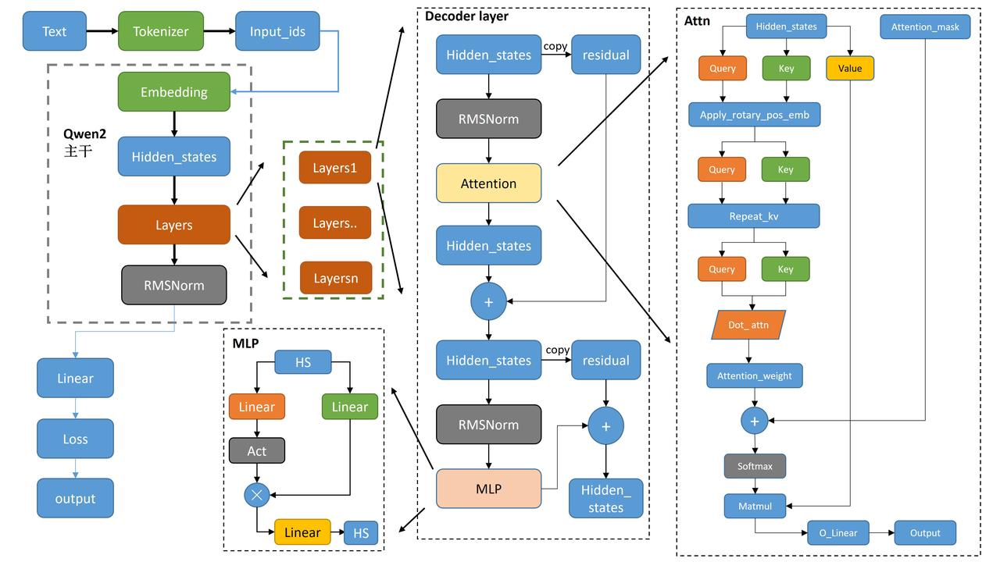  

其中:   
- `tokenizer`将文本转为词表里面的数值。
- 数值经过`embedding`得到一一对应的向量。
- `attention_mask`是用来看见左边、右边，双向等等来设定。
- 各类下游任务，`Casual`,`seqcls`等，基本都是基础模型`model`后面接对应的`Linear`层，还有损失函数不一样。

# 1 Qwen2Config
Qwen2Config中包含一些自定义的超参数，例如`vocab_size`,`hidden_size`,`num_hidden_layers`, `num_attention_heads`等。类似于`dict`可以调用里面的超参数:`config.pad_token_id`。 
## 1.1 Qwen2Model 
### 1.1.1 初始化

- 设置了模型的两个属性:`padding_idx`（用于指定填充标记的索引），`vocab_size`（词汇表的大小）
- 初始化了模型的嵌入层、解码器层、归一化层
- 嵌入层（`nn.Embedding`）：模型使用嵌入层将输入的标记映射成密集的向量表示。
- 解码器层（`nn.ModuleList()`）：模型包含多个解码器层，这些层都是由 `Qwen2DecoderLayer``  定义
- 归一化层 `Qwen2RMSNorm`：归一化层使用的是 Root Mean Square Layer Normalization
- 设置了是否使用 `gradient_checkpoint` 主要是用来节省显存
- 调用 `post_init()` 完成一些初始化和准备检查的代码

```python
class Qwen2Model(Qwen2PreTrainedModel):
    def __init__(self, config: Qwen2Config):
        super().__init__(config)
        self.padding_idx = config.pad_token_id
        self.vocab_size = config.vocab_size

        self.embed_tokens = nn.Embedding(config.vocab_size, config.hidden_size, self.padding_idx)
        self.layers = nn.ModuleList(
            [Qwen2DecoderLayer(config, layer_idx) for layer_idx in range(config.num_hidden_layers)]
        )
        self.norm = Qwen2RMSNorm(config.hidden_size, eps=config.rms_norm_eps)

        self.gradient_checkpointing = False
        # Initialize weights and apply final processing
        self.post_init()
```
对于`post_init`函数：
主要是对参数进行初始化，以及初始化梯度检查点作用  
```python
def post_init(self):
    """
    A method executed at the end of each Transformer model initialization, to execute code that needs the model's
    modules properly initialized (such as weight initialization).
    """
    self.init_weights()
    self._backward_compatibility_gradient_checkpointing()
```

### 1.1.2 Forward
在此只对核心主干进行讲解:
```python
inputs_embeds = self.embed_tokens(input_ids)
# embed positions
hidden_states = inputs_embeds

for idx, decoder_layer in enumerate(self.layers):
    # 将所有的hidden_states保存成tuple
    if output_hidden_states:
        all_hidden_states += (hidden_states,)
    # 将hs送入每一层decoder_layer
    layer_outputs = decoder_layer(
        hidden_states,
        attention_mask=attention_mask,
        position_ids=position_ids,
        past_key_value=past_key_value,
        output_attentions=output_attentions,
        use_cache=use_cache,
    )
    # 取出上一层decoder_输出的hs,再传入下一个layer
    # 只要第一个,第二个是cache的一个类，然后进入下一个layer
    hidden_states = layer_outputs[0]
    
# 将最后layers输出后的hidden_states进行标准化  
hidden_states = self.norm(hidden_states)
    
# 加上最后一层的hidden_states
if output_hidden_states:
    all_hidden_states += (hidden_states,)
```
- 如果保存`output_hidden_states`的话，就是第一个为`input_ids`进行`emb`，然后保存到`n-1`层的`decoder_layer`的输出`hs`，再加上最后一层`layer`的输出`hs`进行过`norm`后的`hs`.
- 最后是以`BaseModelOutputWithPast`的形式输出。

## 1.2 Qwen2DecoderLayer

<div align=center>
    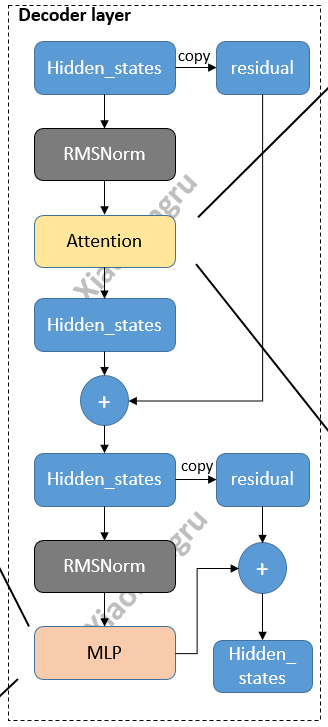
</div>

### 1.2.1 初始化
`layer`三件套:`attn`+`MLP`+`norm`

```python
QWEN2_ATTENTION_CLASSES = {
    "eager": Qwen2Attention,  # 一般情况下是这个
    "flash_attention_2": Qwen2FlashAttention2,
    "sdpa": Qwen2SdpaAttention,
}

class Qwen2DecoderLayer(nn.Module):
    def __init__(self, config: Qwen2Config):
        super().__init__()
        self.hidden_size = config.hidden_size
        self.self_attn = QWEN2_ATTENTION_CLASSES[config._attn_implementation](config, layer_idx)

        self.mlp = Qwen2MLP(config)
        self.input_layernorm = Qwen2RMSNorm(config.hidden_size, eps=config.rms_norm_eps)
        self.post_attention_layernorm = Qwen2RMSNorm(config.hidden_size, eps=config.rms_norm_eps)
```
这里面的`input_layernorm`和`post_attention_layernorm`内容是一样的，只是应用的顺序不一样。
### 1.1.2 Forward
可配合图食用，效果更佳:
- 首先复制一份`hidden_states`为`residual`,然后将`hidden_states`送入`Norm`,再送入`attn`模块。
- 得到`attn`的输出后，再复制一份`residual`，再将`hidden_states`送入`Norm`，`mlp`，再与`residual`进行相加。最后输出的就是这个`hidden_states`啦。  

```python
residual = hidden_states
#  标准化后送入attn
hidden_states = self.input_layernorm(hidden_states)  # RMSNorm标准化
# Self Attention
hidden_states, self_attn_weights, present_key_value = self.self_attn(  
    hidden_states=hidden_states,
    attention_mask=attention_mask,
    position_ids=position_ids,
    past_key_value=past_key_value,
    output_attentions=output_attentions,
    use_cache=use_cache,
    **kwargs,
)

# 残差与新的hidden_states相加
hidden_states = residual + hidden_states

# Fully Connected
residual = hidden_states
# 同样的RMSNorm标准化
hidden_states = self.post_attention_layernorm(hidden_states)
hidden_states = self.mlp(hidden_states)
hidden_states = residual + hidden_states

outputs = (hidden_states,)

return outputs
```

## 1.3 Qwen2Attention
<div align=center>
    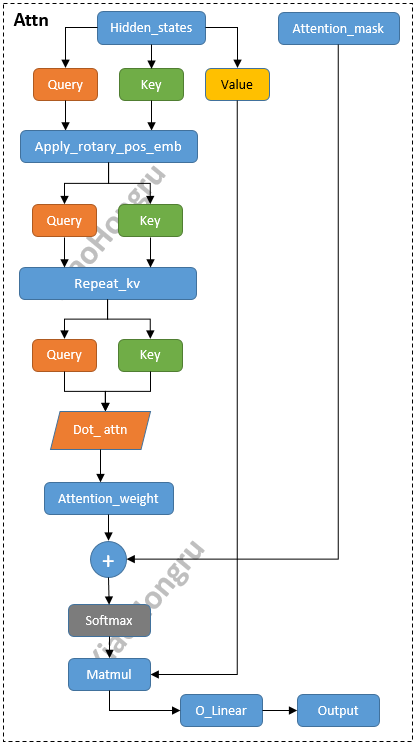
</div>

### 1.3.1 初始化
核心参数解析:
- `num_key_value_heads`:表示键值对的头数
- `num_key_value_groups`:表示键值对的组数，计算为`num_heads` // `num_key_value_headsGQA`的实现！！
- `q_proj`,`k_proj`,`v_proj`,`o_proj`四个`Linear`操作。后续`LoRa`也基本都对他动的刀子.

```python
class Qwen2Attention(nn.Module):
    """Multi-headed attention from 'Attention Is All You Need' paper"""

    def __init__(self, config: Qwen2Config):
        super().__init__()
        self.config = config
        self.layer_idx = layer_idx
        self.hidden_size = config.hidden_size
        self.num_heads = config.num_attention_heads
        self.head_dim = self.hidden_size // self.num_heads
        self.num_key_value_heads = config.num_key_value_heads
        self.num_key_value_groups = self.num_heads // self.num_key_value_heads
        self.max_position_embeddings = config.max_position_embeddings
        self.rope_theta = config.rope_theta
        self.is_causal = True
        self.attention_dropout = config.attention_dropout

        if (self.head_dim * self.num_heads) != self.hidden_size:
            raise ValueError(
                f"hidden_size must be divisible by num_heads (got `hidden_size`: {self.hidden_size}"
                f" and `num_heads`: {self.num_heads})."
            )
        self.q_proj = nn.Linear(self.hidden_size, self.num_heads * self.head_dim, bias=config.attention_bias)
        self.k_proj = nn.Linear(self.hidden_size, self.num_key_value_heads * self.head_dim, bias=config.attention_bias)
        self.v_proj = nn.Linear(self.hidden_size, self.num_key_value_heads * self.head_dim, bias=config.attention_bias)
        self.o_proj = nn.Linear(self.num_heads * self.head_dim, self.hidden_size, bias=config.attention_bias)
        
        self.rotary_emb = Qwen2RotaryEmbedding(
            self.head_dim,
            max_position_embeddings=self.max_position_embeddings,
            base=self.rope_theta,
        )
```
- `config`里面的参数可直接看`Qwen2Config`里面的介绍  

```python
max_position_embeddings (`int`, *optional*, defaults to 32768):
            The maximum sequence length that this model might ever be used with.
            
rope_theta (`float`, *optional*, defaults to 10000.0):
            The base period of the RoPE embeddings.
```
### 1.3.2 Forward
- 首先将`hidden_states`送入`Linear`中得到`query`、`key`与`value`。
- 使用旋转位置嵌入操作`rotary_emb`，使用了旋转位置嵌入的余弦和正弦部分，将他们与`query`和`key`相乘，并将结果相加，从而实现旋转位置嵌入的效果。
- 将`key_states`和`value_states`重复`group`次，再执行`dot attn`操作。
- 在`dot attn`操作后得到`attn_weights`,加上`attention_mask`从而实现读取掩盖操作，在经过`softmax`与`value_states`相乘。得到`attn_output`。
- 再将上述的`attn_output`进行`reshape`操作，送入`o_proj`，得到最终的输出。  

```python
# 获取形状信息,hidden_states输入的为(bs,T,hd)
bsz, q_len, _ = hidden_states.size()

# 对hidden_states进行Linear生成query、key、value
query_states = self.q_proj(hidden_states)
key_states = self.k_proj(hidden_states)
value_states = self.v_proj(hidden_states)

 # reshape多头处理--分块--(bs,T,heads,hd_d)
query_states = query_states.view(bsz, q_len, self.num_heads, self.head_dim).transpose(1, 2)
key_states = key_states.view(bsz, q_len, self.num_key_value_heads, self.head_dim).transpose(1, 2)
value_states = value_states.view(bsz, q_len, self.num_key_value_heads, self.head_dim).transpose(1, 2)

# 将旋转位置嵌入应用于查询和键张量。使用了旋转位置嵌入的余弦和正弦部分，将它们与查询和键张量相乘，并将结果相加，从而实现旋转位置嵌入的效果
cos, sin = self.rotary_emb(value_states, seq_len=kv_seq_len)
query_states, key_states = apply_rotary_pos_emb(query_states, key_states, cos, sin, position_ids)

# 先将key_states和value_states重复了num_key_value_groups次
key_states = repeat_kv(key_states, self.num_key_value_groups)
value_states = repeat_kv(value_states, self.num_key_value_groups)

# 使用dot attn实现q*kT/hd_d^0.5
attn_weights = torch.matmul(query_states, key_states.transpose(2, 3)) / math.sqrt(self.head_dim)

# 然后 attn_weights 加上 attention_mask，实现读取顺序
attn_weights = attn_weights + attention_mask

# softmax + dropout + values_states相乘
attn_weights = nn.functional.softmax(attn_weights, dim=-1, dtype=torch.float32).to(query_states.dtype)
attn_weights = nn.functional.dropout(attn_weights, p=self.attention_dropout, training=self.training)
attn_output = torch.matmul(attn_weights, value_states)

# 转置，修改形状等reshape操作
attn_output = attn_output.transpose(1, 2).contiguous()
attn_output = attn_output.reshape(bsz, q_len, self.hidden_size)

# 最后在进行一次o_proj
attn_output = self.o_proj(attn_output)

# 返回结果
return attn_output, attn_weights, past_key_value
```

### 1.3.3 细节Debug
#### 1.3.3.1 GQA
<div align=center>
    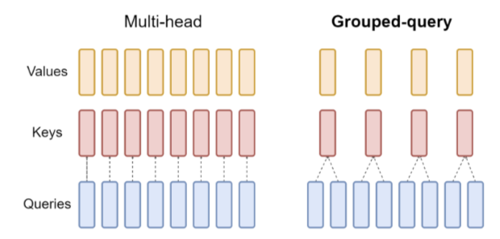
</div>

> 主旨:GQA和MQA不需要在推理的过程存储那么多的kv cache, 那么kv cache占用的显存就变小，那么我们LLM serving可以处理的请求数量就更多

1. 定义初始张量
```python
import torch

## shape:(batch, seq_len, head, head_dim)
query = torch.randn(10, 128, 8, 128)
key = torch.randn(10, 128, 2, 128)
value = torch.randn(10, 128, 2, 128)

## 在此设置组数为4
groups = query.shape[-2] // key.shape[-2]
```
2. 之后进行扩展key，value的操作  
在`GQA`中，`key`和`value`都要比`query`小`group`倍，但是为在后续做矩阵乘法时方便，我们需要先把`key`和`value`的`head`利用expand扩展张量到和`query`相同的维度。方便后续计算。  

```python
# 定义输入x， n_rep是需要重复的次数，在这里一般是组数
def repeat_kv(hidden_states: torch.Tensor, n_rep: int) -> torch.Tensor:

    batch, num_key_value_heads, slen, head_dim = hidden_states.shape
    # dont need repeat here means multi head attention
    if n_rep == 1:
        return hidden_states
    # first we expand x to (bs, seq_len, head, group, head_dim)
    hidden_states = hidden_states[:, :, None, :, :].expand(batch, num_key_value_heads, n_rep, slen, head_dim)
    # reshape make head -> head * group
    return hidden_states.reshape(batch, num_key_value_heads * n_rep, slen, head_dim)
```
3. 矩阵乘法得到`score`与`output`
后面就是征程的`kqv`相乘了
```python
#(bs, head, seq_len, head_dim)
query = query.transpose(1, 2)
key = repeat_kv(key, 4).transpose(1, 2)
value = repeat_kv(value, 4).transpose(1, 2)
scores = torch.matmul(query, key.transpose(2, 3)) / math.sqrt(head_dim)
scores = torch.nn.functional.softmax(scores, dim=-1)

out = torch.matmul(scores, value)
#上一步转置了，还得转回去
out = out.transpose(1, 2)
```
**补充：**   
**为什么要用expand之后再reshape而不能直接用tensor自带的repeat?** 
- `expand` 方法用于对张量进行扩展，但不实际分配新的内存。它返回的张量与原始张量共享相同的数据
- `repeat` 方法通过实际复制数据来扩展张量。它返回的新张量不与原始张量共享数据，扩展后的张量占用了更多的内存。


#### 1.3.3.2 apply_rotary_pos_emb
位置编码的含义是对每一个token的每一个dim赋予不同的位置信息。
公式定义:  
<div align=center>
    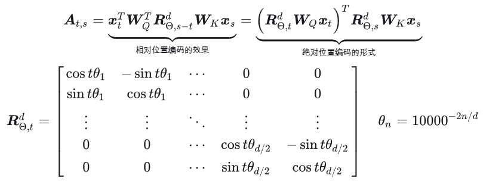
</div> 

概念：通过旋转编码，使得每个token既有相对位置信息，又有绝对位置信息。
- 既能以自注意力矩阵偏置的形式作用于 $A_{t,s}$,直接反映两个token的相对位置信息，又能拆解到向量 $q_{t}$ 和 $k_{s}$ 上，通过直接编码token的绝对位置实现。
- RoPE本质是实现对特征向量的旋转操作，如果以二维特征向量举例，对于相邻两个token来说，其对应同一个 $\theta$,其定义为:  
<div align=center>
    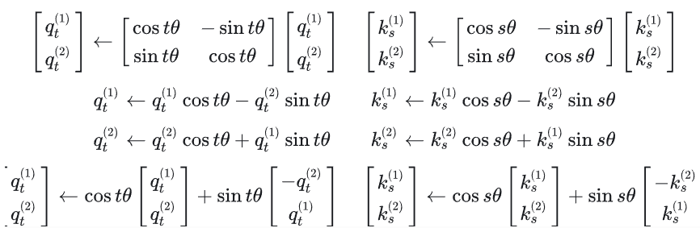
</div> 

可得，其本质就是: $q_{t}$, $k_{s}$ 旋转后的结果，就是 $q_{t}$, $k_{s}$乘上cos再加上 $q_{t}$, $k_{s}$翻转维度并取反一维后乘上sin。
- 对于高纬向量，由于奇、复数维度两两交错实现较为复杂，则现在可简化为将特征维度一切二，如下图所示，在实现过程中对前后各半进行的操作即为rotate_half操作： 
<div align=center>
    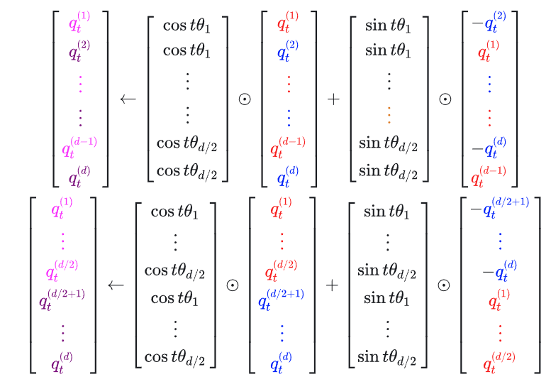
</div> 


代码实现：  
先定义旋转角度
```python
class Qwen2RotaryEmbedding(nn.Module):
    def __init__(self, dim, max_position_embeddings=2048, base=10000, device=None):
        super().__init__()
        # 定义初始值
        self.dim = dim
        self.max_position_embeddings = max_position_embeddings
        self.base = base
        # 定义旋转角
        inv_freq = 1.0 / (self.base ** (torch.arange(0, self.dim, 2, dtype=torch.int64).float().to(device) / self.dim))
        self.register_buffer("inv_freq", inv_freq, persistent=False)

        # Build here to make `torch.jit.trace` work.
        self._set_cos_sin_cache(
            seq_len=max_position_embeddings, device=self.inv_freq.device, dtype=torch.get_default_dtype()
        )
    # 为seq里面的每个token形成独一无二的旋转角嵌入(外积)
    def _set_cos_sin_cache(self, seq_len, device, dtype):
        self.max_seq_len_cached = seq_len
        t = torch.arange(self.max_seq_len_cached, device=device, dtype=torch.int64).type_as(self.inv_freq)

        freqs = torch.outer(t, self.inv_freq)
        # 生成角度信息(利用注册机制生成self.cos_cached与sin_cached
        emb = torch.cat((freqs, freqs), dim=-1)
        self.register_buffer("cos_cached", emb.cos().to(dtype), persistent=False)
        self.register_buffer("sin_cached", emb.sin().to(dtype), persistent=False)

    def forward(self, x, seq_len=None):
        # x: [bs, num_attention_heads, seq_len, head_size]
        if seq_len > self.max_seq_len_cached:
            self._set_cos_sin_cache(seq_len=seq_len, device=x.device, dtype=x.dtype)

        return (
            self.cos_cached[:seq_len].to(dtype=x.dtype),
            self.sin_cached[:seq_len].to(dtype=x.dtype),
        )
```
首先要先生成角度:
$$
\theta = \left(\frac{1}{10000^{2n/d}}\right)
$$

其中，n表示维度数，其取值范围为[0, 1, ..., d/2-1]  
<div align=center>
    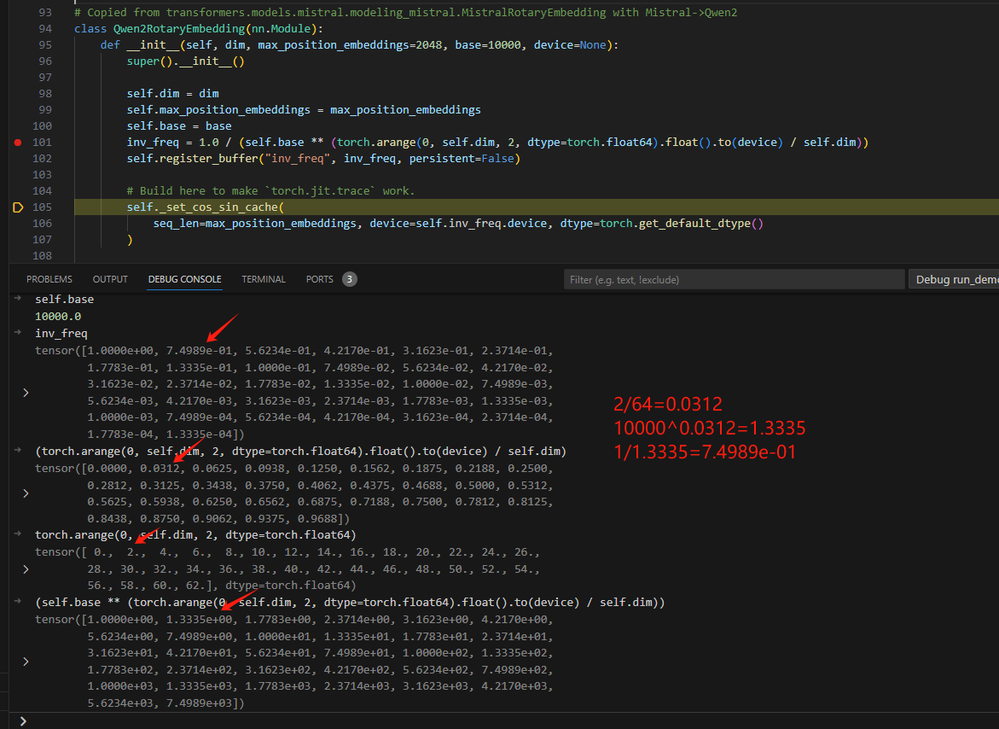
</div> 

然后将上述生成角度与每一个位置乘积，区分一个seq中各个词：其实等价于:
$$\theta = \left(\frac{i}{10000^{2n/d}}\right)$$  
其中: `i`为行数。  
<div align=center>
    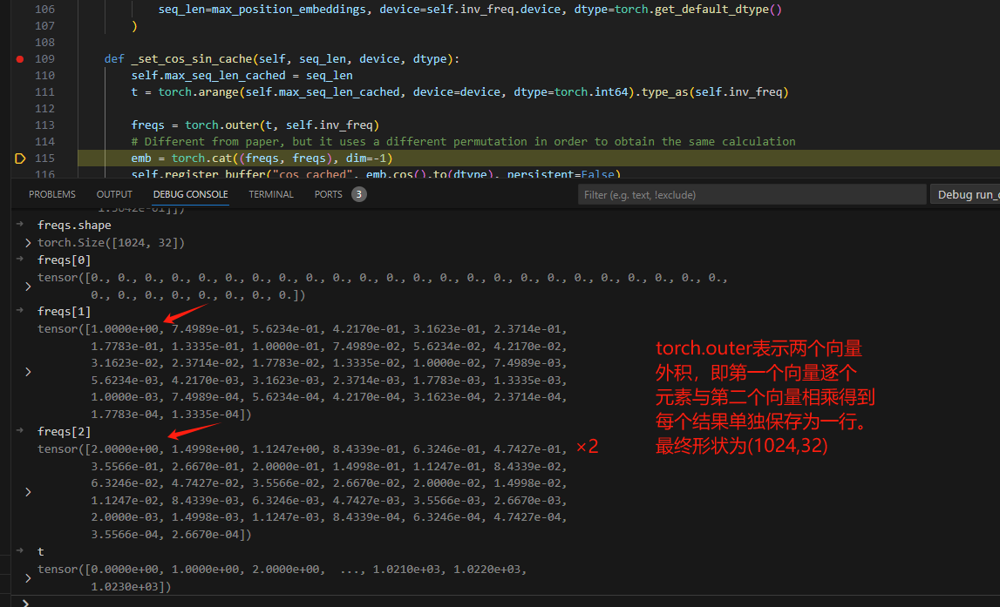
</div> 

emb将二者cat起来，得到dim维度，每dim/2一循环：  
<div align=center>
    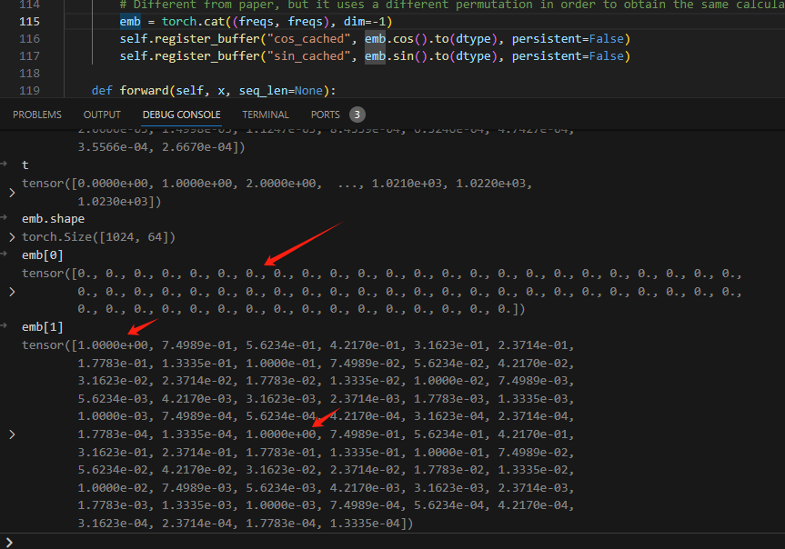
</div> 

然后，在取出位置编码信息`cos`与`sin`的时候，就是将`seq`的部分切出来，原先设置的1024是最大`pos`编码，每次用的时候只取当下`seq_len`的即可.之前求得外积，是为了保证`seq`里面得每一个词都能有不同的1024个位置编码。
<div align=center>
    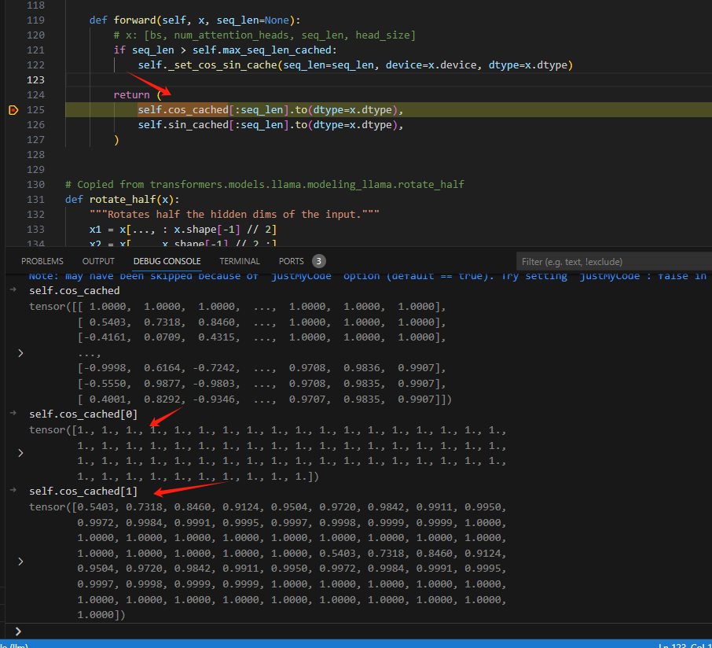
</div> 

进行旋转嵌入:  
```python
# 后半部分和前半部分进行了交换，并且将后半部分的符号取反。
def rotate_half(x):
    """Rotates half the hidden dims of the input."""
    x1 = x[..., : x.shape[-1] // 2]
    x2 = x[..., x.shape[-1] // 2 :]
    return torch.cat((-x2, x1), dim=-1)

def apply_rotary_pos_emb(q, k, cos, sin, position_ids, unsqueeze_dim=1):
    """Applies Rotary Position Embedding to the query and key tensors.

    query and key tensors rotated using the Rotary Position Embedding.
    """
    cos = cos[position_ids].unsqueeze(unsqueeze_dim)
    sin = sin[position_ids].unsqueeze(unsqueeze_dim)
    q_embed = (q * cos) + (rotate_half(q) * sin)
    k_embed = (k * cos) + (rotate_half(k) * sin)
    return q_embed, k_embed
```
对应公式：  
<div align=center>
    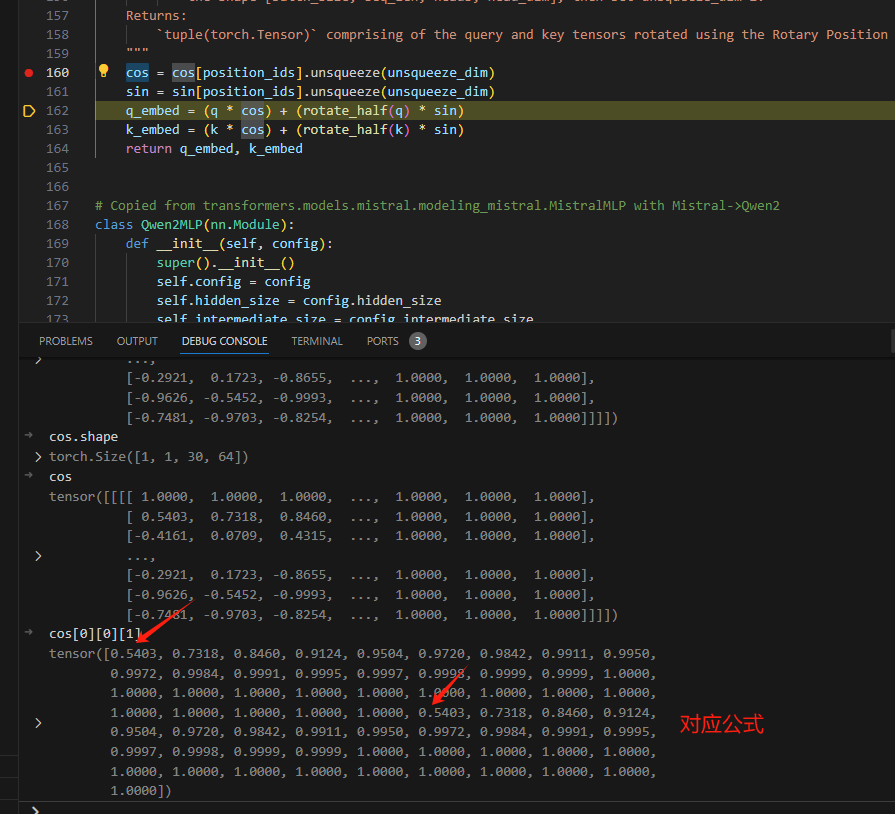
</div> 

其中，下标t则表示位于同一行，也就是同一`seq_len`，对于相邻的两个元素，

#### 1.3.3.3 读取顺序attention_mask
第一步的时候只能看到自己，第二步只能看到0、1...其余的都是负无穷。 
<div align=center>
    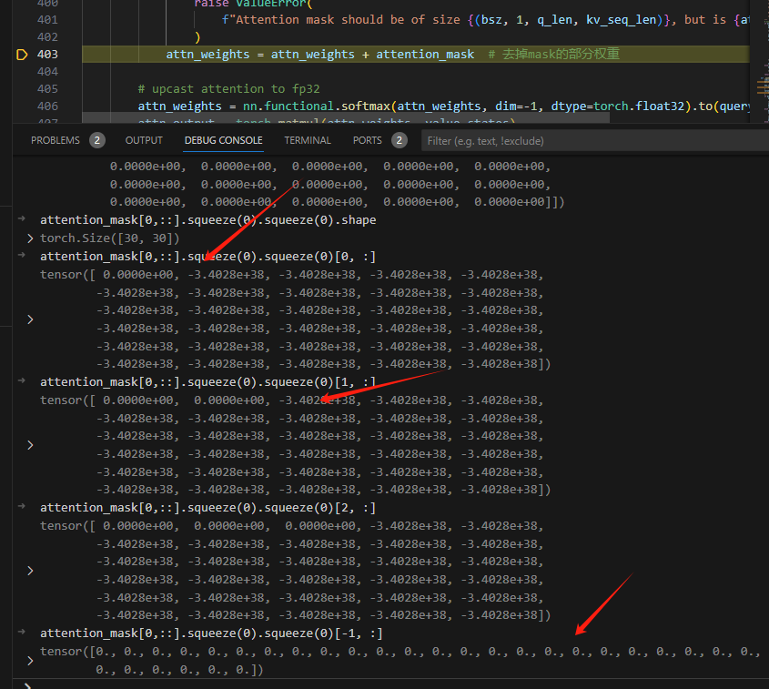
</div> 

经过softmax，对应负无穷的位置权重为0，从而实现只能从左往右。
<div align=center>
    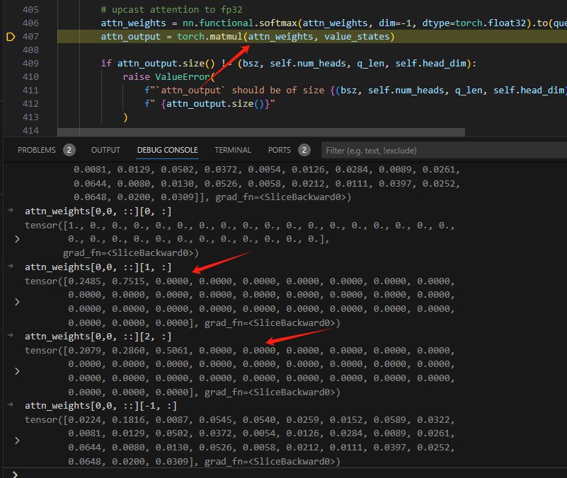
</div> 

- `attn`形状为(bs,heads,T,T),`values`的形状为(bs,heads,T,hd),最终落实到[30,30]×[30,128]上，30表示一句话的步长，也就是总词数。
- `value`里面每一个词有128个维度来描述，对于第一个词，由于`attn`为下三角，所以每一个维度都只有第一个非零元素1进行相乘，其他的都是×0。
- 对于第二行，则是前两个有不同的权值，让`value`的128个维度分别依据这两个的权重，在128个维度上根据前两行，计算得出`output`的第二个词(第二步或者第二行)的128个维度....
- 第n步则对应有n个权重，用来描述从1到n个步之间的各个关系，进而计算出各个维度。
<div align=center>
    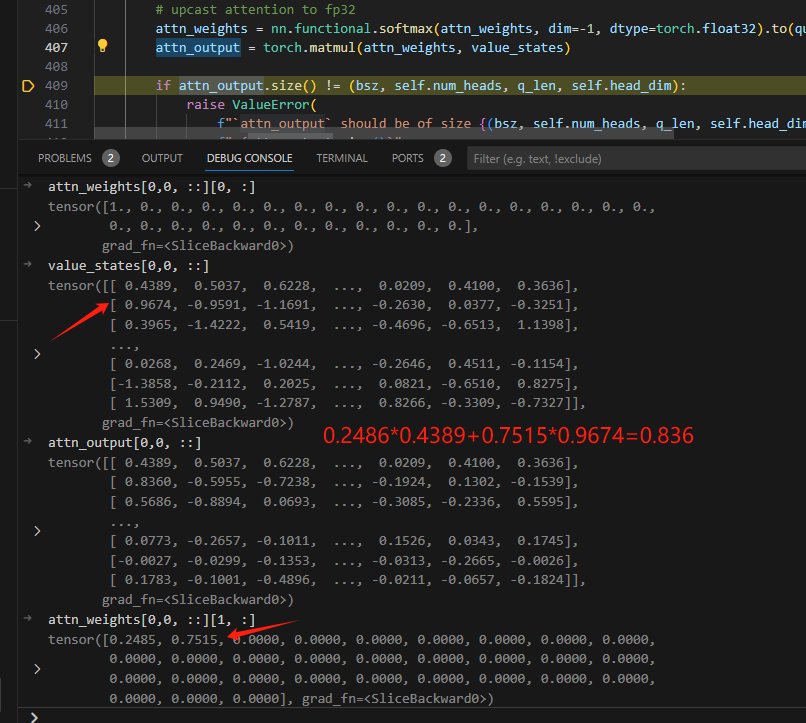
</div>

## 1.4 Qwen2 MLP

<div align=center>
    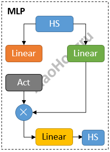
</div>

输入`hidden_state`并行送入两个`Linear`层，其中一个激活一下，再与另一个相乘，最终再经过一个`Linear`，输出最终结果。
```python
class Qwen2MLP(nn.Module):
    def __init__(self, config):
        super().__init__()
        # 这俩不必多说
        self.config = config
        self.hidden_size = config.hidden_size
        self.intermediate_size = config.intermediate_size

        # 三个全连接层
        self.gate_proj = nn.Linear(self.hidden_size, self.intermediate_size, bias=False)
        self.up_proj = nn.Linear(self.hidden_size, self.intermediate_size, bias=False)
        self.down_proj = nn.Linear(self.intermediate_size, self.hidden_size, bias=False)
        self.act_fn = ACT2FN[config.hidden_act]

    def forward(self, x):
        down_proj = self.down_proj(self.act_fn(self.gate_proj(x)) * self.up_proj(x))
        return down_proj
```
## 1.5 Qwen2RMSNorm
计算公式:

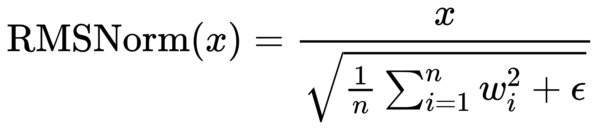

其中:
- $x$是层的输入的`hidden_state`
- $w_i$ 表示的是`hidden_state`的最后一个维度的值
- $n$ 表示上面输入的最后一个维度的数量。
- $\epsilon$ 表示是很小的数，防止除0。

```python
class Qwen2RMSNorm(nn.Module):  # 标准化层
    def __init__(self, hidden_size, eps=1e-6):
        """
        Qwen2RMSNorm is equivalent to T5LayerNorm
        """
        super().__init__()
        self.weight = nn.Parameter(torch.ones(hidden_size))
        self.variance_epsilon = eps

    def forward(self, hidden_states):
        input_dtype = hidden_states.dtype
        hidden_states = hidden_states.to(torch.float32)
        variance = hidden_states.pow(2).mean(-1, keepdim=True)
        hidden_states = hidden_states * torch.rsqrt(variance + self.variance_epsilon)
        return self.weight * hidden_states.to(input_dtype)
```
- `torch.rsqrt`表示输入的东西开根的导数。
- `.pow(2).mean(-1, keepdim=True)`表示对最后一个维度平方并取均值。
