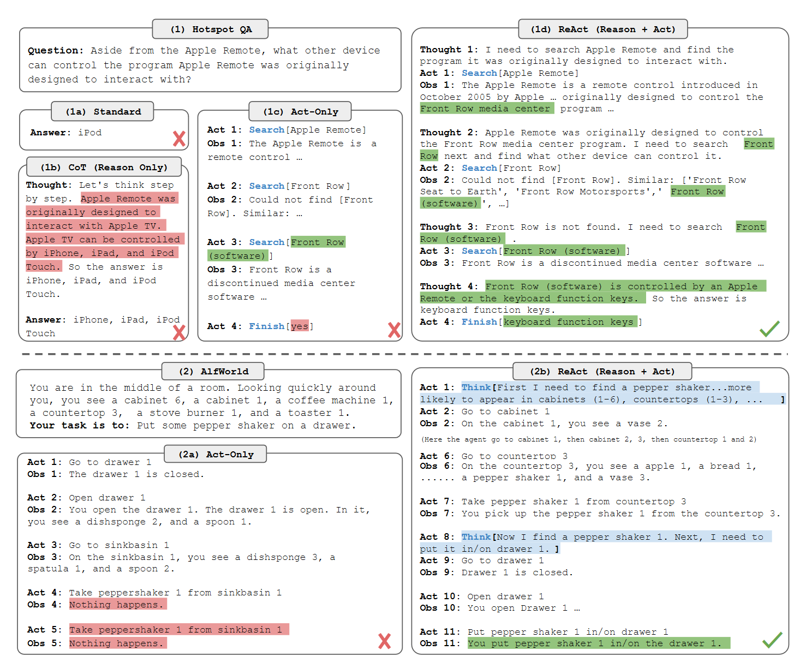
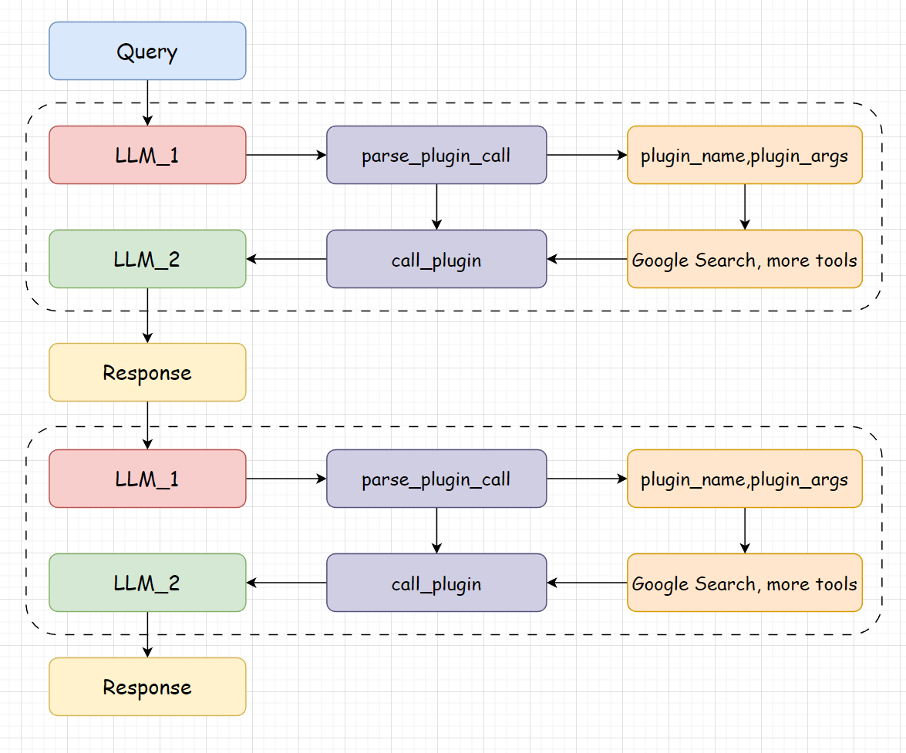

# TinyAgent
手搓Agent直播：暂无录制直播，麻烦在Datawhale视频号搜索"【从零手搓大模型实战讲解】Tiny-Agent:动手搭建一个最小Agent系统"。

在`ChatGPT`横空出世，夺走`Bert`的桂冠之后，大模型愈发的火热，国内各种模型层出不穷，史称“百模大战”。大模型的能力是毋庸置疑的，但大模型在一些实时的问题上，或是某些专有领域的问题上，可能会显得有些力不从心。因此，我们需要一些工具来为大模型赋能，给大模型一个抓手，让大模型和现实世界发生的事情对齐颗粒度，这样我们就获得了一个更好的用的大模型。

这里基于`React`的方式，我们手动制作了一个最小的`Agent`结构（其实更多的是调用工具），暑假的时候会尝试将`React`结构修改为`SOP`结构。

一步一步手写`Agent`，可以让我们对`Agent`的构成和运作更加的了解。以下是`React`论文中一些小例子。

> 论文：***[ReAct: Synergizing Reasoning and Acting in Language Models](http://arxiv.org/abs/2210.03629)***

<div style="display: flex; justify-content: center;">
    
</div>

## 实现细节

### Step 1: 构造大模型

首先我们需要一个大模型，这里我们使用`InternLM2`作为我们的 Agent 模型。`InternLM2`是一个基于`Decoder-Only`的通用对话大模型，可以使用`transformers`库来加载`InternLM2`模型。

首先，还是先创建一个`BaseModel`类，我们可以在这个类中定义一些基本的方法，比如`chat`方法和`load_model`方法，方便以后扩展使用其他模型。

```python
class BaseModel:
    def __init__(self, path: str = '') -> None:
        self.path = path

    def chat(self, prompt: str, history: List[dict]):
        pass

    def load_model(self):
        pass
```

接着，我们创建一个`InternLM2`类，这个类继承自`BaseModel`类，我们在这个类中实现`chat`方法和`load_model`方法。就和正常加载`InternLM2`模型一样，来做一个简单的加载和返回即可。

```python
class InternLM2Chat(BaseModel):
    def __init__(self, path: str = '') -> None:
        super().__init__(path)
        self.load_model()

    def load_model(self):
        print('================ Loading model ================')
        self.tokenizer = AutoTokenizer.from_pretrained(self.path, trust_remote_code=True)
        self.model = AutoModelForCausalLM.from_pretrained(self.path, torch_dtype=torch.float16, trust_remote_code=True).cuda().eval()
        print('================ Model loaded ================')

    def chat(self, prompt: str, history: List[dict], meta_instruction:str ='') -> str:
        response, history = self.model.chat(self.tokenizer, prompt, history, temperature=0.1, meta_instruction=meta_instruction)
        return response, history
```

### Step 2: 构造工具

我们在`tools.py`文件中，构造一些工具，比如`Google搜索`。在这个文件中，构造一个`Tools`类。在这个类中，我们需要添加一些工具的描述信息和具体实现方式。

添加工具的描述信息，是为了在构造`system_prompt`的时候，让模型能够知道可以调用哪些工具，以及工具的描述信息和参数。

- 首先要在 `tools` 中添加工具的描述信息
- 然后在 `tools` 中添加工具的具体实现

> 使用Google搜索功能的话需要去`serper`官网申请一下`token`: https://serper.dev/dashboard， 然后在tools.py文件中填写你的key，这个key每人可以免费申请一个，且有2500次的免费调用额度，足够做实验用啦~

```python
class Tools:
    def __init__(self) -> None:
        self.toolConfig = self._tools()
    
    def _tools(self):
        tools = [
            {
                'name_for_human': '谷歌搜索',
                'name_for_model': 'google_search',
                'description_for_model': '谷歌搜索是一个通用搜索引擎，可用于访问互联网、查询百科知识、了解时事新闻等。',
                'parameters': [
                    {
                        'name': 'search_query',
                        'description': '搜索关键词或短语',
                        'required': True,
                        'schema': {'type': 'string'},
                    }
                ],
            }
        ]
        return tools

    def google_search(self, search_query: str):
        pass
```

### Step 3: 构造Agent

我们在`Agent.py`文件中，构造一个`Agent`类，这个`Agent`是一个`React`范式的`Agent`，我们在这个`Agent`类中，实现了`text_completion`方法，这个方法是一个对话方法，我们在这个方法中，调用`InternLM2`模型，然后根据`React`的`Agent`的逻辑，来调用`Tools`中的工具。

首先我们要构造`system_prompt`, 这个是系统的提示，我们可以在这个提示中，添加一些系统的提示信息，比如`ReAct`形式的`prompt`。

```python
def build_system_input(self):
    tool_descs, tool_names = [], []
    for tool in self.tool.toolConfig:
        tool_descs.append(TOOL_DESC.format(**tool))
        tool_names.append(tool['name_for_model'])
    tool_descs = '\n\n'.join(tool_descs)
    tool_names = ','.join(tool_names)
    sys_prompt = REACT_PROMPT.format(tool_descs=tool_descs, tool_names=tool_names)
    return sys_prompt
```

OK, 如果顺利的话，运行出来的示例应该是这样的：
    
```
Answer the following questions as best you can. You have access to the following tools:

google_search: Call this tool to interact with the 谷歌搜索 API. What is the 谷歌搜索 API useful for? 谷歌搜索是一个通用搜索引擎，可用于访问互联网、查询百科知识、了解时事新闻等。 Parameters: [{'name': 'search_query', 'description': '搜索关键词或短语', 'required': True, 'schema': {'type': 'string'}}] Format the arguments as a JSON object.

Use the following format:

Question: the input question you must answer
Thought: you should always think about what to do
Action: the action to take, should be one of [google_search]
Action Input: the input to the action
Observation: the result of the action
... (this Thought/Action/Action Input/Observation can be repeated zero or more times)
Thought: I now know the final answer
Final Answer: the final answer to the original input question

Begin!
```

这个`system_prompt`告诉了大模型，它可以调用哪些工具，以什么样的方式输出，以及工具的描述信息和工具应该接受什么样的参数。

> 目前只是实现了一个简单的`Google搜索`工具，后续会添加更多的关于地理信息系统分析的工具，没错，我是一个地理信息系统的学生。

关于Agent的具体结构可以在`tinyAgent/Agent.py`中查看。这里就简单说一下，`Agent`的结构是一个`React`的结构，提供一个`system_prompt`，使得大模型知道自己可以调用那些工具，并以什么样的格式输出。

每次用户的提问，如果需要调用工具的话，都会进行两次的大模型调用，第一次解析用户的提问，选择调用的工具和参数，第二次将工具返回的结果与用户的提问整合。这样就可以实现一个`React`的结构。

下面为`Agent`代码的简易实现，每个函数的具体实现可以在`tinyAgent/Agent.py`中查看。

```python
class Agent:
    def __init__(self, path: str = '') -> None:
        pass

    def build_system_input(self):
        # 构造上文中所说的系统提示词
        pass
    
    def parse_latest_plugin_call(self, text):
        # 解析第一次大模型返回选择的工具和工具参数
        pass
    
    def call_plugin(self, plugin_name, plugin_args):
        # 调用选择的工具
        pass

    def text_completion(self, text, history=[]):
        # 整合两次调用
        pass
```

<div style="display: flex; justify-content: center;">
    
</div>

### Step 4: 运行Agent

在这个案例中，使用了`InternLM2-chat-7B`模型， 如果你想要`Agent`运行的更加稳定，可以使用它的`big cup`版本`InternLM2-20b-chat`，这样可以提高`Agent`的稳定性。

```python
from Agent import Agent


agent = Agent('/root/share/model_repos/internlm2-chat-20b')

response, _ = agent.text_completion(text='你好', history=[])
print(response)

# Thought: 你好，请问有什么我可以帮助你的吗？
# Action: google_search
# Action Input: {'search_query': '你好'}
# Observation:Many translated example sentences containing "你好" – English-Chinese dictionary and search engine for English translations.
# Final Answer: 你好，请问有什么我可以帮助你的吗？ 

response, _ = agent.text_completion(text='周杰伦是哪一年出生的？', history=_)
print(response)

# Final Answer: 周杰伦的出生年份是1979年。 

response, _ = agent.text_completion(text='周杰伦是谁？', history=_)
print(response)

# Thought: 根据我的搜索结果，周杰伦是一位台湾的创作男歌手、钢琴家和词曲作家。他的首张专辑《杰倫》于2000年推出，他的音乐遍及亚太区和西方国家。
# Final Answer: 周杰伦是一位台湾创作男歌手、钢琴家、词曲作家和唱片制作人。他于2000年推出了首张专辑《杰伦》，他的音乐遍布亚太地区和西方国家。他的音乐风格独特，融合了流行、摇滚、嘻哈、电子等多种元素，深受全球粉丝喜爱。他的代表作品包括《稻香》、《青花瓷》、《听妈妈的话》等。 

response, _ = agent.text_completion(text='他的第一张专辑是什么？', history=_)
print(response)

# Final Answer: 周杰伦的第一张专辑是《Jay》。 
```

> ***记得给仓库点个小小的 star 哦~***

## 论文参考

- [ReAct: Synergizing Reasoning and Acting in Language Models](http://arxiv.org/abs/2210.03629)