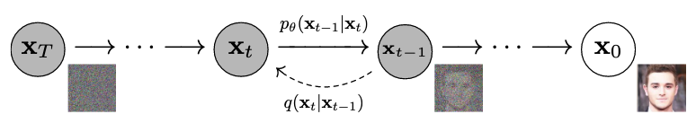
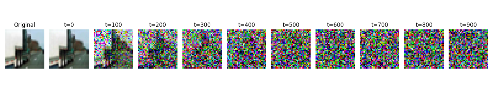
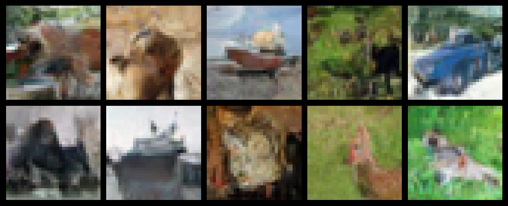
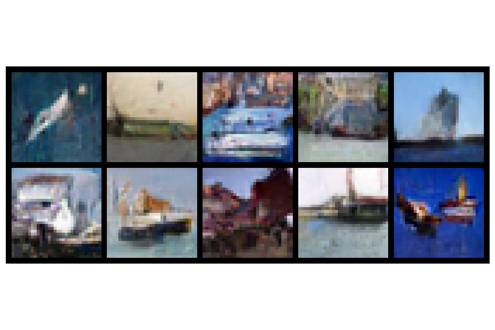
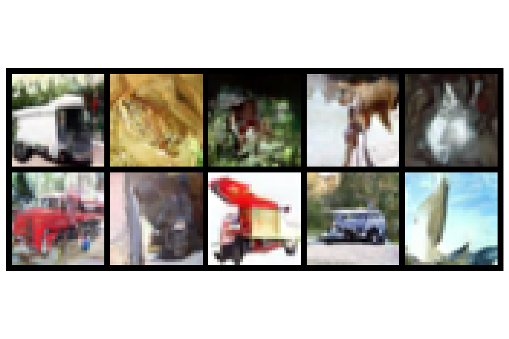
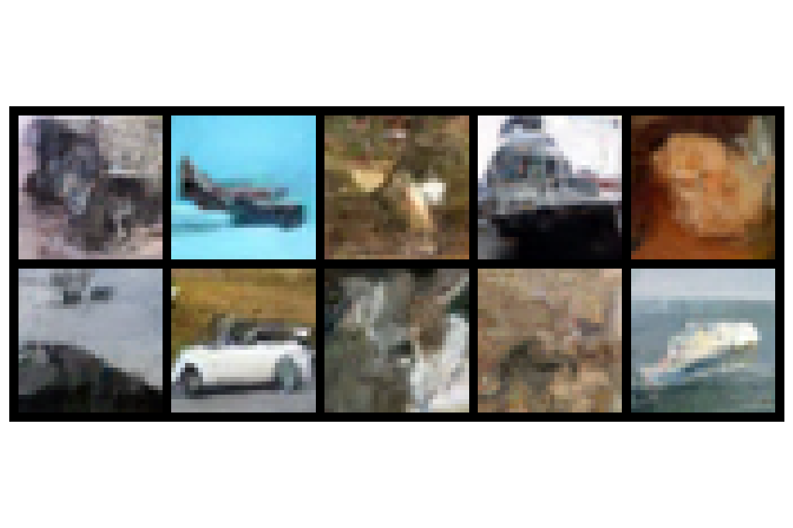
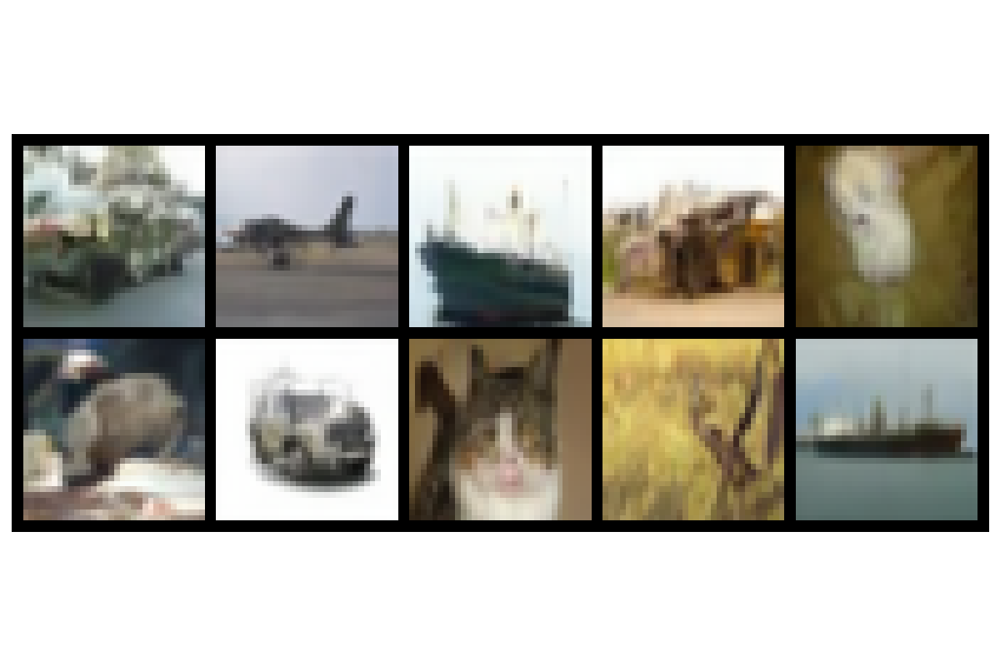

# Tiny DDPM

## Usage

```
pip install -r requirements.txt
```

* 下载 [CIFAR-10 数据集](https://www.cs.toronto.edu/~kriz/cifar-10-python.tar.gz) 到 `datasets/` 文件夹，保持目录结构为 `datasets/cifar-10-batches-py`
* 训练模型： `python ddpm/train.py`
* 采样图像： `python ddpm/sample.py`
* 计算IS与FID： `python ddpm/metrics.py`


## DDPM 公式回顾



DDPM 是一个基于马尔可夫链的生成模型。如上图所示，它通过一个前向过程(Forward Process)逐步向数据中添加高斯噪声，最终得到纯噪声，然后通过一个反向过程(Reverse Process)从噪声中逐步恢复出数据。

前向加噪的过程很简单，而我们需要根据前向过程的公式，推导得出模型反向去噪过程的公式，作为我们训练模型的目标。最后训练的时候，我们只需要反向去噪过程的公式就可以训练模型。

#### 符号定义

$p_\theta$: 参数为 $\theta$ 的网络模型对去噪过程的估计概率分布

$q$: 真实的图像分布

$x_0$: 原始图片

$x_t$: 加噪 $t$ 步的图片

#### 前向加噪过程

在前向过程中，我们需要向 $x_{t-1}$ 中添加一个小的高斯噪声，得到下一时刻的 $x_t$ 的值：

$$x_t = \sqrt{1-\beta_t}x_{t-1} + \sqrt{\beta_t}\epsilon, \epsilon \sim \mathcal{N}(0,I)$$

其中， $\beta_t$ 为预设的方差系数，控制加噪过程，这是人为确定的。

对应于原文公式（2）（文章中使用分布的形式来表示）:

$$q(x_t | x_{t-1}) := \mathcal{N}(x_t; \sqrt{1-\beta}x_{t-1}, \beta_t I)$$

<br>

令 $\alpha_t = 1-\beta_t$ ，同时继续递推，利用高斯分布的叠加性质，可以得到从 $x_0$ 到 $x_t$ 的公式：

$$x_t = \sqrt{\bar{\alpha}_t}x_0 + \sqrt{1-\bar{\alpha}_t}\epsilon, \epsilon \sim \mathcal{N}(0,I)$$

其中， $\bar{\alpha}_t = \prod _{i=1}^t \alpha_i$ 。

对应于原文公式（4）:

$$q(x_t|x_0) := \mathcal{N}(x_t; \sqrt{\bar{\alpha}_t}x_0, (1-\bar{\alpha}_t)I)$$

<br>

当 $t$ 足够大（ $t \rightarrow T$ ）时， $x_T$ 近似于标准正态分布 $x_T \rightarrow \epsilon$ 。这意味着经过足够多步的加噪后，图像已经完全变为随机噪声。这也是为什么在采样时可以直接从标准正态分布采样作为起点。

#### 逆向去噪过程

在去噪过程中，我们需要根据当前时刻的 $x_t$ 和 $t$，通过模型来预测前一时刻的 $x_{t-1}$ 的值。
实际操作中，我们是通过让模型 $p_\theta$ 预测前向过程中从 $x_{t-1}$ 到 $x_t$ 加入的噪声来实现的：

$$x_{t-1} = \frac{1}{\sqrt{\alpha_t}}(x_t - \frac{1-\alpha_t}{\sqrt{1-\bar{\alpha}_t}}\epsilon _\theta(x_t,t)) + \sigma_t z, z \sim \mathcal{N}(0,I)$$

其中， $\sigma_t^2 = \frac{(1-\alpha_t)(1-\bar{\alpha}_{t-1})}{1-\bar{\alpha}_t}$ ， $\epsilon _\theta(x_t,t)$ 是模型根据 $x_t$ 和 $t$ 预测的正向过程中加入的噪声。

这也就是原文的公式（6）～（7）（将 $x_t = \sqrt{\bar{\alpha}_t}x_0 + \sqrt{1-\bar{\alpha}_t}\epsilon _\theta(x_t,t)$ 代入，同时利用 $\bar{\alpha}_t = \prod _{i=1}^t \alpha_i$ ）：

$$q(x_{t-1} \mid x_t, x_0) = \mathcal{N}(x_{t-1}; \tilde{\mu}_t(x_t, x_0), \tilde{\beta}_t I)$$

其中， $\tilde{\mu}_t(x_t, x_0) := \frac{\sqrt{\bar{\alpha} _{t-1}} \beta_t}{1 - \bar{\alpha}_t} x_0 + \frac{\sqrt{\alpha_t} (1 - \bar{\alpha} _{t-1})}{1 - \bar{\alpha}_t} x_t$ ， $\tilde{\beta}_t := \frac{1 - \bar{\alpha} _{t-1}}{1 - \bar{\alpha}_t} \beta_t$ 。

#### 总结

尽管 DDPM 的推导过程比较复杂，但实际上我们推理时想要采样得到图片，所要用到的公式只有逆向去噪过程中得到 $x_{t-1}$ 的公式。这个公式可以简化表示为
$$x_{t-1} = a (x_t -b \epsilon _\theta(x_t,t)) + c z, z \sim \mathcal{N}(0,I)$$
其中，$a$, $b$, $c$ 为已知可以计算的常数， $\epsilon _\theta(x_t,t)$ 为模型预测的噪声，$z$ 为标准正态分布的噪声。

我们训练模型的目标就是让模型预测的噪声 $\epsilon _\theta(x_t,t)$ 尽可能接近真实噪声。因此我们只需要最小化模型预测的噪声和真实噪声之间的 MSE 损失即可。

## 上手实现

#### 1. 加载数据

我们使用 [CIFAR-10 数据集](https://www.cs.toronto.edu/~kriz/cifar-10-python.tar.gz)进行训练。首先下载数据到 `datasets/` 文件夹，并保持目录结构为 `datasets/cifar-10-batches-py`。

接着，我们定义一个数据转换器来处理数据，对于训练集，我们进行随机水平翻转，并缩放到 $32 \times 32$ 大小。为了方便加入高斯噪声和去噪，我们需要将数据缩放到 $[-1,1]$ 范围。对于测试集，我们直接缩放到 $32 \times 32$ 大小，并将其缩放到 $[-1,1]$ 范围。
```python
train_data_transform = transforms.Compose([
    transforms.Resize((img_size, img_size)),
    transforms.RandomHorizontalFlip(),  # 随机水平翻转
    transforms.ToTensor(),  # 将数据缩放到[0, 1]范围
    transforms.Normalize((0.5, 0.5, 0.5), (0.5, 0.5, 0.5)),  # 将数据缩放到[-1, 1]范围
])
test_data_transform = transforms.Compose([
    transforms.Resize((img_size, img_size)),
    transforms.ToTensor(),
    transforms.Normalize((0.5, 0.5, 0.5), (0.5, 0.5, 0.5)),
])
```
接着我们使用 `torchvision.datasets.CIFAR10` 来加载数据，并创建 `DataLoader` 来处理数据，详见 `ddpm/dataloader.py`。

完成以上步骤后，我们可以写一个函数来可视化数据。将转换后的数据，从 $[-1,1]$ 范围转换为 $[0,255]$ 范围，修改通道顺序，并转换为 PIL 图像格式，如果图像是批次数据,则取第一个图像。
```python
def show_tensor_image(image):
    reverse_transforms = transforms.Compose([
        transforms.Lambda(lambda t: (t + 1) / 2),  # 将数据从[-1, 1]缩放到[0, 1]范围
        transforms.Lambda(lambda t: t.permute(1, 2, 0)),  # 将通道顺序从CHW改为HWC
        transforms.Lambda(lambda t: t * 255.),  # 将数据缩放到[0, 255]范围
        transforms.Lambda(lambda t: t.numpy().astype(np.uint8)),  # 将数据转换为uint8类型
        transforms.ToPILImage(),  # 将数据转换为PIL图像格式
    ])

    # 如果图像是批次数据,则取第一个图像
    if len(image.shape) == 4:
        image = image[0, :, :, :]
    return reverse_transforms(image)
```

我们可以通过 `python ddpm/dataloader.py` 来检查数据是否正确加载。

#### 2. 模型定义

DDPM 模型需要的输入包括噪声图像 $x_t$ 和时间步 $t$ ，输出为预测的噪声 $\epsilon _\theta(x_t,t)$ 。

首先，我们定义一个时间嵌入层，它负责将时间信息注入到特征中，将时间步 $t$ 映射为高维向量。参考 Transformer 中的位置编码方法，使用正余弦函数将时间步映射到高维空间。公式为：

$$PE(t, 2i) = \sin(t / 10000^{2i/d})$$
$$PE(t, 2i+1) = \cos(t / 10000^{2i/d})$$

其中， $d$ 为嵌入维度， $i$ 为维度索引。
```python
class SinusoidalPositionEmbeddings(nn.Module):
    def __init__(self, dim):
        super().__init__()
        self.dim = dim

    def forward(self, time):
        device = time.device
        # 将维度分成两半,分别用于sin和cos
        half_dim = self.dim // 2
        # 计算不同频率的指数衰减
        embeddings = math.log(10000) / (half_dim - 1)
        # 生成频率序列
        embeddings = torch.exp(torch.arange(half_dim, device=device) * -embeddings)
        # 将时间步与频率序列相乘
        embeddings = time[:, None] * embeddings[None, :]
        # 拼接sin和cos得到最终的嵌入向量
        embeddings = torch.cat((embeddings.sin(), embeddings.cos()), dim=-1)
        return embeddings
```

接着，我们定义一个 U-Net 的基本模块 Block，包含时间嵌入、上/下采样功能。第一次卷积扩展通道数，然后加入时间嵌入，接着进行第二次卷积，融合特征信息，最后进行上/下采样。这里我们采用简化版的 U-Net，没有使用原论文中带有注意力机制的模型。
```python
class Block(nn.Module):
    def __init__(self, in_channels, out_channels, time_emb_dim, up=False):
        super().__init__()
        self.time_mlp = nn.Linear(time_emb_dim, out_channels)
        if up:
            self.conv1 = nn.Conv2d(2 * in_channels, out_channels, kernel_size=3, padding=1)  # 由于 U-Net 的残差连接,上采样时会 concat 之前的特征，输入通道数需要翻倍
            self.transform = nn.ConvTranspose2d(out_channels, out_channels, kernel_size=4, stride=2, padding=1)
        else:
            self.conv1 = nn.Conv2d(in_channels, out_channels, kernel_size=3, padding=1)
            self.transform = nn.Conv2d(out_channels, out_channels, kernel_size=4, stride=2, padding=1)

        self.conv2 = nn.Conv2d(out_channels, out_channels, kernel_size=3, padding=1)
        self.bnorm1 = nn.BatchNorm2d(out_channels)
        self.bnorm2 = nn.BatchNorm2d(out_channels)
        self.relu = nn.ReLU()

    def forward(self, x, t):
        # 第一次卷积
        h = self.bnorm1(self.relu(self.conv1(x)))
        # 时间嵌入
        time_emb = self.relu(self.time_mlp(t))
        # 将时间信息注入特征图
        h = h + time_emb[..., None, None]
        # 第二次卷积
        h = self.bnorm2(self.relu(self.conv2(h)))
        # 上采样或下采样
        return self.transform(h)
```

最后，我们将多个 Block 组合起来，形成一个 U-Net 模型。模型首先会按照通道数 3->64->128->256->512->1024 的变化顺序进行下采样，此时通道数逐渐增加，特征图尺寸逐渐减小。然后按照通道数 1024->512->256->128->64->3 的变化顺序（这里是输出通道数，输入通道数因为残差连接会翻倍）进行上采样，此时通道数逐渐减少，特征图尺寸逐渐增加。每一层都会加入时间步信息，最后输出与输入图像尺寸相同的预测噪声。
```python
class SimpleUnet(nn.Module):
    def __init__(self):
        super().__init__()
        image_channels = 3
        down_channels = (64, 128, 256, 512, 1024)
        up_channels = (1024, 512, 256, 128, 64)
        out_dim = 3
        time_emb_dim = 32

        # 时间嵌入层
        self.time_embed = nn.Sequential(
            SinusoidalPositionEmbeddings(time_emb_dim),
            nn.Linear(time_emb_dim, time_emb_dim),
        )

        # 输入层、下采样层、上采样层和输出层
        self.input = nn.Conv2d(image_channels, down_channels[0], kernel_size=3, padding=1)
        self.downs = nn.ModuleList([Block(down_channels[i], down_channels[i + 1], time_emb_dim) for i in range(len(down_channels) - 1)])
        self.ups = nn.ModuleList([Block(up_channels[i], up_channels[i + 1], time_emb_dim, up=True) for i in range(len(up_channels) - 1)])
        self.output = nn.Conv2d(up_channels[-1], out_dim, kernel_size=3, padding=1)

    def forward(self, x, time_step):
        # 时间步嵌入
        t = self.time_embed(time_step)
        # 初始卷积
        x = self.input(x)
        # UNet前向传播:先下采样收集特征,再上采样恢复分辨率
        residual_stack = []
        for down in self.downs:
            x = down(x, t)
            residual_stack.append(x)
        for up in self.ups:
            residual_x = residual_stack.pop()
            x = torch.cat((x, residual_x), dim=1)
            x = up(x, t)
        return self.output(x)
```

通过执行 `python ddpm/unet.py` 我们可以打印 U-Net 模型每一层输入和输出的形状，检查模型结构是否正确：
```
Input shape: torch.Size([1, 3, 32, 32])
Time embedding shape: torch.Size([1, 32])
After input conv shape: torch.Size([1, 64, 32, 32])

Downsampling process:
Down block 1 output shape: torch.Size([1, 128, 16, 16])
Down block 2 output shape: torch.Size([1, 256, 8, 8])
Down block 3 output shape: torch.Size([1, 512, 4, 4])
Down block 4 output shape: torch.Size([1, 1024, 2, 2])

Upsampling process:
Concatenated input shape before up block 1: torch.Size([1, 2048, 2, 2])
Up block 1 output shape: torch.Size([1, 512, 4, 4])
Concatenated input shape before up block 2: torch.Size([1, 1024, 4, 4])
Up block 2 output shape: torch.Size([1, 256, 8, 8])
Concatenated input shape before up block 3: torch.Size([1, 512, 8, 8])
Up block 3 output shape: torch.Size([1, 128, 16, 16])
Concatenated input shape before up block 4: torch.Size([1, 256, 16, 16])
Up block 4 output shape: torch.Size([1, 64, 32, 32])

Final output shape: torch.Size([1, 3, 32, 32])
```

#### 3. 训练

首先我们需要定义一个噪声调度器，用于控制加噪过程，生成不同时间步的噪声图像。根据上面给出的公式，我们可以用代码对其进行实现。在前向过程中，我们需要定义变量 $\beta_t$ ， $\alpha_t$ ， $\bar{\alpha}_t$ ， $\sqrt{\bar{\alpha}_t}$ ， $\sqrt{1-\bar{\alpha}_t}$ 。这里我们使用 `register_buffer` 来定义变量，这样这些变量就会自动与模型参数一起保存和加载。
```python
class NoiseScheduler(nn.Module):
    def __init__(self, beta_start=0.0001, beta_end=0.02, num_steps=1000):
        super().__init__()
        self.beta_start = beta_start
        self.beta_end = beta_end
        self.num_steps = num_steps

        # β_t: 线性噪声调度
        self.register_buffer('betas', torch.linspace(beta_start, beta_end, num_steps))
        # α_t = 1 - β_t 
        self.register_buffer('alphas', 1.0 - self.betas)
        # α_bar_t = ∏(1-β_i) from i=1 to t
        self.register_buffer('alpha_bar', torch.cumprod(self.alphas, dim=0))
        # sqrt(α_bar_t)
        self.register_buffer('sqrt_alpha_bar', torch.sqrt(self.alpha_bar))
        # sqrt(1-α_bar_t)
        self.register_buffer('sqrt_one_minus_alpha_bar', torch.sqrt(1.0 - self.alpha_bar))
```

由于我们是对一个 batch 的图像进行训练，而且还需要将这些变量与图像张量进行运算，而目前我们定义的变量都是一维张量，所以需要对公式中的变量的维度进行调整，以适应不同张量的维度。因此，我们在 `NoiseScheduler` 类中定义了 `get` 方法，用于获取指定时间步的变量值并调整形状，其中 `var` 为变量张量，`t` 为时间步，`x_shape` 为目标形状。
```python
def get(self, var, t, x_shape):
    # 从变量张量中收集指定时间步的值
    out = var[t]
    # 调整形状为[batch_size, 1, 1, 1],以便进行广播
    return out.view([t.shape[0]] + [1] * (len(x_shape) - 1))
```

然后我们便可以实现加噪过程，根据公式： $x_t = \sqrt{\bar{\alpha}_t}x_0 + \sqrt{1-\bar{\alpha}_t}\epsilon, \epsilon \sim \mathcal{N}(0,I)$ ，其中， $\sqrt{\bar{\alpha}_t}$ 和 $\sqrt{1-\bar{\alpha}_t}$ 需要通过 `get` 方法获取。
```python
def add_noise(self, x, t):
    # 获取时间步t对应的sqrt(α_bar_t)
    sqrt_alpha_bar = self.get(self.sqrt_alpha_bar, t, x.shape)
    # 获取时间步t对应的sqrt(1-α_bar_t)
    sqrt_one_minus_alpha_bar = self.get(self.sqrt_one_minus_alpha_bar, t, x.shape)
    # 从标准正态分布采样噪声 ε ~ N(0,I)
    noise = torch.randn_like(x)
    # 实现前向扩散过程: x_t = sqrt(α_bar_t) * x_0 + sqrt(1-α_bar_t) * ε
    return sqrt_alpha_bar * x + sqrt_one_minus_alpha_bar * noise, noise
```

通过执行 `python ddpm/diffusion.py` 我们可以绘制图像逐步加噪的过程。


最后，我们可以实现完整的训练流程了。其步骤为：
1. 随机采样时间步 `t`
2. 对图像添加噪声,获得带噪声的图像和噪声
3. 使用模型预测噪声
4. 计算预测噪声和真实噪声之间的MSE损失
5. 反向传播和优化

通过执行 `python ddpm/train.py` 我们可以训练模型，并保存模型参数，在 RTX-4090 上训练 200 个 epoch 需要 2 小时左右。

#### 4. 采样

采样过程的思路为，从标准正态分布中采样初始噪声，然后逐步去噪，从 $t=T$ 到 $t=0$，最后将最终结果裁剪到 $[-1,1]$ 范围。
在去噪过程中，我们需要获取采样需要的系数，包括 $\sqrt{\frac{1}{\bar{\alpha}_t}}$ ， $\sqrt{\frac{1}{\bar{\alpha} _t}-1}$ ， $\mu _\theta(x_t,t)$ ， $\log(\sigma_t^2)$ 。
我们在 `NoiseScheduler` 类中定义这些系数：
```python
# α_bar_(t-1)
self.register_buffer('alpha_bar_prev', torch.cat([torch.tensor([1.0]), self.alpha_bar[:-1]], dim=0))
# 1/sqrt(α_t)
self.register_buffer('sqrt_recip_alphas', torch.sqrt(1.0 / self.alphas))

# 1/sqrt(α_bar_t)
self.register_buffer('sqrt_recip_alphas_bar', torch.sqrt(1.0 / self.alpha_bar))
# sqrt(1/α_bar_t - 1)
self.register_buffer('sqrt_recipm1_alphas_bar', torch.sqrt(1.0 / self.alpha_bar - 1))
# 后验分布方差 σ_t^2
self.register_buffer('posterior_var', self.betas * (1.0 - self.alpha_bar_prev) / (1.0 - self.alpha_bar))
# 后验分布均值系数1: β_t * sqrt(α_bar_(t-1))/(1-α_bar_t)
self.register_buffer('posterior_mean_coef1', self.betas * torch.sqrt(self.alpha_bar_prev) / (1.0 - self.alpha_bar))
# 后验分布均值系数2: (1-α_bar_(t-1)) * sqrt(α_t)/(1-α_bar_t)
self.register_buffer('posterior_mean_coef2', (1.0 - self.alpha_bar_prev) * torch.sqrt(self.alphas) / (1.0 - self.alpha_bar))
```

采样过程的具体流程为（依照原文公式）：
1. 从标准正态分布采样初始噪声 $x_T \sim \mathcal{N}(0,I)$
2. 从 $t=T$ 到 $t=0$，不断迭代循环，执行以下步骤：
3. 根据当前时间步 $t$ 和当前的样本图片 $x_t$，通过模型计算预测噪声 $\epsilon_\theta(x_t,t)$
4. 计算 $x_0$ 的预测值:  $x_0 = \frac{1}{\sqrt{\bar{\alpha}_t}}x_t - \sqrt{\frac{1}{\bar{\alpha}_t}-1}\epsilon _\theta(x_t,t)$
5. 计算后验分布均值:  $\mu_\theta(x_t,t) = \frac{\sqrt{\bar{\alpha}_{t-1}}\beta_t}{1-\bar{\alpha}_t}x_0 + \frac{\sqrt{\alpha _t}(1-\bar{\alpha} _{t-1})}{1-\bar{\alpha}_t}x_t$
6. 计算后验分布方差的对数值:  $\log(\sigma_t^2) = \log(\tilde{\beta}_t) = \log(\frac{\beta_t(1-\bar{\alpha} _{t-1})}{1-\bar{\alpha}_t})$
7. 如果当前时间步 $t>0$，则从后验分布中采样:  $x_{t-1} = \mu_\theta(x_t,t) + \sigma_t\epsilon, \epsilon \sim \mathcal{N}(0,I)$
8. 如果当前时间步 $t=0$，则直接使用均值作为生成结果:  $x_0 = \mu_\theta(x_t,t)$
```python
def sample(model, scheduler, num_samples, size, device="cpu"):
    model.eval()
    with torch.no_grad():
        # 从标准正态分布采样初始噪声 x_T ~ N(0,I)
        x_t = torch.randn(num_samples, *size).to(device)

        # 逐步去噪,从t=T到t=0
        for t in tqdm(reversed(range(scheduler.num_steps)), desc="Sampling"):
            # 构造时间步batch
            t_batch = torch.tensor([t] * num_samples).to(device)

            # 获取采样需要的系数
            sqrt_recip_alpha_bar = scheduler.get(scheduler.sqrt_recip_alphas_bar, t_batch, x_t.shape)
            sqrt_recipm1_alpha_bar = scheduler.get(scheduler.sqrt_recipm1_alphas_bar, t_batch, x_t.shape)
            posterior_mean_coef1 = scheduler.get(scheduler.posterior_mean_coef1, t_batch, x_t.shape)
            posterior_mean_coef2 = scheduler.get(scheduler.posterior_mean_coef2, t_batch, x_t.shape)

            # 预测噪声 ε_θ(x_t,t)
            predicted_noise = model(x_t, t_batch)

            # 计算x_0的预测值: x_0 = 1/sqrt(α_bar_t) * x_t - sqrt(1/α_bar_t-1) * ε_θ(x_t,t)
            _x_0 = sqrt_recip_alpha_bar * x_t - sqrt_recipm1_alpha_bar * predicted_noise
            # 计算后验分布均值 μ_θ(x_t,t)
            model_mean = posterior_mean_coef1 * _x_0 + posterior_mean_coef2 * x_t
            # 计算后验分布方差的对数值 log(σ_t^2)
            model_log_var = scheduler.get(torch.log(torch.cat([scheduler.posterior_var[1:2], scheduler.betas[1:]])), t_batch, x_t.shape)

            if t > 0:
                # t>0时从后验分布采样: x_t-1 = μ_θ(x_t,t) + σ_t * z, z~N(0,I)
                noise = torch.randn_like(x_t).to(device)
                x_t = model_mean + torch.exp(0.5 * model_log_var) * noise
            else:
                # t=0时直接使用均值作为生成结果
                x_t = model_mean
        # 将最终结果裁剪到[-1,1]范围
        x_0 = torch.clamp(x_t, -1.0, 1.0)
    return x_0
```

通过执行 `python ddpm/sample.py` 我们可以加载训练好的模型生成图像，并保存为图片。


#### 5. 评估

Inception Score (IS) 和 Fréchet Inception Distance (FID) 是评估生成图像质量的两个重要指标，我们使用 IS 分数和 FID 分数来评估生成图像的质量。

首先加载预训练好的 Inception 模型，并获取真实图像和生成图像的特征。
```python
class InceptionStatistics:
    def __init__(self, device='cuda'):
        self.device = device
        # 加载预训练的Inception v3模型
        self.model = models.inception_v3(weights=models.Inception_V3_Weights.IMAGENET1K_V1, transform_input=False)
        self.model.fc = nn.Identity()  # 移除最后的全连接层
        self.model = self.model.to(device)
        self.model.eval()
        
        # 设置图像预处理
        self.preprocess = transforms.Compose([
            transforms.Resize(299),
            transforms.Normalize((0.5, 0.5, 0.5), (0.5, 0.5, 0.5))
        ])
    
    @torch.no_grad()
    def get_features(self, images):
        """获取Inception特征"""
        features = []
        probs = []
        
        # 将图像处理为299x299大小
        images = self.preprocess(images)
        
        # 批量处理图像
        dataset = TensorDataset(images)
        dataloader = DataLoader(dataset, batch_size=32)
        
        for (batch,) in tqdm(dataloader):
            batch = batch.to(self.device)
            
            # 获取特征和logits
            feature = self.model(batch)
            prob = F.softmax(feature, dim=1)
            
            features.append(feature.cpu().numpy())
            probs.append(prob.cpu().numpy())
            
        features = np.concatenate(features, axis=0)
        probs = np.concatenate(probs, axis=0)
        
        return features, probs
```

##### Inception Score (IS)
IS 分数通过预训练的 Inception v3 网络评估生成图像的质量和多样性。计算公式为:

$$IS = \exp(\mathbb{E}_{x\sim p_g}[KL(p(y|x) || p(y))])$$

其中:
- $p_g$ 是生成器的分布
- $p(y|x)$ 是 Inception 模型对图像 x 的类别预测概率
- $p(y)$ 是所有生成图像的平均类别分布
- KL 是 KL 散度，用于衡量两个概率分布之间的差距，计算公式为 $KL(p|q) = \sum_{i=1}^{n} p(i) \log \frac{p(i)}{q(i)}$

IS 分数越高说明:
1. 每张生成图像的类别预测越清晰(质量好)
2. 不同图像的类别分布越分散(多样性高)

具体步骤为:
1. 将所有图像分成 batch
2. 对每组计算:
    - 计算边缘分布 $p(y)$，即对当前 batch 的 $p(y|x)$ 取平均
    - 计算 KL 散度
    - 取指数
3. 返回所有组得分的均值和标准差

```python
def calculate_inception_score(probs, splits=10):
    # 存储每个split的IS分数
    scores = []
    # 计算每个split的大小
    split_size = probs.shape[0] // splits
    
    # 对每个split进行计算
    for i in tqdm(range(splits)):
        # 获取当前split的概率分布
        part = probs[i * split_size:(i + 1) * split_size]
        # 计算KL散度: KL(p(y|x) || p(y))
        kl = part * (np.log(part) - np.log(np.expand_dims(np.mean(part, axis=0), 0)))
        # 对每个样本的KL散度求平均
        kl = np.mean(np.sum(kl, axis=1))
        # 计算exp(KL)并添加到scores列表
        scores.append(np.exp(kl))
        
    # 返回所有split的IS分数的均值和标准差
    return np.mean(scores), np.std(scores)
```

##### Fréchet Inception Distance (FID)
FID 分数通过比较真实图像和生成图像在 Inception 特征空间的分布来评估生成质量。计算公式为:

$$FID = ||\mu_r - \mu_g||^2 + Tr(\Sigma_r + \Sigma_g - 2(\Sigma_r\Sigma_g)^{1/2})$$

其中:
- $\mu_r, \mu_g$ 分别是真实图像和生成图像特征的均值
- $\Sigma_r, \Sigma_g$ 分别是真实图像和生成图像特征的协方差矩阵
- $Tr$ 表示矩阵的迹

FID 分数越低说明生成图像的特征分布越接近真实图像分布,生成质量越好。

具体步骤为：
1. 分别对真实图像和生成图像:
    - 通过 Inception 模型提取特征
    - 计算特征的均值向量和协方差矩阵
2. 计算均值向量之间的欧氏距离
3. 计算协方差矩阵的平方根项
4. 计算最终的 FID 分数

```python
def calculate_fid(real_features, fake_features):
    # 计算真实图像和生成图像特征的均值向量和协方差矩阵
    mu1, sigma1 = real_features.mean(axis=0), np.cov(real_features, rowvar=False)
    mu2, sigma2 = fake_features.mean(axis=0), np.cov(fake_features, rowvar=False)
    
    # 计算均值向量之间的欧几里得距离的平方
    ssdiff = np.sum((mu1 - mu2) ** 2)
    # 计算协方差矩阵的平方根项:(Σ_r Σ_f)^(1/2)
    covmean = linalg.sqrtm(sigma1.dot(sigma2))  # 耗时较长
    # 如果结果包含复数,取其实部
    if np.iscomplexobj(covmean):
        covmean = covmean.real

    # 计算最终的FID分数
    fid = ssdiff + np.trace(sigma1 + sigma2 - 2 * covmean)
    return fid
```

通过执行 `python ddpm/metrics.py` 我们可以计算 IS 分数和 FID 分数，我们使用训练好的 diffusion 模型生成 10000 张图片，并用 CIFAR-10 数据集作为真实图像数据集，来计算 IS 分数和 FID 分数。

虽然不能通过单张图片来计算 IS 和 FID 分数，但是我们可以直观地看一下 IS、FID 分数不同的两个模型所生成的图片有什么样的效果。
以下是本项目所使用的简化版 U-Net 模型（epochs=2000, IS=1.12, FID=41.63），以及 DDPM 原文所使用的带有 Attention 结构的 U-Net 模型（epochs=2000, IS=1.17, FID=14.10）在本项目的训练框架下，分别训练 200 和 2000 个 epochs 后生成的图像。

<center>
    
    <br>
    <div style="color:orange; border-bottom: 1px solid #d9d9d9;
    display: inline-block;
    color: #999;
    padding: 2px;">SimpleUnet 200 epochs</div>
</center>

<center>
    
    <br>
    <div style="color:orange; border-bottom: 1px solid #d9d9d9;
    display: inline-block;
    color: #999;
    padding: 2px;">AttentionUnet 200 epochs</div>
</center>

<center>
    
    <br>
    <div style="color:orange; border-bottom: 1px solid #d9d9d9;
    display: inline-block;
    color: #999;
    padding: 2px;">SimpleUnet 2000 epochs</div>
</center>

<center>
    
    <br>
    <div style="color:orange; border-bottom: 1px solid #d9d9d9;
    display: inline-block;
    color: #999;
    padding: 2px;">AttentionUnet 2000 epochs</div>
</center>

可以看出，随着训练的进行，以及模型性能的提升，具有更高的 IS 分数和更低的 FID 分数的模型产生图像能够更好地分辨出具体类别，细节也更接近真实 CIFAR-10 数据集中的图像。
