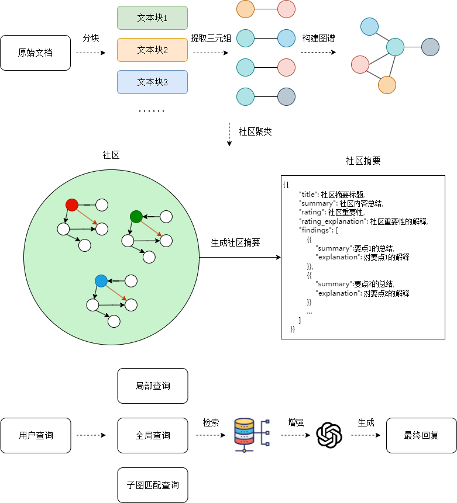
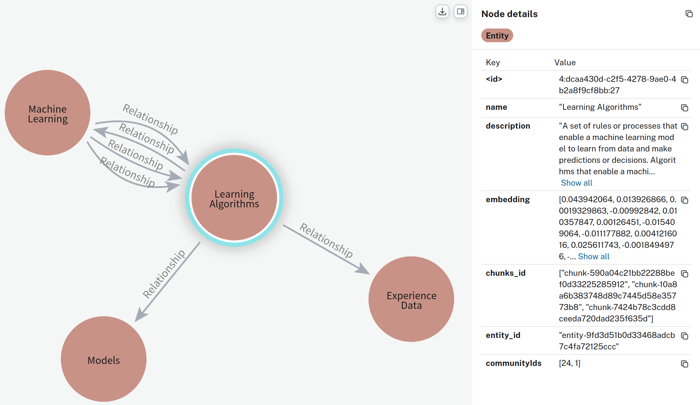
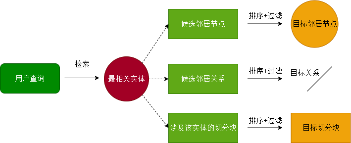
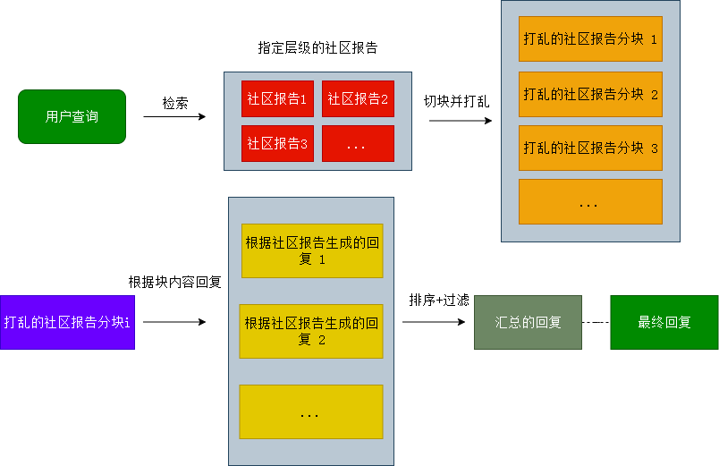

# TinyGraphRAG

## 项目动机

随着大模型技术的不断发展，人们越来越关注于大模型的幻觉问题，大模型在生成文本时，往往会受到干扰，给出不真实，不合理的内容，同时由于大模型内容知识更新的困难性，我们难以负担高昂的更新成本，因此 RAG 技术应运而生，通过召回参考文本，我们可以为大模型在回答用户问题前，提供充足的预备知识。然而，RAG 技术同样存在一些缺陷。关于 RAG 技术的实现，你可以参考 tiny-universe 中的 tiny-rag 项目。

RAG 技术在分块策略上存在一些问题，以下面的文本举例：

```
chunk 1
小明的爷爷叫老明

chunk 2
小明的爷爷是一个木匠

chunk 3
小明的爷爷...
```

假如我们希望查询：“小明认识的木匠叫什么名字？”，很明显，这段话的内容需要召回两个 chunk 来回答，我们可以预测的是，chunk 2 的相关性分数将会相当的高，但其对我们回答这个问题的贡献度却很低，而真正关键的 chunk 1 片段却有可能无法被召回，原因就在于，分块策略实际上严重破坏了文档的语义连续性，已经有一些工作着手于解决这个问题，比如 Jina AI 提出的 late chunking 策略等等，同时 GraphRAG 也是一个解决这个问题的好方案。

同时，RAG 技术还面临一个比较棘手的问题，即全局信息的查询，假如我们有一个文档，我们希望“查询文档中小明所有家人的信息”，这同样是一个重大挑战，因为这些信息很有可能存在与各个位置，按照分块检索的难度很大，同时，还有可能涉及一些复杂的推理问题，同样已经有一些工作提出了 Agentic RAG 策略来尝试解决， GraphRAG 也提供了自己的解决方案，即通过图中的社区聚类，预先聚类信息用以应对用户回答。

**需要注意的是，由于篇幅限制，我们无法展示完整的整个实现过程，但是，我们将在文档中讲解每个必要的实现步骤以及背后的思考，您可以通过这些内容快速理解如何实现一个 GraphRAG 系统，如果您有更多时间，我仍然建议您阅读完整代码。**

**由于并未展示完整实现，笔者建议读者在阅读时，可以一边完成教程中的代码，一边思考如何补充至完整实现，您可以随时查看笔者的实现，以帮助您理解。**

## 前置实现

接下来，我们将带领大家，从 0 开始，实现一个复杂的 GraphRAG 系统。首先，我们将完成一些基本的准备过程

### 1. 实现 LLM 模块

首先我们需要实现 LLM 模块，这是系统中最基本的模块，我们将利用大模型完成文档的清洗，信息提取等工作，可以说 GraphRAG 的一部分精髓即为使用大模型预先处理文档信息，方便后续进行检索，这里我们使用 zhipuai 的 api 来实现。

```python
from abc import ABC, abstractmethod
from typing import Any, Optional

class BaseLLM(ABC):
    """Interface for large language models.

    Args:
        model_name (str): The name of the language model.
        model_params (Optional[dict[str, Any]], optional): Additional parameters passed to the model when text is sent to it. Defaults to None.
        **kwargs (Any): Arguments passed to the model when for the class is initialised. Defaults to None.
    """

    def __init__(
        self,
        model_name: str,
        model_params: Optional[dict[str, Any]] = None,
        **kwargs: Any,
    ):
        self.model_name = model_name
        self.model_params = model_params or {}

    @abstractmethod
    def predict(self, input: str) -> str:
        """Sends a text input to the LLM and retrieves a response.

        Args:
            input (str): Text sent to the LLM

        Returns:
            str: The response from the LLM.
        """
```

如上是一个调用大模型的抽象接口，这可以帮助我们统一调用大模型的格式，我们继承这个基类，实现调用大模型的接口。

```python
from zhipuai import ZhipuAI
from typing import Any, Optional
from .base import BaseLLM


class zhipuLLM(BaseLLM):
    """Implementation of the BaseLLM interface using zhipuai."""

    def __init__(
        self,
        model_name: str,
        api_key: str,
        model_params: Optional[dict[str, Any]] = None,
        **kwargs: Any,
    ):
        super().__init__(model_name, model_params, **kwargs)
        self.client = ZhipuAI(api_key=api_key)

    def predict(self, input: str) -> str:
        """Sends a text input to the zhipuai model and retrieves a response.

        Args:
            input (str): Text sent to the zhipuai model

        Returns:
            str: The response from the zhipuai model.
        """
        response = self.client.chat.completions.create(
            model=self.model_name,
            messages=[{"role": "user", "content": input}],
        )
        return response.choices[0].message.content
```

完成搭建后，我们可以通过尝试调用 predict 方法来测试是否成功。

```python
llm = zhipuLLM(model_name="....", api_key="...")
print(llm.predict("Hello, how are you?"))
```

当观察到 LLM 正确回复后，我们这一模块的构建就完成了。

### 2. 实现 Embedding 模块

除了调用大模型，我们还需要实现 Embedding 模块，Embedding 模块用于将文本转换为向量，我们将使用向量来表示文档中的信息，这样的好处是，我们可以通过向量的相似度来衡量文档与查询之间的相似度，从而召回对回复用户问题最有帮助的文档。

构建 Embedding 模块的方法与构建 LLM 模块类似。

```python
from abc import ABC, abstractmethod
from typing import List, Any, Optional


class BaseEmb(ABC):
    def __init__(
        self,
        model_name: str,
        model_params: Optional[dict[str, Any]] = None,
        **kwargs: Any,
    ):
        self.model_name = model_name
        self.model_params = model_params or {}

    @abstractmethod
    def get_emb(self, input: str) -> List[float]:
        """Sends a text input to the embedding model and retrieves the embedding.

        Args:
            input (str): Text sent to the embedding model

        Returns:
            List[float]: The embedding vector from the model.
        """
        pass

from zhipuai import ZhipuAI
from typing import List
from .base import BaseEmb


class zhipuEmb(BaseEmb):
    def __init__(self, model_name: str, api_key: str, **kwargs):
        super().__init__(model_name=model_name, **kwargs)
        self.client = ZhipuAI(api_key=api_key)

    def get_emb(self, text: str) -> List[float]:
        emb = self.client.embeddings.create(
            model=self.model_name,
            input=text,
        )
        return emb.data[0].embedding
```

完成搭建后，我们可以通过尝试调用 get_emb 方法来测试是否成功。

```python
emb = zhipuEmb(model_name="....", api_key="...")
print(emb.get_emb("Hello, how are you?"))
```

当观察到 Embedding 正确给出了编码后的向量，我们这一模块的构建就完成了。

### 3. 实现与 Neo4j 的交互

为了存储数据，我们还需要预先准备好一个图数据库，用来进行图的存储与查询，以及一些必要的图操作算法，我们选择使用 Neo4j 作为图数据库，Neo4j 是一个基于图的数据库，可以方便的进行图的存储与查询，同时，Neo4j 也提供了丰富的图操作算法，可以方便的进行图的分析。

我们使用 Neo4j 的提供的 neo4j 库来实现与 Neo4j 的交互。

```python
from neo4j import GraphDatabase

driver = GraphDatabase.driver(
            url, auth=(username, password)
        )  # 创建Neo4j数据库驱动
```

完成数据库驱动的设置后，我们就可以采用下面的方法来运行 Cypher 查询语句了，Cypher 查询语句是 Neo4j 的查询语言，类似于 SQL 语言，我们后续的所有操作基本都通过 Cypher 查询语句来实现。

```python
with driver.session() as session:
    result = session.run("MATCH (n) RETURN n") # 查询图中的所有节点
    for record in result:
        print(record)
```

## 核心实现

GraphRAG 的主要流程如图所示：



首先，让我们来梳理一下 GraphRAG 的工作流程，GraphRAG 的一个核心思想在于，我们需要把用户提供的文档内容转化为三元组用以构建知识图谱，这样在检索时，对于同一实体的信息，他们将会被聚集起来，以查询：“小明的个人信息都有哪些？” 为例，像这样的查询在传统 RAG 方法中需要召回大量文本段，并且存在召回不全，信息冗余等问题，而通过图数据库，我们可以直接召回小明这个关键实体以及小明实体所连接的边与节点回答用户问题，从而解决。

因此，第一步，首先我们需要构建数据预处理模块，数据预处理模块主要负责对原始数据进行清洗、分词、实体识别与关系抽取，将非结构化数据转化为结构化的图数据格式。

### 数据预处理

首先，我们需要读取用户上传的文档，这一步相当简单，我们可以使用 python 自带的文件处理 api 来读取文件内容

```python
with open(filepath, "r", encoding="utf-8") as f:
    content = f.read()
```

完成读取后，我们就需要对文档内容进行解析了，这一步的主要目标为解析得到三元组，由于用户的原始文档内容长度可能超出我们 LLM 的最大输入长度，因此，我们需要将文档内容进行分块，分块后，我们再将每个分块送入 LLM 进行解析，得到三元组。

首先，我们对文档进行分块，分块的策略为，我们使用滑动窗口的策略，将文档内容分割成多个片段，每个片段的长度为 segment_length，相邻片段之间有 overlap_length 的重叠。

```python
def split_text(self,file_path:str, segment_length=300, overlap_length=50) -> Dict:
        """
        将文本文件分割成多个片段，每个片段的长度为segment_length，相邻片段之间有overlap_length的重叠。

        参数:
        - file_path: 文本文件的路径
        - segment_length: 每个片段的长度，默认为300
        - overlap_length: 相邻片段之间的重叠长度，默认为50

        返回:
        - 包含片段ID和片段内容的字典
        """
        chunks = {}  # 用于存储片段的字典
        with open(file_path, "r", encoding="utf-8") as file:
            content = file.read()  # 读取文件内容

        text_segments = []  # 用于存储分割后的文本片段
        start_index = 0  # 初始化起始索引

        # 循环分割文本，直到剩余文本长度不足以形成新的片段
        while start_index + segment_length <= len(content):
            text_segments.append(content[start_index : start_index + segment_length])
            start_index += segment_length - overlap_length  # 更新起始索引，考虑重叠长度

        # 处理剩余的文本，如果剩余文本长度小于segment_length但大于0
        if start_index < len(content):
            text_segments.append(content[start_index:])

        # 为每个片段生成唯一的ID，并将其存储在字典中
        for segment in text_segments:
            chunks.update({compute_mdhash_id(segement, prefix="chunk-"): segement})

        return chunks
```

完成分块后，我们即通过 LLM 对每个分块进行解析，得到三元组。LLM 被提示从每个文本块中提取关键实体及其之间的关系。LLM 将首先被提示提取文本中的实体，为实体生成简洁的描述性文本。接着根据当前文本块中的实体，LLM 被提示从文本中提取这些实体之间的关系，同样生成简洁的描述性文本，以以下文本块为例：

```
在最新的研究中，我们探索了机器学习算法在疾病预测中的潜力。我们使用支持向量机和随机森林算法对医疗数据进行分析。结果表明，这些模型在通过特征选择和交叉验证预测疾病风险方面表现良好。尤其值得一提的是，随机森林模型在处理过拟合问题方面表现出色。此外，我们还探讨了深度学习在医学图像分析中的应用。
```

LLM 被引导提取如下信息：

实体 支持向量机，描述为：“用于分类和回归任务的监督学习模型，在高维空间中特别有效。”

实体 随机森林算法，描述为：“一种集成学习方法，建立多个决策树并将它们合并在一起以获得更准确、更稳定的预测，通常用于减少过度拟合。

实体间关系：支持向量机 与 随机森林算法，关系描述为：“随机森林算法在处理过拟合问题方面表现优于支持向量机。”

这些提示可以根据语料库所属的具体领域进行定制，例如通过选择领域内具有代表性的少量示例作为上下文，提升 LLM 的抽取准确性和语义理解能力。

我们定义实体的基本结构如下：

```python
class Entity:
    name: str
    desc: str
    chunks_id: list
    entity_id: str
```

其中 name 表示实体的名称，例如 “小明”， “随机森林算法” 等。
desc 表示实体的描述，例如 “小明是北京大学的学生”， “随机森林算法是机器学习中的一个集成学习方法” 等。
chunks_id 表示实体所属的文本块 ID，
entity_id 表示实体的唯一 ID。

抽取实体使用的提示词如下：

```python
GET_ENTITY = """
## Goal

You are an experienced machine learning teacher.
You need to identify the key concepts related to machine learning that the article requires students to master. For each concept, provide a brief description that explains its relevance and importance in the context of the article.

## Example

article:
"In the latest study, we explored the potential of using machine learning algorithms for disease prediction. We used support vector machines (SVM) and random forest algorithms to analyze medical data. The results showed that these models performed well in predicting disease risk through feature selection and cross-validation. In particular, the random forest model showed better performance in dealing with overfitting problems. In addition, we discussed the application of deep learning in medical image analysis."

response:
<concept>
    <name>Support Vector Machine (SVM)</name>
    <description>A supervised learning model used for classification and regression tasks, particularly effective in high-dimensional spaces.</description>
</concept>
<concept>
    <name>Random Forest Algorithm</name>
    <description>An ensemble learning method that builds multiple decision trees and merges them together to get a more accurate and stable prediction, often used to reduce overfitting.</description>
</concept>
<concept>
    <name>Feature Selection</name>
    <description>The process of selecting a subset of relevant features for use in model construction, crucial for improving model performance and reducing complexity.</description>
</concept>
<concept>
    <name>Overfitting</name>
    <description>A common issue where a model learns the details and noise in the training data to the extent that it negatively impacts the model's performance on new data.</description>
</concept>
<concept>
    <name>Deep Learning</name>
    <description>A subset of machine learning that uses neural networks with many layers to model complex patterns in large datasets, often applied in image and speech recognition tasks.</description>
</concept>

## Format

Wrap each concept in the HTML tag <concept>, and include the name of the concept in the <name> tag and its description in the <description> tag.

## Article

{text}

## Your response
"""

```

d
收到 LLM 的回复后，我们还需要进一步解析 LLM 的回复用来得到可用的实体数据，在上面的提示词中，我们要求 LLM 的回复格式为 HTML 格式，因此，我们需要提取指定标签内的内容，这一步我们使用正则表达式来实现。

```python
def get_text_inside_tag(html_string: str, tag: str):
    # html_string 为待解析文本，tag为查找标签
    pattern = f"<{tag}>(.*?)<\/{tag}>"
    try:
        result = re.findall(pattern, html_string, re.DOTALL)
        return result
    except SyntaxError as e:
        raise ("Json Decode Error: {error}".format(error=e))

def get_entity(self, text: str, chunk_id: str) -> List[Dict]:
        """
        从给定的文本中提取实体，并为每个实体生成唯一的ID和描述。

        参数:
        - text: 输入的文本
        - chunk_id: 文本块的ID

        返回:
        - 包含提取的实体信息的列表
        """
        # 使用语言模型预测实体信息
        data = self.llm.predict(GET_ENTITY.format(text=text))
        concepts = []  # 用于存储提取的实体信息

        # 从预测结果中提取实体信息
        for concept_html in get_text_inside_tag(data, "concept"):
            concept = {}
            concept["name"] = get_text_inside_tag(concept_html, "name")[0].strip()
            concept["description"] = get_text_inside_tag(concept_html, "description")[
                0
            ].strip()
            concept["chunks id"] = [chunk_id]
            concept["entity id"] = compute_mdhash_id(
                concept["description"], prefix="entity-"
            )
            concepts.append(concept)

        return concepts
```

完成实体的抽取后，我们根据抽取到的实体信息，提示 LLM 根据这些实体进行三元组的抽取，抽取三元组的过程与抽取实体相当相似，我们只需要简单修改一下提示词与信息提取步骤即可

抽取三元组的提示词如下：

```python
GET_TRIPLETS = """
## Goal
Identify and extract all the relationships between the given concepts from the provided text.
Identify as many relationships between the concepts as possible.
The relationship in the triple should accurately reflect the interaction or connection between the two concepts.

## Guidelines:
1. **Subject:** The first entity from the given entities.
2. **Predicate:** The action or relationship linking the subject to the object.
3. **Object:** The second entity from the given entities.

## Example:
1. Article :
    "Gaussian Processes are used to model the objective function in Bayesian Optimization"
   Given entities:
   [{{"name": "Gaussian Processes", "entity id": "entity-1"}}, {{"name": "Bayesian Optimization", "entity id": "entity-2"}}]
   Output:
   <triplet><subject>Gaussian Processes</subject><subject_id>entity-1</subject_id><predicate>are used to model the objective function in</predicate><object>Bayesian Optimization</object><object_id>entity-2</object_id></triplet>

2. Article :
    "Hydrogen is a colorless, odorless, non-toxic gas and is the lightest and most abundant element in the universe. Oxygen is a gas that supports combustion and is widely present in the Earth's atmosphere. Water is a compound made up of hydrogen and oxygen, with the chemical formula H2O."
    Given entities:
    [{{"name": "Hydrogen", "entity id": "entity-3"}}, {{"name": "Oxygen", "entity id": "entity-4"}}, {{"name": "Water", "entity id": "entity-5"}}]
    Output:
    <triplet><subject>Hydrogen</subject><subject_id>entity-3</subject_id><predicate>is a component of</predicate><object>Water</object><object_id>entity-5</object_id></triplet>
3. Article :
    "John read a book on the weekend"
    Given entities:
    []
    Output:
    None

## Format:
For each identified triplet, provide:
**the entity should just from "Given Entities"**
<triplet><subject>[Entity]</subject><subject_id>[Entity ID]</subject_id><predicate>[The action or relationship]</predicate><object>[Entity]</object><object_id>[Entity ID]</object_id></triplet>

## Given Entities:
{entity}

### Article:
{text}

## Additional Instructions:
- Before giving your response, you should analyze and think about it sentence by sentence.
- Both the subject and object must be selected from the given entities and cannot change their content.
- If no relevant triplet involving both entities is found, no triplet should be extracted.
- If there are similar concepts, please rewrite them into a form that suits our requirements.

## Your response:
"""
```

当大模型回复我们按照指定格式抽取的三元组后，与解析实体类似，我们使用正则表达式提取指定标签内的内容。

```python
def get_triplets(self, content, entity: list) -> List[Dict]:
        """
        从给定的内容中提取三元组（Triplet）信息，并返回包含这些三元组信息的列表。

        参数:
        - content: 输入的内容
        - entity: 实体列表

        返回:
        - 包含提取的三元组信息的列表
        """
        try:
            # 使用语言模型预测三元组信息
            data = self.llm.predict(GET_TRIPLETS.format(text=content, entity=entity))
            data = get_text_inside_tag(data, "triplet")
        except Exception as e:
            print(f"Error predicting triplets: {e}")
            return []

        res = []  # 用于存储提取的三元组信息

        # 从预测结果中提取三元组信息
        for triplet_data in data:
            try:
                subject = get_text_inside_tag(triplet_data, "subject")[0]
                subject_id = get_text_inside_tag(triplet_data, "subject_id")[0]
                predicate = get_text_inside_tag(triplet_data, "predicate")[0]
                object = get_text_inside_tag(triplet_data, "object")[0]
                object_id = get_text_inside_tag(triplet_data, "object_id")[0]
                res.append(
                    {
                        "subject": subject,
                        "subject_id": subject_id,
                        "predicate": predicate,
                        "object": object,
                        "object_id": object_id,
                    }
                )
            except Exception as e:
                print(f"Error extracting triplet: {e}")
                continue

        return res
```

至此，我们就完成了三元组的抽取工作，迈出了坚实一步，接下来，我们需要将已经抽取的实体数据以及三元组数据导入至 neo4j 数据库中，不过，在此之前，我们还有必要进行一步实体消岐工作。

在实体、关系的抽取过程中，某一元素可能在多个文档中重复出现，因而会被多次检测并记录，产生多个实例。同时，同一实体可能在文档中按照不同的名称出现，在构建知识图谱的过程中，这些实例会被整合为图中的单个节点或边，并对其描述进行归纳与总结。

一些同名的实体也不能直接进行合并，这些内容如果不加以处理，直接导入知识图谱的话可能会产生相当严重的错误，比如苹果公司与苹果（水果），这两种实体有可能在知识图谱中被整合为一个节点，因此我们需要进行实体消岐，来缓解这一问题。

实体消岐可以分为两个思路，第一个即为在提取实体时，我们就要求大模型抽取的实体名称要尽可能的唯一，当三元组抽取结束后，我们也可以使用大模型来协助消岐，通过再次检查抽取的内容，来判断是否需要进行实体消岐。

具体的做法为，我们检查相同名称的实体，使用大模型检查这些实体的具体内容，接着大模型给出需要被合并的实体名单，我们根据大模型的回复，整合对应的信息。

实体消融使用的提示词如下：

```python
ENTITY_DISAMBIGUATION = """
## Goal
Given multiple entities with the same name, determine if they can be merged into a single entity. If merging is possible, provide the transformation from entity id to entity id.

## Guidelines
1. **Entities:** A list of entities with the same name.
2. **Merge:** Determine if the entities can be merged into a single entity.
3. **Transformation:** If merging is possible, provide the transformation from entity id to entity id.

## Example
1. Entities:
   [
       {"name": "Entity A", "entity id": "entity-1"},
       {"name": "Entity A", "entity id": "entity-2"},
       {"name": "Entity A", "entity id": "entity-3"}
   ]

Your response should be:

<transformation>{"entity-2": "entity-1", "entity-3": "entity-1"}</transformation>


2. Entities:
   [
       {"name": "Entity B", "entity id": "entity-4"},
       {"name": "Entity C", "entity id": "entity-5"},
       {"name": "Entity B", "entity id": "entity-6"}
   ]

Your response should be:

<transformation>None</transformation>

## Output Format
Provide the following information:
- Transformation: A dictionary mapping entity ids to the final entity id after merging.

## Given Entities
{entities}

## Your response
"""
```

如上大模型回复我们，告知我们哪些实体可以被相似的实体取代，例如实体 1 可以被实体 2 取代，那么大模型将回复 <transformation>{"entity-1": "entity-2"}</transformation>， 我们可以通过这个字典结构，将所有需要被取代的实体的 ID 更新为取代实体的 ID。

```python
entity_names = list(set(entity["name"] for entity in all_entities))

if use_llm_deambiguation:
    entity_id_mapping = {}
    for name in entity_names:
        same_name_entities = [
            entity for entity in all_entities if entity["name"] == name
        ]
        transform_text = self.llm.predict(
            ENTITY_DISAMBIGUATION.format(same_name_entities)
        )
        entity_id_mapping.update(
            get_text_inside_tag(transform_text, "transform")
        )
else:
    entity_id_mapping = {}
    for entity in all_entities:
        entity_name = entity["name"]
        if entity_name not in entity_id_mapping:
            entity_id_mapping[entity_name] = entity["entity id"]

for entity in all_entities:
    entity["entity id"] = entity_id_mapping.get(
        entity["name"], entity["entity id"]
    )

triplets_to_remove = [
    triplet
    for triplet in all_triplets
    if entity_id_mapping.get(triplet["subject"], triplet["subject_id"]) is None
    or entity_id_mapping.get(triplet["object"], triplet["object_id"]) is None
]

updated_triplets = [
    {
        **triplet,
        "subject_id": entity_id_mapping.get(
            triplet["subject"], triplet["subject_id"]
        ),
        "object_id": entity_id_mapping.get(
            triplet["object"], triplet["object_id"]
        ),
    }
    for triplet in all_triplets
    if triplet not in triplets_to_remove
]
all_triplets = updated_triplets
```

完成实体消岐后，我们就可以开始合并同一实体的信息了，我们把三元组中的实体 ID 更新为消岐后的 ID，接着我们合并同一实体的描述信息，以及它们所属的文本块 ID 。

```python
entity_map = {}

for entity in all_entities:
    entity_id = entity["entity id"]
    if entity_id not in entity_map:
        entity_map[entity_id] = {
            "name": entity["name"],
            "description": entity["description"],
            "chunks id": [],
            "entity id": entity_id,
        }
    else:
        entity_map[entity_id]["description"] += " " + entity["description"]

    entity_map[entity_id]["chunks id"].extend(entity["chunks id"])
```

最终我们得到的实体信息如图所示，其中 embedding 信息与 community id 信息我们将在后续的内容中讲解。



至此我们已经完成了三元组导入前的所有前置工作，接下来我们就可以向 Neo4j 数据库中导入实体和三元组了。

三元组的导入我们通过 Cypher 语句实现

```python
query = (
        "MERGE (a:Entity {name: $subject_name, description: $subject_desc, chunks_id: $subject_chunks_id, entity_id: $subject_entity_id}) "
        "MERGE (b:Entity {name: $object_name, description: $object_desc, chunks_id: $object_chunks_id, entity_id: $object_entity_id}) "
        "MERGE (a)-[r:Relationship {name: $predicate}]->(b) "
        "RETURN a, b, r"
    )
```

上面的语句即为在 Neo4j 中创建实体 a 实体 b 以及它们的关系 r，我们把提取出的三元组信息导入这个 Cypher 语句中，接着，通过 neo4j 的 driver，我们可以在 neo4j 中执行这个语句，即可实现三元组的导入。

```python
def create_triplet(self, subject: dict, predicate, object: dict) -> None:
    """
    创建一个三元组（Triplet）并将其存储到Neo4j数据库中。

    参数:
    - subject: 主题实体的字典，包含名称、描述、块ID和实体ID
    - predicate: 关系名称
    - object: 对象实体的字典，包含名称、描述、块ID和实体ID

    返回:
    - 查询结果
    """
    # 定义Cypher查询语句，用于创建或合并实体节点和关系
    query = (
        "MERGE (a:Entity {name: $subject_name, description: $subject_desc, chunks_id: $subject_chunks_id, entity_id: $subject_entity_id}) "
        "MERGE (b:Entity {name: $object_name, description: $object_desc, chunks_id: $object_chunks_id, entity_id: $object_entity_id}) "
        "MERGE (a)-[r:Relationship {name: $predicate}]->(b) "
        "RETURN a, b, r"
    )

    # 使用数据库会话执行查询
    with self.driver.session() as session:
        result = session.run(
            query,
            subject_name=subject["name"],
            subject_desc=subject["description"],
            subject_chunks_id=subject["chunks id"],
            subject_entity_id=subject["entity id"],
            object_name=object["name"],
            object_desc=object["description"],
            object_chunks_id=object["chunks id"],
            object_entity_id=object["entity id"],
            predicate=predicate,
        )

    return

for triplet in all_triplets:
    subject_id = triplet["subject_id"]
    object_id = triplet["object_id"]

    subject = entity_map.get(subject_id)
    object = entity_map.get(object_id)
    if subject and object:
        self.create_triplet(subject, triplet["predicate"], object)
```

导入后的图谱如图所示：


完成导入后，我们就已经构建出了一个根据文档内容提取出的知识图谱，但是，当前这个图谱仅仅能处理一些针对一个或者多个实体的问题，面对全局性的问题，比如“小明家里有几口人”，当前的图谱并不能给出答案，因此，我们还需要进行社区聚类，将图谱中的节点聚类，以实现对全局性问题的处理。

### 社区聚类概览

首先，我们来讨论一下全局性的查询，它们需要的信息都呈现为哪些特征？我们以“小明家里有几口人”为例，可以预见的是，我们需要召回一个以小明为中心，扩展 N 跳的子图，并且，很多全局性的查询都可以用类似的思路解决，区别仅在于 N 的大小。以一个更复杂的查询为例：“描述大乔和曹操的关系”，通过查询这两个实体附近的关系以及实体就可以回答对应的信息。因此，在 TinyGraphRAG 中我们通过聚类算法预先聚类这些实体与关系，形成社区，我们将使用社区信息作为回答全局问题时的参考，试想如果我们成功聚类了关于 “大乔与曹操” 的社区，那么，当用户询问“描述大乔和曹操的关系”时，我们就可以直接从社区中召回答案，而不需要进行复杂的图搜索。

目前社区检测算法有很多种，在 TinyGraphRAG 中，我们选择使用分层的 Leiden 社区检测算法，以递归方式构建社区层级结构：首先在全图中识别出初始社区，然后在每个社区内继续执行子社区检测，直到无法进一步划分为止，形成叶级社区。

分层 Leiden 算法流程主要包括以下三个阶段：

(1) 节点聚合：在固定社区划分的前提下，尝试将每个节点移动到邻居节点所属社区，以提升总体模块度。

(2) 社区细化：对每个社区进行局部划分，确保每个社区子图中的所有节点之间是连通的，防止出现不连通的社区。

(3) 图聚合：构建新的超图，将每个社区作为一个超级节点，重复第一步，形成递归的社区层级结构。

模块度用于衡量当前社区划分相较于随机划分的“好坏”，定义如下：

$$
Q = \frac{1}{2m} \sum_{i,j} \left[ A_{ij} - \gamma \frac{k_i k_j}{2m} \right] \delta(c_i, c_j)
$$

其中，$ A\_{ij} $表示节点 $ i $ 与节点 $ j $ 之间的边的权重；$ \gamma $为分辨率参数，控制社区规模，默认为 1。

$ k*i $表示节点 $ i $ 的度（边的总权重）；$ m $即图中所有边的总权重的一半（即 $ m = \frac{1}{2} \sum*{i,j} A\_{ij} $）；$ c_i $为节点 $ i $ 所属的社区编号；$ \delta(c_i, c_j) $表示当 $ i $ 与 $ j $ 属于同一社区时为 1，否则为 0。

在本文中，使用 Neo4j 的 GDS 库提供的分层 Leiden 算法包对提取出的知识图谱进行社区检测，得到包含节点和关系的社区信息。在社区检测过程中，模块度中的分辨率参数 $ \gamma $ 并非固定不变。具体来说，在越低的层级中，$ \gamma $ 值会逐渐减小，以此鼓励算法在当前社区内进一步划分出更多的子社区，从而实现更细致的社区结构划分。

在社区划分完成后，为社区层级结构中的每一个社区生成类报告形式的摘要。这一过程支持对大规模数据集的结构性理解，提供了不依赖具体查询的语义概览，帮助用户快速掌握语料库中各主题的全貌。

例如，用户可以浏览某一层级的社区摘要以确定感兴趣的主题，并进一步阅读下级社区报告，获取更细粒度的信息。尽管这些摘要本身具有独立意义，但本文主要关注其作为图索引机制的一部分，在响应全局性查询时的效用。

摘要的生成采用模板方法，逐步将图中节点、边及其声明的摘要填充到社区摘要模板中。较低层级的社区摘要将作为上层社区摘要生成的基础。具体步骤如下：

(1) 对于叶级社区，从图中提取的节点和边的摘要被按优先级排序加入到 LLM 上下文窗口中。排序标准是：依据边的源节点和目标节点的整体度量（即显著性）降序排列。依次添加源节点描述、目标节点描述、边的描述。

(2) 对于高级社区，若所有元素摘要在上下文窗口的 token 限制内可容纳，则按叶级社区的方法汇总所有元素摘要；否则，将子社区按摘要的 token 数量降序排序，逐步用更短的子社区摘要替换较长的元素摘要，直到整体摘要符合上下文窗口限制。

理论描述到此结束，接下来我们来一步步实现上述功能。

### 社区检测实现

在了解完我们使用的社区检测算法后，实际上实现相当简单，由于 neo4j 提供了 GDS 库，我们只需要调用 GDS 库中的分层 Leiden 算法包即可。

社区检测的算法如下：

```python
def detect_communities(self) -> None:
    query = """
    CALL gds.graph.project(
        'graph_help',
        ['Entity'],
        {
            Relationship: {
                orientation: 'UNDIRECTED'
            }
        }
    )
    """
    with self.driver.session() as session:
        result = session.run(query)

    query = """
    CALL gds.leiden.write('graph_help', {
        writeProperty: 'communityIds',
        includeIntermediateCommunities: True,
        maxLevels: 10,
        tolerance: 0.0001,
        gamma: 1.0,
        theta: 0.01
    })
    YIELD communityCount, modularity, modularities
    """
    with self.driver.session() as session:
        result = session.run(query)
        for record in result:
            print(
                f"社区数量: {record['communityCount']}, 模块度: {record['modularity']}"
            )
        session.run("CALL gds.graph.drop('graph_help')")
```

完成社区检测后，我们会为每个节点增加它们所属的社区属性，很明显，同一个节点有可能属于不同社区，所以这里的 communityIds 实际上是一个列表。

社区检测完成后，我们为社区生成一个 schema，这个 schema 包含了社区的层次结构、社区内包含的节点、边等信息。作为一个单独的结构存储社区信息。

```python
def gen_community_schema(self) -> dict[str, dict]:
    results = defaultdict(
        lambda: dict(
            level=None,
            title=None,
            edges=set(),
            nodes=set(),
            chunk_ids=set(),
            sub_communities=[],
        )
    )

    with self.driver.session() as session:
        # Fetch community data
        result = session.run(
            f"""
            MATCH (n:Entity)
            WITH n, n.communityIds AS communityIds, [(n)-[]-(m:Entity) | m.entity_id] AS connected_nodes
            RETURN n.entity_id AS node_id,
                    communityIds AS cluster_key,
                    connected_nodes
            """
        )

        max_num_ids = 0
        for record in result:
            for index, c_id in enumerate(record["cluster_key"]):
                node_id = str(record["node_id"])
                level = index
                cluster_key = str(c_id)
                connected_nodes = record["connected_nodes"]

                results[cluster_key]["level"] = level
                results[cluster_key]["title"] = f"Cluster {cluster_key}"
                results[cluster_key]["nodes"].add(node_id)
                results[cluster_key]["edges"].update(
                    [
                        tuple(sorted([node_id, str(connected)]))
                        for connected in connected_nodes
                        if connected != node_id
                    ]
                )
        for k, v in results.items():
            v["edges"] = [list(e) for e in v["edges"]]
            v["nodes"] = list(v["nodes"])
            v["chunk_ids"] = list(v["chunk_ids"])
        for cluster in results.values():
            cluster["sub_communities"] = [
                sub_key
                for sub_key, sub_cluster in results.items()
                if sub_cluster["level"] > cluster["level"]
                and set(sub_cluster["nodes"]).issubset(set(cluster["nodes"]))
            ]

    return dict(results)
```

### 社区摘要生成

完成社区聚类后，接下来我们就是根据社区内节点的内容生成该社区的摘要，反馈这个社区内的核心内容，这一步相当易懂，我们只需要使用 LLM 读取社区内节点与关系的描述，最后总结即可，但是需要注意的是，本文在处理摘要时使用了比较直接的思路，即每个社区的信息都导入 LLM 让其生成摘要。但实际上更优的做法是我们在撰写社区摘要时，需要从下往上生成，因为过大的社区可能造成超过 LLM 的 token 限制，而从下而上的处理方式使得我们可以跳过一些已经生成过摘要的子社区，直接将子社区的摘要作为一部分节点的描述，从而最大程度减小 token 消耗。

````python
def generate_community_report(self):
    communities_schema = self.read_community_schema()
    for community_key, community in tqdm(
        communities_schema.items(), desc="generating community report"
    ):
        community["report"] = self.gen_single_community_report(community)
    with open(self.community_path, "w", encoding="utf-8") as file:
        json.dump(communities_schema, file, indent=4)
    print("All community report has been generated.")

def gen_single_community_report(self, community: dict):
    nodes = community["nodes"]
    edges = community["edges"]
    nodes_describe = []
    edges_describe = []
    for i in nodes:
        node = self.get_node_by_id(i)
        nodes_describe.append({"name": node["name"], "desc": node["description"]})
    for i in edges:
        edge = self.get_edges_by_id(i[0], i[1])
        edges_describe.append(
            {"source": edge["src"], "target": edge["tar"], "desc": edge["r"]}
        )
    nodes_csv = "entity,description\n"
    for node in nodes_describe:
        nodes_csv += f"{node['name']},{node['desc']}\n"
    edges_csv = "source,target,description\n"
    for edge in edges_describe:
        edges_csv += f"{edge['source']},{edge['target']},{edge['desc']}\n"
    data = f"""
    Text:
    -----Entities-----
    ```csv
    {nodes_csv}
    ```
    -----Relationships-----
    ```csv
    {edges_csv}
    ```
    """
    prompt = GEN_COMMUNITY_REPORT.format(input_text=data)
    report = self.llm.predict(prompt)
    return report
````

我们读取每个社区内节点与边的描述，然后将他们整理之后导入 LLM 中，让其生成社区摘要，社区摘要内容主要包括社区名称，社区总结，以及社区内需要关注的要点信息，经过如上处理之后，我们就得到了聚类之后社区内的主要信息都是什么。我们使用的 prompt 如下：

````python
GEN_COMMUNITY_REPORT = """
## Role
You are an AI assistant that helps a human analyst to perform general information discovery.
Information discovery is the process of identifying and assessing relevant information associated with certain entities (e.g., organizations and individuals) within a network.

## Goal
Write a comprehensive report of a community.
Given a list of entities that belong to the community as well as their relationships and optional associated claims. The report will be used to inform decision-makers about information associated with the community and their potential impact.
The content of this report includes an overview of the community's key entities, their legal compliance, technical capabilities, reputation, and noteworthy claims.

## Report Structure

The report should include the following sections:

- TITLE: community's name that represents its key entities - title should be short but specific. When possible, include representative named entities in the title.
- SUMMARY: An executive summary of the community's overall structure, how its entities are related to each other, and significant information associated with its entities.
- DETAILED FINDINGS: A list of 5-10 key insights about the community. Each insight should have a short summary followed by multiple paragraphs of explanatory text grounded according to the grounding rules below. Be comprehensive.

Return output as a well-formed JSON-formatted string with the following format:
{{
"title": <report_title>,
"summary": <executive_summary>,
"findings": [
{{
"summary":<insight_1_summary>,
"explanation": <insight_1_explanation>
}},
{{
"summary":<insight_2_summary>,
"explanation": <insight_2_explanation>
}}
...
]
}}

## Grounding Rules
Do not include information where the supporting evidence for it is not provided.

## Example Input
-----------
Text:


Entities:

```csv
entity,description
VERDANT OASIS PLAZA,Verdant Oasis Plaza is the location of the Unity March
HARMONY ASSEMBLY,Harmony Assembly is an organization that is holding a march at Verdant Oasis Plaza
\```

Relationships:

```csv
source,target,description
VERDANT OASIS PLAZA,UNITY MARCH,Verdant Oasis Plaza is the location of the Unity March
VERDANT OASIS PLAZA,HARMONY ASSEMBLY,Harmony Assembly is holding a march at Verdant Oasis Plaza
VERDANT OASIS PLAZA,UNITY MARCH,The Unity March is taking place at Verdant Oasis Plaza
VERDANT OASIS PLAZA,TRIBUNE SPOTLIGHT,Tribune Spotlight is reporting on the Unity march taking place at Verdant Oasis Plaza
VERDANT OASIS PLAZA,BAILEY ASADI,Bailey Asadi is speaking at Verdant Oasis Plaza about the march
HARMONY ASSEMBLY,UNITY MARCH,Harmony Assembly is organizing the Unity March
\```

\```
Output:
{{
"title": "Verdant Oasis Plaza and Unity March",
"summary": "The community revolves around the Verdant Oasis Plaza, which is the location of the Unity March. The plaza has relationships with the Harmony Assembly, Unity March, and Tribune Spotlight, all of which are associated with the march event.",
"findings": [
{{
"summary": "Verdant Oasis Plaza as the central location",
"explanation": "Verdant Oasis Plaza is the central entity in this community, serving as the location for the Unity March. This plaza is the common link between all other entities, suggesting its significance in the community. The plaza's association with the march could potentially lead to issues such as public disorder or conflict, depending on the nature of the march and the reactions it provokes."
}},
{{
"summary": "Harmony Assembly's role in the community",
"explanation": "Harmony Assembly is another key entity in this community, being the organizer of the march at Verdant Oasis Plaza. The nature of Harmony Assembly and its march could be a potential source of threat, depending on their objectives and the reactions they provoke. The relationship between Harmony Assembly and the plaza is crucial in understanding the dynamics of this community."
}},
{{
"summary": "Unity March as a significant event",
"explanation": "The Unity March is a significant event taking place at Verdant Oasis Plaza. This event is a key factor in the community's dynamics and could be a potential source of threat, depending on the nature of the march and the reactions it provokes. The relationship between the march and the plaza is crucial in understanding the dynamics of this community."
}},
{{
"summary": "Role of Tribune Spotlight",
"explanation": "Tribune Spotlight is reporting on the Unity March taking place in Verdant Oasis Plaza. This suggests that the event has attracted media attention, which could amplify its impact on the community. The role of Tribune Spotlight could be significant in shaping public perception of the event and the entities involved."
}}
]
}}

## Real Data
Use the following text for your answer. Do not make anything up in your answer.

Text:

{input_text}

The report should include the following sections:

- TITLE: community's name that represents its key entities - title should be short but specific. When possible, include representative named entities in the title.
- SUMMARY: An executive summary of the community's overall structure, how its entities are related to each other, and significant information associated with its entities.
- DETAILED FINDINGS: A list of 5-10 key insights about the community. Each insight should have a short summary followed by multiple paragraphs of explanatory text grounded according to the grounding rules below. Be comprehensive.

Return output as a well-formed JSON-formatted string with the following format:
{{
"title": <report_title>,
"summary": <executive_summary>,
"rating": <impact_severity_rating>,
"rating_explanation": <rating_explanation>,
"findings": [
{{
"summary":<insight_1_summary>,
"explanation": <insight_1_explanation>
}},
{{
"summary":<insight_2_summary>,
"explanation": <insight_2_explanation>
}}
...
]
}}

## Grounding Rules
Do not include information where the supporting evidence for it is not provided.

Output:
"""
````

至此我们就已经完成了社区部分的工作，接下来，我们将准备检索算法部分。

### 节点嵌入生成

目前得到的图，我们还无法直接用于检索，因为我们没有为图中的任何组件生成嵌入，嵌入是检索算法的核心之一，我们需要把原本的文本信息转化为向量，这样我们就可以使用向量相似度来衡量文本之间的相似度，帮助我们判断哪些信息对于回复用户信息最有帮助。

嵌入的生成实际上相当简单，我们只需要调用 zhipuai 提供的 embedding 模型 api 即可，具体的实现我们在上文中已经提及。

我们通过遍历图中的所有节点，然后为每个节点生成嵌入，最后将嵌入存储在节点的 embedding 属性中。

```python
 def add_embedding_for_graph(self):
    query = """
    MATCH (n)
    RETURN n
    """
    with self.driver.session() as session:
        result = session.run(query)
        for record in result:
            node = record["n"]
            description = node["description"]
            id = node["entity_id"]
            embedding = self.embedding.get_emb(description)
            # 更新节点，添加新的 embedding 属性
            update_query = """
            MATCH (n {entity_id: $id})
            SET n.embedding = $embedding
            """
            session.run(update_query, id=id, embedding=embedding)
```

### 检索算法概览

局部查询算法流程图如下图所示



局部查询方法主要用于回答那些聚焦于单一或少数几个实体的问题，比如“孙悟空的生平”或“矢车菊的治疗特性”。这种方法通过一系列步骤，从知识图谱和原始语料中提取与查询密切相关的信息，以构建精准的上下文，并最终生成高质量的回答。

系统首先将用户查询转化为向量，捕捉其语义含义。接着，计算知识图谱中实体节点向量与查询向量的相似度，筛选出相似度超过阈值的相关实体。之后，系统提取这些实体的邻居节点和边，在原始文本中查找相关内容片段。最终，将相关实体、邻居节点和文本片段组合成局部上下文窗口，输入 LLM 生成回答。

全局查询算法流程图如下图所示



全局查询方法适用于更复杂的问题，尤其是那些需要跨越多个知识图谱社区、结构性较强的查询，比如“曹操与大乔之间的联系”。这种类型的问题通常难以通过关注单一实体来解决，因此需要更宏观的视角和层级化的信息整合。

整个流程围绕社区结构展开。知识图谱被组织成多层的社区集合，每一层的社区代表一组语义相关的实体节点，每个社区都有一个由 LLM 生成的摘要，简要概括了该社区的主要信息。

处理这类查询时，系统首先将用户提出的问题转换为一个向量表示，用于捕捉其深层语义。随后，它会将这个向量与所有社区摘要的嵌入进行比较，筛选出与查询最相关的一组社区。这一筛选基于相似度阈值，确保只保留与查询密切相关的区域。

接下来，系统会把这些相关社区的摘要进一步切分成较小的文本块，每一块单独输入到语言模型中进行处理。模型会为每个文本块生成一个中间响应，识别出若干关键信息点，并为每个信息点打分，以反映其对回答问题的贡献度。

然后，系统会根据评分，从所有中间响应中挑选出最重要的若干信息点，组成一个高质量的全局上下文。这些信息点跨越不同的社区，构成了一个面向复杂查询的知识核心。

最后，这个上下文连同原始问题一起被输入到语言模型中，生成最终的答案。通过这种方式，全局查询不仅能覆盖广泛的实体与关系，还能整合跨社区的背景信息，提供更深入、综合的回答。

### 局部查询算法实现

如前文中讨论所言，首先，我们需要将用户的查询转化为向量形式

```python
query_emb = self.embedding.get_emb(query)
```

接着，我们就需要查询与用户查询相似度最高的实体，我们遍历图中的所有节点，计算它们与用户查询的相似度，然后返回相似度最高的 k 个节点。这里实际上 neo4j 提供了更简单的实现办法，笔者的写法其实有些笨比。感兴趣的读者们可以自行查阅实现。

```python
topk_similar_entities_context = self.get_topk_similar_entities(query_emb)

def get_topk_similar_entities(self, input_emb, k=1) -> List[Node]:
    res = []
    query = """
    MATCH (n)
    RETURN n
    """
    with self.driver.session() as session:
        result = session.run(query)
    for record in result:
        node = record["n"]
        if node["embedding"] is not None:
            similarity = cosine_similarity(input_emb, node["embedding"])
            node = Node(
                name=node["name"],
                desc=node["description"],
                chunks_id=node["chunks_id"],
                entity_id=node["entity_id"],
                similarity=similarity,
            )
            res.append(node)
    return sorted(res, key=lambda x: x.similarity, reverse=True)[:k]
```

获取这些节点后，我们将获取这些节点相连的社区，关系，文本块信息，用于回复用户的原始问题

```python

topk_similar_communities_context = self.get_communities(
    topk_similar_entities_context
)
topk_similar_relations_context = self.get_relations(
    topk_similar_entities_context, query
)
topk_similar_chunks_context = self.get_chunks(
    topk_similar_entities_context, query
)

def get_communities(self, nodes: List[Node]):
    communities_schema = self.read_community_schema()
    res = []
    nodes_ids = [i.entity_id for i in nodes]
    for community_id, community_info in communities_schema.items():
        if set(nodes_ids) & set(community_info["nodes"]):
            res.append(
                {
                    "community_id": community_id,
                    "community_info": community_info["report"],
                }
            )
    return res

def get_relations(self, nodes: List, input_emb):
    res = []
    for i in nodes:
        res.append(self.get_node_edgs(i))
    return res

def get_chunks(self, nodes, input_emb):
    chunks = []
    for i in nodes:
        chunks.append(self.get_node_chunks(i))
    return chunks
```

获取完成后，我们整理上述信息，将其输入至 LLM 中得到回复

````python
return f"""
    -----Reports-----
    ```csv
    {topk_similar_communities_context}
    \```
    -----Entities-----
    ```csv
    {topk_similar_entities_context}
    \```
    -----Relationships-----
    ```csv
    {topk_similar_relations_context}
    \```
    -----Sources-----
    ```csv
    {topk_similar_chunks_context}
    \```
    """

def local_query(self, query):
    context = self.build_local_query_context(query)
    prompt = LOCAL_QUERY.format(query=query, context=context)
    response = self.llm.predict(prompt)
    return response

LOCAL_QUERY = """
## User Query
{query}
## Context
{context}
## Task
Based on given context, please provide a response to the user query.
## Your Response
"""
````

至此，我们就已经实现了局部查询算法。

### 全局查询算法实现

与局部查询相同，首先，我们需要将用户的查询转化为向量形式

```python
query_emb = self.embedding.get_emb(query)
```

由于不同等级的社区代表着不同大的主题，我们在全局查询前往往需要先确定查询的范围，如果涉及超大的社区，那我们必须有限从大社区开始，因此全局查询中存在参数 level， 用以指定查询的范围，不符合指定 level 的社区将被过滤掉。

```python
def build_global_query_context(self, query, level=1):
    communities_schema = self.read_community_schema()
    candidate_community = {}
    points = []
    for communityid, community_info in communities_schema.items():
        if community_info["level"] < level:
            candidate_community.update({communityid: community_info})
    for communityid, community_info in candidate_community.items():
        points.extend(self.map_community_points(community_info["report"], query))
    points = sorted(points, key=lambda x: x[-1], reverse=True)
    return points
```

完成社区过滤后，我们就需要对社区内的信息进行进一步处理，由于社区内部信息众多，其中有可能存在有利信息，也有可能存在有害信息，因此直接召回社区摘要是不明智的，我们选择将社区摘要信息通过 LLM 筛选出与查询相关的内容以及它们的贡献度，最后我们按照贡献度的大小，返回这些内容，贡献度的判断以及要点的提取都可以通过 LLM 完成。

```python
def map_community_points(self, community_info, query):
    points_html = self.llm.predict(
        GLOBAL_MAP_POINTS.format(context_data=community_info, query=query)
    )
    points = get_text_inside_tag(points_html, "point")
    res = []
    for point in points:
        try:
            score = get_text_inside_tag(point, "score")[0]
            desc = get_text_inside_tag(point, "description")[0]
            res.append((desc, score))
        except:
            continue
    return res

GLOBAL_MAP_POINTS = """
You are a helpful assistant responding to questions about data in the tables provided.


---Goal---

Generate a response consisting of a list of key points that responds to the user's question, summarizing all relevant information in the input data tables.

You should use the data provided in the data tables below as the primary context for generating the response.
If you don't know the answer or if the input data tables do not contain sufficient information to provide an answer, just say so. Do not make anything up.

Each key point in the response should have the following element:
- Description: A comprehensive description of the point.
- Importance Score: An integer score between 0-100 that indicates how important the point is in answering the user's question. An 'I don't know' type of response should have a score of 0.

The response should be HTML formatted as follows:


<point><description>"Description of point 1..."</description><score>score_value</score></point>
<point><description>"Description of point 2..."</description><score>score_value</score></point>


The response shall preserve the original meaning and use of modal verbs such as "shall", "may" or "will".
Do not include information where the supporting evidence for it is not provided.


---Data tables---

{context_data}

---User query---

{query}

---Goal---

Generate a response consisting of a list of key points that responds to the user's question, summarizing all relevant information in the input data tables.

You should use the data provided in the data tables below as the primary context for generating the response.
If you don't know the answer or if the input data tables do not contain sufficient information to provide an answer, just say so. Do not make anything up.

Each key point in the response should have the following element:
- Description: A comprehensive description of the point.
- Importance Score: An integer score between 0-100 that indicates how important the point is in answering the user's question. An 'I don't know' type of response should have a score of 0.

The response shall preserve the original meaning and use of modal verbs such as "shall", "may" or "will".
Do not include information where the supporting evidence for it is not provided.

The response should be HTML formatted as follows:

<point><description>"Description of point 1..."</description><score>score_value</score></point>
<point><description>"Description of point 2..."</description><score>score_value</score></point>


"""
```

至此，我们已经完成了社区内容的提取，接着，我们把这些内容传递给 LLM ，LLM 根据这些内容回答用户的问题

```python
def global_query(self, query, level=1):
        context = self.build_global_query_context(query, level)
        prompt = GLOBAL_QUERY.format(query=query, context=context)
        response = self.llm.predict(prompt)
        return response

GLOBAL_QUERY = """
## User Query
{query}
## Context
{context}
## Task
Based on given context, please provide a response to the user query.
## Your Response
"""
```

至此，我们就完成了全局查询算法的实现。


### 写在最后

恭喜你阅读完此文，你已经充分了解了如何实现一个最小的 GraphRAG 系统以及其背后的思考，但是 GraphRAG 算法仍然存在诸多未解决的问题。比如，由于社区的存在，知识图谱的更删改操作将会变得格外复杂，同时，固定的社区结构也很难适应多样的查询类型，已经有一些研究者在着手改进这些问题，希望大家在学习中也能不断思考，不断进步。

读者们可以运行仓库下的 help.ipynb 文件，体验一下笔者实现的 TinyGraphRAG 系统。


## 致谢


编写 Tiny-Graphrag 的过程中，我们参考了以下项目，是这些优秀的项目实现帮助我理解了 GraphRAG 算法的实现细节，特此感谢：

[GraphRAG](https://github.com/microsoft/graphrag)

[nano-graphrag](https://github.com/gusye1234/nano-graphrag)

需要说明的是，Tiny-Graphrag 是一个简化版本的 GraphRAG 实现，并不适用于生产环境，如果你需要一个更完整的 GraphRAG 实现，我们建议你使用上述项目。

