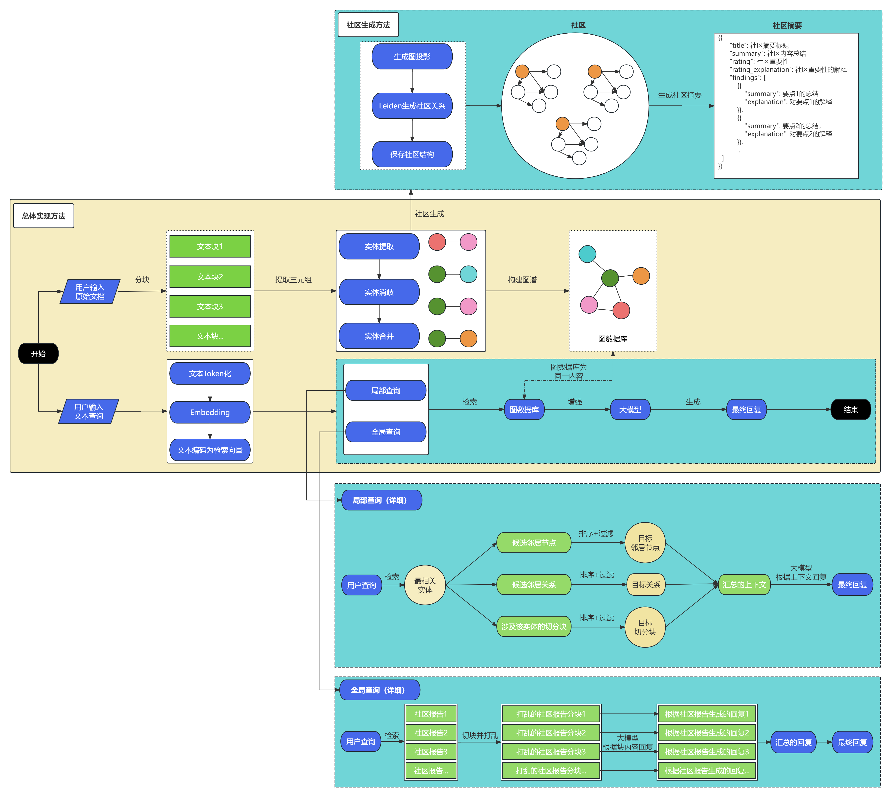
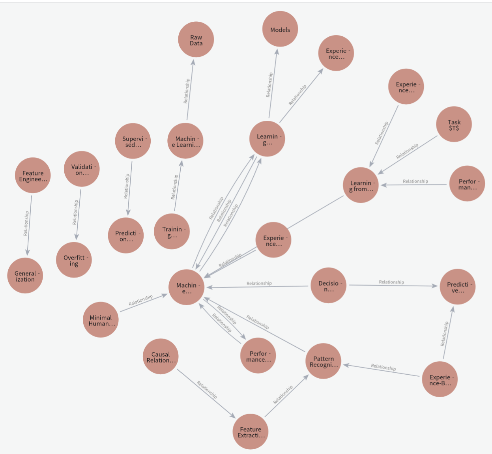
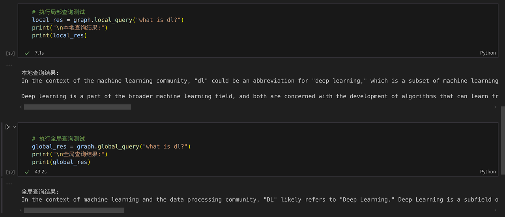

# Tiny-Graphrag使用指南与代码解读
>此README包括两部分：1.引言；2.正文
## 引言：
- Tiny-Graphrag是一个基于Graphrag的简化版本，包含了Graphrag的核心功能: 1.知识图谱构建；2.图检索优化；3.生成增强。创建Graphrag项目的目的是帮助大家理解Graphrag的原理并提供Demo来实现。
- 本项目实现流程如下所示：

<div align="center">
    
</div>

- 用通俗语言来描述就是：**输入问题后，通过图结构运算层的计算，将得到的上下文交给一个“聪明的学生”（即大语言模型 LLM），让它基于这些上下文进行推理和回答问题。**
## 正文：
>正文包括三部分：1.Graphrag简要介绍；2.Tiny-Graphrag 使用方法；3.Tiny-Graphrag代码解读
### Graphrag简要介绍
---
- 是什么？
    - 基于知识图谱的检索增强生成技术，通过显式建模实体关系提升rag的多跳推理能力。
- 提出时能够解决什么问题？
    - 传统rag的局限：单跳检索（无法回答"特朗普和拜登的母校有何共同点？"类问题） 语义相似度≠逻辑相关性     
    - Graphrag的改进：通过图路径实现多跳推理（如"特朗普→宾大→法学←拜登"）
- 以微软Graphrag为例，其核心功能如下表所示：

| 模块 | 模块描述 | 
|:------|:-----|
| 知识图谱构建 | 核心功能之一，将文本或结构化数据转化为图结构（节点和边）。  |
| 图检索优化   | 基于图谱的拓扑关系（如多跳路径、子图匹配）改进传统向量检索。    | 
| 生成增强    | 利用检索到的图结构（如子图、路径）增强大模型的生成逻辑性和准确性。  | 

- Leiden算法介绍
    - Leiden 算法是一种用于社区检测的高效算法，是 Louvain 算法的改进版本。它解决了 Louvain 算法可能产生的不连通社区问题，并提供了更高质量的社区划分。本文 1.3.7 生成社区内容 对此有进一步的介绍，更深入的了解请访问： https://arxiv.org/pdf/1810.08473

### Tiny-Graphrag 使用方法
---
  - 本项目给出了Tiny-Graphrag使用方法，初学者可以先直接跑通这个程序，然后再继续了解具体原理。这样的学习曲线更缓和，能有效防止卡在代码理解层面而对代码的整体作用缺少理解，难以应用。下面给出Tiny-Graphrag使用的具体方法。
  - Tiny-Graphrag 使用方法
    - 个人主机环境：ubuntu24.04
    - 代码下载
      ```bash
        git clone https://github.com/limafang/tiny-graphrag.git
        cd tiny-graphrag
      ```
    - 主机环境配置
      1. 安装：`neo4j --version 5.26.5`，可使用wget配合pip来完成
      2. 安装插件：`GDS`。 可从github上找到与`neo4j 5.26.5`**兼容**的`GDS 2.13.2`，将这个.jar文件放到neo4j的插件文件夹里。
      3. 安装：`OpenJDK-21`。命令行`sudo apt install openjdk-21-jre-headless`
    - 使用conda创建虚拟环境（虚拟环境创建此处仅作参考，学习者可以使用自己常用的开发环境来运行）
        ```bash
        conda create --name tinygrag python=3.10 -y # 虚拟环境创建
        conda activate tinygrag # 命令行激活虚拟环境
        conda install pip -y # 在conda环境内安装pip包管理工具
        ```
    - 环境中安装requirements.txt中的依赖，对应命令行为`pip install -r requirements.txt`
    - 先运行Neo4j，命令行为：`sudo neo4j start`，然后在浏览器中登陆到neo4j，默认网址为：http://localhost:7474
    - 运行`help.ipynb`
      - 注意每次全部重新运行都需要重启内核，否则在本地查询等步骤会报错
      - 使用本电脑首次运行完成耗时15分钟
    - 对于非首次运行的打开过程为：
      1. 激活当前项目的对应虚拟环境
      2. 打开neo4j
      3. 运行`help.ipynb`
    - 其他要求：
      - 本项目以zhipuAI作为调用的大模型，需要调用其API，所以需要注册智谱API的帐号，从而获得API
### Tiny-Graphrag代码解读
---
>下面将按照Graphrag的三个核心功能来介绍本项目的代码：
#### 1. 知识图谱构建

- 运行代码前需要启动neo4j客户端。
- 模块导入，并添加API，其中API可以手动添加，也可以通过将API设置为环境变量的方法添加，本项目采用后者。
    ```python
    # 导入模块
    import os
    import sys

    from Tiny-Graph.graph import Tiny-Graph
    from Tiny-Graph.embedding.zhipu import zhipuEmb
    from Tiny-Graph.llm.zhipu import zhipuLLM

    from neo4j import GraphDatabase
    from dotenv import load_dotenv # 用于加载环境变量

    sys.path.append('.') # 添加当前目录到 Python 路径
    print(os.getcwd())  # 验证下当前工作路径

    # 加载 .env文件, 从而导入api_key
    load_dotenv()  # 加载工作目录下的 .env 文件
    ```
##### 1.1 emb、llm类的实例化
-  将zhipuAi的嵌入模型（zhipuEmb）、zhipuLLM以及Tiny-Graph类分别实例化：
- llm以及模型的embedding服务，依次完成实例化。其中的llm以及embedding可以根据自己的需要再调整，此处作为示例用，两者分别传入了嵌入模型 / LLM模型的名称以及API_KEY
- 对应代码
    ```python
    emb = zhipuEmb(
        model_name="embedding-2",  # 嵌入模型
        api_key=os.getenv('API_KEY')
    )
    llm = zhipuLLM(
        model_name="glm-3-turbo",  # LLM
        api_key=os.getenv('API_KEY')
    )
    ```
- 以`zhipuEmb`为例，分析下类的继承关系。此处的`zhipuEmb`类是继承于`BaseEmb`类，在类实例化的过程（此处为`emb = zhipuEmb`）中会先调用`__init__`方法；
    ```python
    class zhipuEmb(BaseEmb):
        def __init__(self, model_name: str, api_key: str, **kwargs):
            super().__init__(model_name=model_name, **kwargs)
            self.client = ZhipuAI(api_key=api_key) # 创建 ZhipuAI 客户端，self.client 是zhipuEmb类的一个属性

        def get_emb(self, text: str) -> List[float]:
            emb = self.client.embeddings.create(
                model=self.model_name,
                input=text,
            )
            return emb.data[0].embedding
    ```
- 为了调用`zhipuEmb`继承的`BaseEmb`类的属性，使用`super().__init__(model_name=model_name, **kwargs)`将模型名称传入`zhipuEmb`继承的`BaseEmb`类；
- 而`BaseEmb`类继承自`ABC`类（`Abstract Base Class`，抽象基类）
- `zhipuLLM`的实例化过程与此类似。
##### 1.2 Tiny-Graph类的实例化
- 传入了neo4j的默认网址、用户名、密码、llm、emb。
- 对应代码
    ```python
    graph = Tiny-Graph(
        url="neo4j://localhost:7687",
        username="neo4j",
        password="neo4j-passwordTGR",
        llm=llm,
        emb=emb,
    )
    ```
- 实例化过程自动调用的`__init__`方法完成了创建Neo4j数据库驱动、设置语言模型、设置嵌入模型、设置工作目录等工作，详细注释见下方代码：
    ```python
    class Tiny-Graph:
        """
        一个用于处理图数据库和语言模型的类。

        该类通过连接到Neo4j图数据库，并使用语言模型（LLM）和嵌入模型（Embedding）来处理文档和图数据。
        它还管理一个工作目录，用于存储文档、文档块和社区数据。
        """

        def __init__(
            self,
            url: str,  # Neo4j数据库的URL
            username: str,  # Neo4j数据库的用户名
            password: str,  # Neo4j数据库的密码
            llm: BaseLLM,  # 语言模型（LLM）实例
            emb: BaseLLM,  # 嵌入模型（Embedding）实例
            working_dir: str = "workspace",  # 工作目录，默认为"workspace"
        ):
            """
            初始化Tiny-Graph类。

            参数:
            - url: Neo4j数据库的URL
            - username: Neo4j数据库的用户名
            - password: Neo4j数据库的密码
            - llm: 语言模型（LLM）实例
            - emb: 嵌入模型（Embedding）实例
            - working_dir: 工作目录，默认为"workspace"
            """
            self.driver = driver = GraphDatabase.driver(
                url, auth=(username, password)
            )  # 创建Neo4j数据库驱动
            self.llm = llm  # 设置语言模型
            self.embedding = emb  # 设置嵌入模型
            self.working_dir = working_dir  # 设置工作目录
            os.makedirs(self.working_dir, exist_ok=True)  # 创建工作目录（如果不存在）

            # 定义文档、文档块和社区数据的文件路径
            self.doc_path = os.path.join(working_dir, "doc.txt")
            self.chunk_path = os.path.join(working_dir, "chunk.json")
            self.community_path = os.path.join(working_dir, "community.json")

            # 创建文件（如果不存在）
            create_file_if_not_exists(self.doc_path)
            create_file_if_not_exists(self.chunk_path)
            create_file_if_not_exists(self.community_path)

            # 加载已加载的文档
            self.loaded_documents = self.get_loaded_documents()
    ```
##### 1.3 添加文档到图数据库
- 使用Tiny-Graph类下的`add_document`方法来将指定路径的文档添加到图数据库中`graph.add_document("example/data.md")`。该方法会自动处理文档的分块和嵌入生成，并将结果存储在图数据库中。这里的路径是相对路径，指向当前工作目录下的example/data.md文件。其主要功能如下：
###### 1.3.1 检查文档是否已经分块；
- 对应代码
    ```python
    # ================ Check if the document has been loaded ================
    if filepath in self.get_loaded_documents():
        print(
            f"Document '{filepath}' has already been loaded, skipping import process."
        )
        return # 在这段代码中，return 的作用是 终止函数的执行，并返回到调用该函数的地方
    ```
- 功能：检查指定文档是否已经被加载过，避免重复处理。
- 实现步骤：
    1. 调用`self.get_loaded_documents()`方法，读取已加载文档的缓存文件（doc.txt），返回一个包含已加载文档路径的集合
    2. 检查文档路径是否已经存在，如果已经存在，则打印提示信息
    3. 中止函数的执行，return在此段代码中的作用是中止函数的执行，并返回到调用该函数的地方。
    2. 将文档分割成块（此处就是分割为json格式的文件）；


###### 1.3.2. 将文档分割成块（此处就是分割为json格式的文件）
- 对应代码
    ```python
    # ================ Chunking ================
    chunks = self.split_text(filepath)
    existing_chunks = read_json_file(self.chunk_path)

    # Filter out chunks that are already in storage
    new_chunks = {k: v for k, v in chunks.items() if k not in existing_chunks}

    if not new_chunks:
        print("All chunks are already in the storage.")
        return

    # Merge new chunks with existing chunks
    all_chunks = {**existing_chunks, **new_chunks}
    write_json_file(all_chunks, self.chunk_path)
    print(f"Document '{filepath}' has been chunked.")
    ```
- 功能：将文档分割成多个小块（chunks），并将这些分块存储到一个JSON文件中，避免重复存储已经存在的分块。
- 实现步骤：
    1. 分割文档：调用`chunks = self.split_text(filepath)`方法，将文档分割成多个小块，并且相邻小块之间有一定重叠，返回值chunks是一个字典，键是分块的唯一ID，值是分块的内容。
    2. 读取已经存储的分块：`existing_chunks = read_json_file(self.chunk_path)`，调用该方法从chunk.json中读取已经存储的分块，返回值existing_chunks是一个字典，包含所有已经存储的分块。
    3. 过渡新分块：`new_chunks = {k: v for k, v in chunks.items() if k not in existing_chunks}`，使用字典推导式过滤出新的分块，返回值new_chunks是一个字典，包含所有新的分块。
    4. 检查是否有新的分块,如果new_chunks为空，也就是没有新的分块需要存储的话，打印提示信息并终止函数执行。
        ```python
            if not new_chunks:
            print("All chunks are already in the storage.")
            return            
        ```
    5. 合并分块：`all_chunks = {**existing_chunks, **new_chunks}`，使用字典包语法将existing_chunks和new_chunks合并为一个新的字典。
    6. 写入JSON文件：`write_json_file(all_chunks, self.chunk_path)`，将合并后的分块写入chunk.json文件。
    7. 打印提示信息。

###### 1.3.3 从块中提取实体（entities）和三元组（triplets）；
- 对应代码
    ```python
    # ================ Entity Extraction ================
    all_entities = []# 用于存储从文档块中提取的实体
    all_triplets = []# 用于存储从所有文档中提取的三元组

    # 遍历文档块，每个分块有一个唯一的chunk_id和对应的内容chunk_content
    for chunk_id, chunk_content in tqdm(
        new_chunks.items(), desc=f"Processing '{filepath}'"
    ):
        try:
            # 从当前分块中提取实体，每个实体包含名称、描述、关联的分块ID以及唯一的实体ID
            entities = self.get_entity(chunk_content, chunk_id=chunk_id)
            all_entities.extend(entities)
            # 从当前分块中提取三元组，每个三元组由主语（subject）、谓语（predicate）和宾语（object）组成，表示实体之间的关系
            triplets = self.get_triplets(chunk_content, entities)
            all_triplets.extend(triplets)
        except:
            print(
                f"An error occurred while processing chunk '{chunk_id}'. SKIPPING..."
            )

    print(
        f"{len(all_entities)} entities and {len(all_triplets)} triplets have been extracted."
    )
    ```
- 功能：遍历文档块以及从当前分块中提取实体和三元组，其中提取实体和三元组，均使用llm来完成。下面分析这代代码的实现步骤，再简单解释下实体和三元组的定义与结构。
- 实现步骤：
    1. 初始化存储容器；
    2. 遍历文档块，遍历new_chunks字典，其中每一块有一个chunk_id和对应的内容chunk_content。
    3. 提取实体和三元组：首先调用self.get_entity(chunk_conten, chunk_id= chunk_id)方法，从当前分块中提取实体，将提取到的实体追加到all_entities列表中；然后调用self.get_triplets(chunk_content, entities)方法，从当前分块中提取三元组，将提取到的三元组追加到all_triplets列表中。如果在处理过程中出现错误，打印错误信息并跳过该分块。
    4. 打印提取的实体和三元组综述，便于检查和提取结果。
- 实体的定义与结构
    - 定义：实体是文档中提取的关键概念或对象，通常是名词或专有名词。
    - 结构示意
        ```python
        {
            "name": "Entity Name",  # 实体名称
            "description": "Entity Description",  # 实体描述
            "chunks id": ["chunk-1a2b3c"],  # 关联的文档块 ID
            "entity id": "entity-123456"  # 实体的唯一标识符
        }
        ```
- 三元组的定义与结构
    - 定义：三元组是描述实体之间关系的结构，包含主语（subject）、谓语（predicate）和宾语（object）。
    - 结构示意
        ```python
        {
            "subject": "Subject Name",  # 主语名称
            "subject_id": "entity-123456",  # 主语的唯一标识符
            "predicate": "Predicate Name",  # 谓语（关系名称）
            "object": "Object Name",  # 宾语名称
            "object_id": "entity-654321"  # 宾语的唯一标识符
        }
        ```

- 实体（Entities）是图数据库中的节点，表示文档中的关键概念。三元组（Triplets）是+图数据库中的边，表示实体之间的关系，Neo4j中的节点与三元组关系如下所示：

<div align="center">
    
</div>

###### 1.3.4 执行实体消歧和三元组更新。实体消歧有两种方法可以选择，默认将同名实体认为是同一实体
- 对应代码
    ```python
    # ================ Entity Disambiguation ================
    entity_names = list(set(entity["name"] for entity in all_entities))

    if use_llm_deambiguation:
        entity_id_mapping = {}
        for name in entity_names:
            same_name_entities = [
                entity for entity in all_entities if entity["name"] == name
            ]
            transform_text = self.llm.predict(
                ENTITY_DISAMBIGUATION.format(same_name_entities)
            )
            entity_id_mapping.update(
                get_text_inside_tag(transform_text, "transform")
            )
    else:
        entity_id_mapping = {}
        for entity in all_entities:
            entity_name = entity["name"]
            if entity_name not in entity_id_mapping:
                entity_id_mapping[entity_name] = entity["entity id"]

    for entity in all_entities:
        entity["entity id"] = entity_id_mapping.get(
            entity["name"], entity["entity id"]
        )

    triplets_to_remove = [
        triplet
        for triplet in all_triplets
        if entity_id_mapping.get(triplet["subject"], triplet["subject_id"]) is None
        or entity_id_mapping.get(triplet["object"], triplet["object_id"]) is None
    ]

    updated_triplets = [
        {
            **triplet,
            "subject_id": entity_id_mapping.get(
                triplet["subject"], triplet["subject_id"]
            ),
            "object_id": entity_id_mapping.get(
                triplet["object"], triplet["object_id"]
            ),
        }
        for triplet in all_triplets
        if triplet not in triplets_to_remove
    ]
    all_triplets = updated_triplets
    ```
- 对于实体消歧（Entity Disambiguation）部分
    - 功能：
        - 解决同名实体歧义的问题，确保每个实体都有唯一的entity_id。如果启用了LLM消歧（use_llm_deambiguation=True），则默认将同名实体视为同一实体；如果未启用LLM消歧，则默认将同名实体视为同一实体。本项目采用后者。
    - 实现步骤：
        1. 提取实体的名称存储到entity_names中；
        2. 使用默认方法消歧义
        3. 更新实体ID
- 对于三元组更新（Triplet Update）部分
    - 功能：
        - 根据消歧后的实体ID更新三元组，并移除无效的三元组。
    - 实现步骤：
        1. 移除所有无效的三元组（如果三元组的主语或者宾语的实体ID无法在entity_id_mapping中找到，则将其标记为无效）；
        2. 更新三元组（对于有效的三元组，更新其主语和宾语的实体ID）
        3. 保存更新后的三元组（将更新后的三元组列表保存到all_triplets中）
###### 1.3.5 合并实体和三元组
- 对应代码
    ```python
    # ================ Merge Entities ================
    entity_map = {}

    for entity in all_entities:
        entity_id = entity["entity id"]
        if entity_id not in entity_map:
            entity_map[entity_id] = {
                "name": entity["name"],
                "description": entity["description"],
                "chunks id": [],
                "entity id": entity_id,
            }
        else:
            entity_map[entity_id]["description"] += " " + entity["description"]

        entity_map[entity_id]["chunks id"].extend(entity["chunks id"])
    ```
- 功能：
    - 将所有提取的实体（all_entities）按照其唯一标识符（entity_id）进行归并，确保同一个实体的描述和关联的文档块ID被整合到一起
- 实现步骤：
    - 使用一个字典entity_map，以entity_id作为键，存储每个实体的合并信息。如果某个实体entity_id已经存在于entity_map中，则将其描述和文档块ID合并到已有的实体中。
###### 1.3.6 将合并的实体和三元组存储到Neo4j的图数据库中
- 对应代码
    ```python
    # ================ Store Data in Neo4j ================
    for triplet in all_triplets:
        subject_id = triplet["subject_id"]
        object_id = triplet["object_id"]

        subject = entity_map.get(subject_id)
        object = entity_map.get(object_id)
        if subject and object:
            self.create_triplet(subject, triplet["predicate"], object)
    ```
- 功能：将提取的三元组（triplets）存储到Neo4j图数据库中
- 实现步骤：
    1. 遍历all_triplets列表，逐个处理每个三元组
    2. 根据三元组中的subject_id和object_id，从entity_map中获取对应的实体信息
    3. 如果主语和宾语实体都存在，则调用self.create_triplet方法，将三元组存储到Neo4j中。其中的create_triplet方法能够通过Cypher查询语句将实体和关系插入到数据库中。
###### 1.3.7 生成社区内容

基于上一步构建的知识图谱索引，可以使用多种社区检测算法对图进行划分，以识别其中强连接的节点集合（即社区）。在我们的处理流程中，我们采用 Leiden 社区检测算法以递归方式构建社区层级结构：首先在全图中识别出初始社区，然后在每个社区内继续执行子社区检测，直到无法进一步划分为止，形成叶级社区。

Leiden 算法主要包括以下三个阶段：


- 节点聚合： 在固定社区划分的前提下，尝试将每个节点移动到邻居节点所属社区，以提升总体模块度。
- 社区细化： 对每个社区进行局部划分，确保每个社区子图中的所有节点之间是连通的，防止出现不连通的社区。
- 图聚合： 构建新的超图，将每个社区作为一个超级节点，重复第一步，形成递归的社区层级结构。


模块度用于衡量当前社区划分相较于随机划分的“好坏”，定义如下：

$$
Q = \frac{1}{2m} \sum_{i,j} \left[ A_{ij} - \frac{k_i k_j}{2m} \right] \delta(c_i, c_j)
$$

其中:

$A_{ij}$：节点 $i$ 与节点 $j$ 之间的边的权重；
$k_i$：节点 $i$ 的度（边的总权重）；
$m$：图中所有边的总权重的一半（即 $m = \frac{1}{2} \sum_{i,j} A_{ij}$）；
$c_i$：节点 $i$ 所属的社区编号；
$\delta(c_i, c_j)$：当 $i$ 与 $j$ 属于同一社区时为 1，否则为 0。

在社区划分完成后，我们为社区层级结构中的每一个社区生成类报告形式的摘要。这一过程支持对大规模数据集的结构性理解，提供了不依赖具体查询的语义概览，帮助用户快速掌握语料库中各主题的全貌。

例如，用户可以浏览某一层级的社区摘要以确定感兴趣的主题，并进一步阅读下级社区报告，获取更细粒度的信息。尽管这些摘要本身具有独立意义，但我们主要关注其作为图索引机制的一部分，在响应全局性查询时的效用。

摘要的生成采用模板方法，逐步将图中节点、边及其声明的摘要填充到社区摘要模板中。较低层级的社区摘要将作为上层社区摘要生成的基础。

 对于叶级社区，从图中提取的节点和边的摘要被按优先级排序加入到 LLM 上下文窗口中。排序标准是：依据边的源节点和目标节点的整体度量（即显著性）降序排列。依次添加源节点描述、目标节点描述、边的描述。

对于高级社区，若所有元素摘要在上下文窗口的 token 限制内可容纳，则按叶级社区的方法汇总所有元素摘要；否则，将子社区按摘要的 token 数量降序排序，逐步用更短的子社区摘要替换较长的元素摘要，直到整体摘要符合上下文窗口限制。


- 对应代码    
    ```python
    # ================ communities ================
    self.gen_community()
    self.generate_community_report()
    ```
- 功能：
    - 生成社区：通过图算法（本项目为 Leiden 算法）检测图中的社区结构。
    - 生成社区报告：借助大语言模型为每个社区生成详细的报告，描述社区中的实体和关系。
- 实现步骤：
    1. 对于生成社区功能，调用 self.gen_community() 方法：
        - 使用 Neo4j 的图算法（如 gds.leiden.write）检测社区。
        - 生成社区架构（community schema），包括社区的层级、节点、边等信息。
        - 将社区架构存储到 community.json 文件中。
    2. 对于生成社区报告功能，调用 self.generate_community_report() 方法：
        - 遍历每个社区，生成包含实体和关系的报告。
        - 报告通过大语言模型（LLM）生成，描述社区的结构和内容。

###### 1.3.8 生成嵌入式向量
- 对应代码
    ```python
    # ================ embedding ================
    self.add_embedding_for_graph()
    self.add_loaded_documents(filepath)
    print(f"doc '{filepath}' has been loaded.")
    ```
- 功能：
    - 为图数据库中的每个实体节点生成嵌入向量（embedding），用于计算相似度（本项目采用余弦相似度）和查询。
    - 将处理过的文档路径记录到缓存文件中，避免重复处理。
- 实现步骤：
    1. 生成嵌入：调用 self.add_embedding_for_graph() 方法：遍历图数据库中的每个实体节点；使用嵌入模型（self.embedding）计算节点描述的嵌入向量；将嵌入向量存储到节点的 embedding 属性中。
    2. 记录文档路径：调用 self.add_loaded_documents(filepath) 方法：将当前文路径添加到缓存文件中，避免重复加载。
- 最终生成的图数据信息如下所示：
  
<div align="center">
    
</div>
  
###### 1.3.9 验证下数据库连接是否正常（当然，此步也可省略）
- 对应代码
    ```python
    with graph.driver.session() as session:
        result = session.run("MATCH (n) RETURN count(n) as count")
        count = result.single()["count"]
        print(f"数据库连接正常，节点数量: {count}")
    ```
#### 2. 图检索优化
##### 2.1 两种图检索方法
-  按照Tiny-Graphrag demo代码的执行过程，图检索优化过程有两种：分别为Tiny-Graph类中`local_query`方法和`global_query`方法。
  - 全局查询和局部查询的特点如下表所示：

| 查询类型 | 特点 | 适用场景 |
|----------|------|----------|
| 全局查询（global_query） | • 基于社区层级评分<br>• 筛选候选社区<br>• 返回排序列表 | • 高层次理解<br>• 全局视角分析 |
| 局部查询（local_query） | • 基于直接关联上下文<br>• 提取精确实体/关系<br>• 返回多部分结果 | • 精确定位<br>• 深度分析 |
- 下面依次分析下`local_query`方法和`global_query`方法的具体实现过程。
##### 2.2 local_query方法

局部查询方法主要用于回答那些聚焦于单一或少数几个实体的问题，比如“孙悟空的生平”或“矢车菊的治疗特性”。这种方法通过一系列步骤，从知识图谱和原始语料中提取与查询密切相关的信息，以构建精准的上下文，并最终生成高质量的回答。

首先，系统会将用户的查询转换为一个向量表示，用于捕捉其语义含义。接着，它会在知识图谱中为每个实体节点也生成相应的向量表示，然后通过计算它们与查询向量之间的相似度，筛选出那些与查询密切相关的实体。如果它们之间的相似度超过一个设定的阈值，就会被认为是“相关实体”。

找到这些关键实体之后，系统会进一步扩展它们的上下文信息，包括提取它们在知识图谱中直接连接的邻居节点和边，以补充相关的结构性信息。同时，系统还会在原始文本语料中查找与这些实体强相关的内容片段，为后续生成提供更多语义背景。

最后，这些相关实体、邻居节点以及对应的文本片段会被组合成一个紧凑的局部上下文窗口，这个窗口会被输入到 LLM 中，用来生成针对用户问题的具体回答。

- 在Tiny_Graphrag_test.ipynb中，执行局部查询测试时，使用的是local_query方法
    - 具体代码为：`local_res = graph.local_query("what is dl?")` 
    - 其中调用的方法`local_query("what is dl?")`，将"what is dl?"传递给`local_query()`方法，以下是`local_query()`方法的代码内容和代码解读
- 代码内容
    ```python
    def local_query(self, query):
        context = self.build_local_query_context(query) # 分别包括社区、实体、关系、文档块这四部分
        prompt = LOCAL_QUERY.format(query=query, context=context) # 需要的参数context以及query都在该方法内得到了
        response = self.llm.predict(prompt)
        return response
    ```
- 代码解读
    - 执行`context = self.build_local_query_context(query)`后，根据用户问题（本项目中是"what is dl?"）得到的包括社区、实体、关系、文档块的这四部分内容的上下文（context）。得到上下文的具体方法为：`build_local_query_context(self, query)`，该方法内的代码执行顺序是：
    1. 获得输入文本的嵌入向量。对应代码为：`query_emb = self.embedding.get_emb(query)` 
    2. 获得前k个最相似的实体，相似判断的依据是余弦相似度。对应代码为：`topk_similar_entities_context = self.get_topk_similar_entities(query_emb)`
    3. 获得前k个最相似的社区，依据的方法是：
        - 利用上面得到的最相似实体；
        - 只要包含上述的任意topk节点，就认为是相似社区（社区：community，由相互关联的节点组成的集合）。对应代码为：
            ```python
            topk_similar_communities_context = self.get_communities(
                topk_similar_entities_context
            )
            ```
    4. 获得前k个最相似的关系，依据的方法是：在`get_relations`方法中调用`get_node_edgs`方法，获取该实体的所有关系边，认为这些边就是similar relation。对应代码为：
        ```python
        topk_similar_relations_context = self.get_relations(
        topk_similar_entities_context, query
        )
        ```
    5. 获得前k个最相似的文档块，依据是方法是：在`get_chunks`方法中调用`get_node_chunks`方法，获取该实体关联的文档块，认为这些文档块就是similar chunks。对应代码为：
        ```python
        topk_similar_chunks_context = self.get_chunks(
        topk_similar_entities_context, query
        )
        ```
    6. `build_local_query_context()`方法最终返回的是一个多行字符串，包括: 
        - Reports：社区报告；
        - Entities：与查询最相似的实体；
        - Relationships：这些实体之间的关系；
        - Sources：这些实体关联的文档块。对应的代码为：
            ```python
                return f"""
                -----Reports-----
                ```csv
                {topk_similar_communities_context}
                ```
                -----Entities-----
                ```csv
                {topk_similar_entities_context}
                ```
                -----Relationships-----
                ```csv
                {topk_similar_relations_context}
                ```
                -----Sources-----
                ```csv
                {topk_similar_chunks_context}
                ```
                """
            ```
    - 之后的`prompt = LOCAL_QUERY.format(query=query, context=context)`可以理解为根据刚刚生成的context作为上下文，生成prompt为大模型使用。
    -  最后 ，`response = self.llm.predict(prompt)`是将上文得到的prompt传输给大模型，从而让大模型做推理和回答，然后该方法返回到`response（return response）`作为大模型的回答结果。
###### 2.3 global_query方法

全局查询方法适用于更复杂的问题，尤其是那些需要跨越多个知识图谱社区、结构性较强的查询，比如“曹操与大乔之间的联系”。这种类型的问题通常难以通过关注单一实体来解决，因此需要更宏观的视角和层级化的信息整合。

整个流程围绕社区结构展开。知识图谱被组织成多层的社区集合，每一层的社区代表一组语义相关的实体节点，每个社区都有一个由 LLM 生成的摘要，简要概括了该社区的主要信息。

处理这类查询时，系统首先将用户提出的问题转换为一个向量表示，用于捕捉其深层语义。随后，它会将这个向量与所有社区摘要的嵌入进行比较，筛选出与查询最相关的一组社区。这一筛选基于相似度阈值，确保只保留与查询密切相关的区域。

接下来，系统会把这些相关社区的摘要进一步切分成较小的文本块，每一块单独输入到语言模型中进行处理。模型会为每个文本块生成一个中间响应，识别出若干关键信息点，并为每个信息点打分，以反映其对回答问题的贡献度。

然后，系统会根据评分，从所有中间响应中挑选出最重要的若干信息点，组成一个高质量的全局上下文。这些信息点跨越不同的社区，构成了一个面向复杂查询的知识核心。

最后，这个上下文连同原始问题一起被输入到语言模型中，生成最终的答案。通过这种方式，全局查询不仅能覆盖广泛的实体与关系，还能整合跨社区的背景信息，提供更深入、综合的回答。


-  在`Tiny_Graphrag_test.ipynb`中，执行全局查询测试时，使用的是`global_query`方法
      - 具体代码为：`global_res = graph.global_query("what is dl?")`
      - 其中调用的方法`global_query("what is dl?")`，将"what is dl?"传递给`global_query()`方法，以下是`global_query()`方法的代码内容和代码解读
- 代码内容：
    ```python
    def global_query(self, query, level=1):
        context = self.build_global_query_context(query, level) # 得到的是一个列表，包含社区的描述和分数
        prompt = GLOBAL_QUERY.format(query=query, context=context)# 将得到的context传入到prompt中
        response = self.llm.predict(prompt)# 将prompt传入到llm中，得到最终的结果，也就是将包含描述和分数的列表传入到llm中
        return response
    ```
- 代码解读：
- 运行`context = self.build_global_query_context(query, level)`时，会根据用户问题（本项目中是“what is dl?"）得到的包含社区描述和分数的上下文（context）。对应代码为：`context = self.build_global_query_context(query, level)`，该方法内的代码执行顺序是：
    1. 设定空的候选社区（字典）以及空的社区评分列表（列表），并筛选符合层级要求的社区。对应代码为：
        ```python
        communities_schema = self.read_community_schema()
        candidate_community = {} # 候选社区 字典
        points = [] # 社区评分列表 列表
        # 筛选符合层级要求的社区
        for communityid, community_info in communities_schema.items():
            if community_info["level"] < level:
                candidate_community.update({communityid: community_info})
        ```
    2. 计算候选的社区的评分，通过调用`map_community_points`函数，结合社区报告和大语言模型的能力，为每个候选社区生成与查询内容（如 "What is DL?"）相关程度的评分。对应的代码为：
        ```python
        for communityid, community_info in candidate_community.items():
        points.extend(self.map_community_points(community_info["report"], query))
        ```
    3. 按照评分降序排序，得到包含描述和分数的列表。描述是社区的描述，分数是查询的相关性得分。对应代码为：
        ```python
        points = sorted(points, key=lambda x: x[-1], reverse=True)
        return points # 得到包含描述和分数的列表，描述是社区的描述，分数是查询的相关性得分
        ```
    4. 之后的`prompt = GLOBAL_QUERY.format(query=query, context=context)`可以理解为根据刚刚生成的context作为上下文，生成prompt给大模型使用。
    5. 最后，`response=self.llm.predict(prompt)`将上文得到的prompt传输给大模型。`return response`作为大模型的回答结果。
##### 2.4 生成增强
1. 通俗来讲就是：将得到的上下文输入给大模型，基于此上下文，大模型作推理和回答
2. 在本项目代码中，`local_query`方法和`global_query`方法的将各自得到的上下文传输给大模型将是生成增强的过程。
  - 局部查询和全局查询成功运行的示例：

<div align="center">
  
</div>

