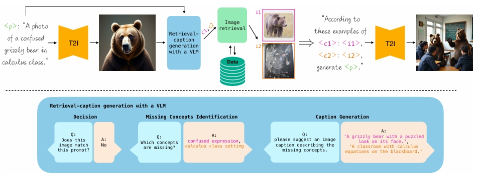
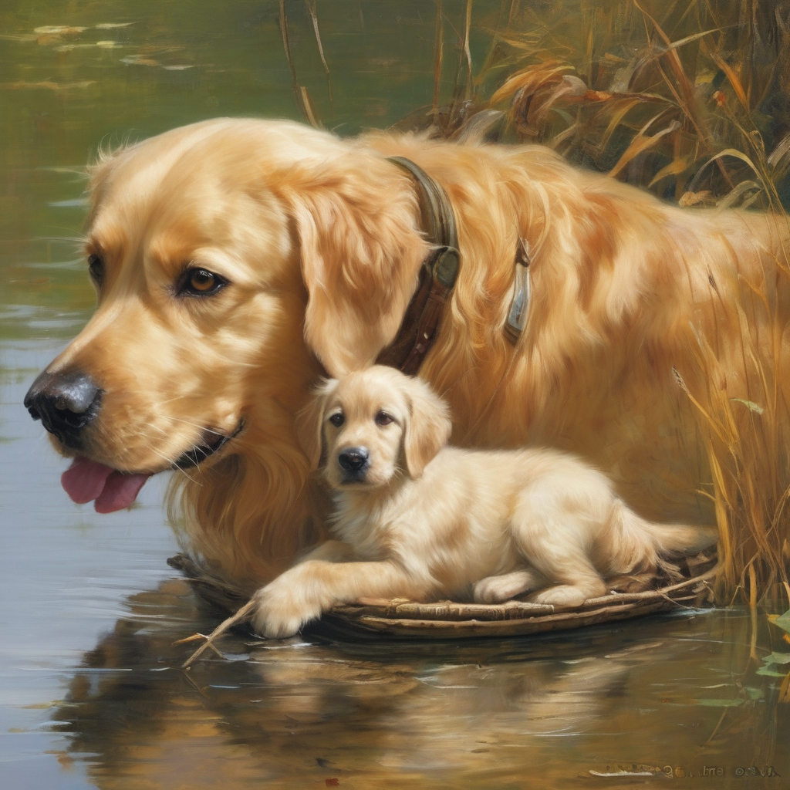
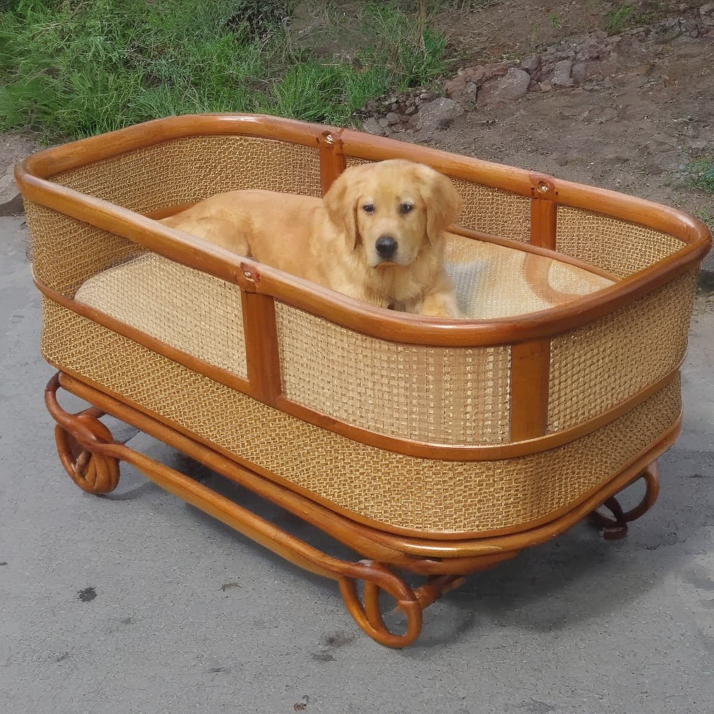

# TinyIMGRAG

## 简介
常规的AIGC生图模型主要是基于提示词进行指导和生成的。但就像LLM会出现幻觉一样，Stable Diffusion等图像生成模型也同样存在一定的幻觉，并且很难控制图像多次生成时的一致性。

鉴于此，我将会带领大家实现一个以SD模型为基础，结合CLIP图像检索，Qwen2.5-VL图像评判以及Qwen2.5提示词重写来进行增强生图的TinyIMGRAG项目，这实际上是一个简化版本的IMGRAG项目，只包含核心模块，项目没有调用api，所有模型全程均运行在一张24G的3090显卡上面。

下面是我所使用的一些基础环境与需要单独下载的包或模型的介绍：
- OS Windows 10
- cuda 12.1
- python 3.10
- 从github下载CLIP安装包并安装(先安装requirements.txt中的包，再装这个)
```shell
git clone https://github.com/openai/CLIP.git 
cd CLIP-main
pip install -e .
```
如果git clone下载失败可以从https://github.com/openai/CLIP#直接下载到本地是一样的

- Vit-B-32.pt模型可以从 https://huggingface.co/jinaai/clip-models/blob/main/ViT-B-32.pt 处下载

## 1. IMGRAG 介绍

在文本到图像（T2I）生成领域，AIGC模型在处理未见过的概念或者需要服从前后生图的一致性时常常表现出局限性，难以生成符合预期的图像。这种现象的根本原因在于模型缺乏对特定视觉线索的充分学习，尤其是在面对新颖或复杂概念时，生成结果往往偏离目标。

与AIGC生图不同，IMGRAG可以利用外部数据集中的图像数据来支持图像生成的质量和对提示词的忠诚度。但其需要解决三个问题：

- 如何确定初始生成图像中缺失的概念？
- 如何获取与缺失概念匹配的图像？
- 如何利用获取的所有信息来生成符合预期的图像？

针对这一挑战，AIGC结合检索增强生成（RAG）方法形成了IMGRAG，其旨在通过动态选择能够补充模型缺失视觉信息的图像，进一步提升生成模型的鲁棒性。



图片来源于：***[ImageRAG: Dynamic Image Retrieval for Reference-Guided Image Generation](https://arxiv.org/pdf/2502.09411)***

如上图所示，IMGRAG通过以下步骤即可逐步实现目标：

- 初始生成：基于给定的文本提示，利用T2I生成模型生成一张初始图像。
- 匹配评估：将生成的图像输入视觉语言模型（VLM），评估该图像是否与原始提示匹配。
- 检索与优化：如果不匹配，系统会识别图像中缺失的概念，并为每个缺失概念生成检索描述。通过这些描述，从外部数据库中检索相关图像，并将这些图像作为额外的上下文提供给生成模型，以引导其更好地与提示对齐。
- 结果生成：通过整合检索到的图像信息，模型最终生成更符合预期的新概念图像。

## 2.生成原始图像

为了实现图像生成，我们需要实现一个SDXLGenerator类，其基于 Stable Diffusion XL (SDXL) 模型，支持文本到图像生成以及文本+图像引导的生成方式。它封装了模型加载、参数配置和图像生成的整个流程。
```python
class SDXLGenerator:
    def __init__(self, prompt, output_path, steps=50, seed=0,
                 use_image_guidance=False, image_path=None, ip_scale=0.5,
                 sd_path="./model/stabilityai/stable-diffusion-xl-base-1.0",
                 adapter_path="./model/h94/IP-Adapter"):
        self.prompt = prompt
        self.output_path = output_path
        self.steps = steps
        self.seed = seed
        self.use_image_guidance = use_image_guidance
        self.image_path = image_path
        self.ip_scale = ip_scale

        # 设备设置
        self.device = "cuda" if torch.cuda.is_available() else "cpu"
        self.torch_dtype = torch.float16 if self.device == "cuda" else torch.float32

        # 初始化管道
        self.pipe = AutoPipelineForText2Image.from_pretrained(
            sd_path,
            torch_dtype=self.torch_dtype
        ).to(self.device)

        # 如果需要使用图像引导，加载图像编码器和IP-Adapter
        if self.use_image_guidance:
            # 初始化图像编码器
            self.image_encoder = CLIPVisionModelWithProjection.from_pretrained(
                adapter_path,
                subfolder="models/image_encoder",
                torch_dtype=self.torch_dtype
            ).to(self.device)

            # 将图像编码器设置到管道中
            self.pipe = AutoPipelineForText2Image.from_pretrained(
                sd_path,
                image_encoder=self.image_encoder,
                torch_dtype=self.torch_dtype
            ).to(self.device)

            # 加载IP-Adapter
            self.pipe.load_ip_adapter(
                adapter_path,
                subfolder="sdxl_models",
                weight_name="ip-adapter-plus_sdxl_vit-h.safetensors"
            )
            self.pipe.set_ip_adapter_scale(self.ip_scale)

    def generate_image(self):
        # 准备生成参数
        generator = torch.Generator(device=self.device).manual_seed(self.seed)

        # 执行生成
        print("开始生成...")
        if self.use_image_guidance:
            # 加载参考图像
            ref_image = Image.open(self.image_path)

            # 使用图像和文本生成
            result = self.pipe(
                prompt=self.prompt,
                ip_adapter_image=ref_image,
                negative_prompt="monochrome, lowres, bad anatomy, worst quality, low quality",
                num_inference_steps=self.steps,
                generator=generator,
            )
        else:
            # 只使用文本生成
            result = self.pipe(
                prompt=self.prompt,
                negative_prompt="monochrome, lowres, bad anatomy, worst quality, low quality",
                num_inference_steps=self.steps,
                generator=generator,
            )

        # 保存结果
        result.images[0].save(self.output_path)
        print(f"生成完成，结果已保存至: {self.output_path}")
        return self.output_path
```
SDXLGenerator 采用了模块化设计思想。其主要组件包括：
- 模型加载系统：自动处理 SDXL 基础模型和 IP-Adapter 的加载
- 设备管理：自动检测并选择 CUDA 或 CPU
- 实现生成图像的pipeline：封装了完整的图像生成流程

具体内容则主要分为两块:
- '__init__初始化'，需要注意的是，可以根据 use_image_guidance 决定是否加载 IP-Adapter，进而实现文生图和图文联合生图的切换
- 'generate_image生成图片函数'主要进行生成控制，包括根据配置选择纯文本生成或图文联合生成，内置负面提示词过滤低质量结果等。最后会自动保存图像并返回路径

## 3.VLM模型调用-（用于判断生成的图像与提示文本是否一致，不一致则捕捉其差异概念）
这部分的目的是利用 Qwen2.5-VL视觉语言模型来处理第一步生成的图像和提示文本，并返回该图像与提示文本之间的差异或一致性。

它由两个简单的函数组成：

- load_qwen_vlm：这个函数负责加载Qwen-VL的模型和处理器。模型是用于处理图像和文本生成的核心，而处理器则用于将输入数据（图像和文本）转换为模型可以理解的格式。
- run_qwen_vl：该函数执行具体的推理任务。它首先将输入图像编码为 Base64 格式，然后构建一个包含图像和提示信息的消息结构。接着，函数通过处理器将输入文本和图像预处理为适合模型的格式，并将其传递给模型进行推理。最后，模型生成一个结果，该结果指示图像与描述文本之间的差异或一致性。

```python
def load_qwen_vlm(pretrained_model="./model/Qwen/Qwen2.5-VL-3B-Instruct"):

    min_pixels = 256 * 28 * 28
    max_pixels = 1280 * 28 * 28
    # default: Load the model on the available device(s)
    model = Qwen2_5_VLForConditionalGeneration.from_pretrained(
        pretrained_model, torch_dtype="auto", device_map="auto"
    )

    # default processer
    processor = AutoProcessor.from_pretrained(pretrained_model, min_pixels=min_pixels,
                                              max_pixels=max_pixels)
    return model,processor

def run_qwen_vl(image_path,prompt,model,processor):

    # 编码图片
    with open(image_path, "rb") as image_file:
        base64_image = base64.b64encode(image_file.read()).decode('utf-8')

    messages = [
        {
            "role": "user",
            "content": [
                {
                    "type": "image",
                    "image": f"data:image/jpeg;base64,{base64_image}",
                },
                {"type": "text", "text": f"Please identify the different between the image and the description of the {prompt}, and output in the format 'The different conception is a XX'. If no inconsistent content are found, return <Content matches>."},
            ],
        }
    ]

    # Preparation for inference
    text = processor.apply_chat_template(
        messages, tokenize=False, add_generation_prompt=True
    )
    image_inputs, video_inputs = process_vision_info(messages)
    inputs = processor(
        text=[text],
        images=image_inputs,
        videos=video_inputs,
        padding=True,
        return_tensors="pt"
    )
    inputs = inputs.to("cuda")

    # Inference: Generation of the output
    generated_ids = model.generate(**inputs, max_new_tokens=128, temperature=0.01)
    generated_ids_trimmed = [
        out_ids[len(in_ids):] for in_ids, out_ids in zip(inputs.input_ids, generated_ids)
    ]
    output_text = processor.batch_decode(
        generated_ids_trimmed, skip_special_tokens=True, clean_up_tokenization_spaces=False
    )

    return output_text[0]
```

## 4.LLM模型调用-（用于改写差异概念文本以更好地匹配相关图片）
该部分是利用 Int4量化的Qwen2.5 模型对生成图像的差异点进行概念性文本重写，其主要功能函数有两个。具体如下：

- load_qwen_llm 函数：该函数加载了 Qwen2.5 语言模型和其对应的分词器（tokenizer）。模型通过 AutoModelForCausalLM 加载，支持自动调整数据类型和设备映射，确保在 GPU 上运行。分词器通过 AutoTokenizer 加载，用于处理文本输入。

- run_qwen_llm 函数：该函数负责执行文本生成的过程。它首先将系统提示和用户输入的文本组合成一个消息列表，然后通过分词器将消息转换为适合模型的格式。接着，生成的输入被传递到模型中，模型生成相应的输出文本。最后，生成的文本会通过分词器解码，返回给用户。
```python
def load_qwen_llm(model_name = "./model/Qwen/Qwen2.5-7B-Instruct-GPTQ-Int4"):

    model = AutoModelForCausalLM.from_pretrained(
        model_name,
        torch_dtype="auto",
        device_map="auto"
    )
    tokenizer = AutoTokenizer.from_pretrained(model_name)

    return model,tokenizer

def run_qwen_llm(prompt,model,tokenizer):

    messages = [
        {"role": "system", "content": "You are Qwen, created by Alibaba Cloud. You are a helpful assistant."},
        {"role": "user", "content": prompt}
    ]
    text = tokenizer.apply_chat_template(
        messages,
        tokenize=False,
        add_generation_prompt=True
    )
    model_inputs = tokenizer([text], return_tensors="pt").to(model.device)
    generated_ids = model.generate(
        **model_inputs,
        max_new_tokens=512,
        temperature=0.01
    )
    generated_ids = [
        output_ids[len(input_ids):] for input_ids, output_ids in zip(model_inputs.input_ids, generated_ids)
    ]
    response = tokenizer.batch_decode(generated_ids, skip_special_tokens=True)[0]

    return response
```

## 5.图像向量化与clip检索
该部分使用了 CLIP 来计算文本提示和图片之间的相似性。具体的实现流程如下：

- get_clip_similarities 函数：该函数接受一组文本提示和图片路径，计算每个文本提示与图片之间的相似性。
它首先加载 CLIP 模型和预处理函数，接着将文本提示转化为文本特征。
然后，在批量处理的基础上，处理图片，计算每张图片的特征。
使用 torch.matmul 计算文本特征和图片特征之间的余弦相似性。
返回与文本最相似的前 k 张图片的路径和相似度分数。

- _get_image_embeddings 函数：该函数负责加载或计算图像的嵌入（embeddings）。
如果之前已经缓存了图像嵌入，它会直接加载缓存的结果。
如果没有缓存，则通过 CLIP 模型对图像进行编码，生成图像的嵌入，并缓存到指定目录。

```python

def get_clip_similarities(prompts, image_paths, embeddings_path="./datasets/vector_bases", bs=2, k=5, device='cuda:0',
                          model_path="./model/ViT-B-32.pt"):
    """
    Calculate similarity between text prompts and images using CLIP model.

    Args:
        prompts: List of text prompts to compare against images
        image_paths: List of paths to images
        embeddings_path: Directory to save/load precomputed image embeddings
        bs: Batch size for processing images
        k: Number of top similar images to return
        device: Device to run computations on
        model_path: Path to CLIP model weights

    Returns:
        Tuple of (top image paths, top similarity scores) sorted by similarity
    """
    # Load CLIP model and preprocessing
    model, preprocess = clip.load(model_path, device=device)
    text_tokens = clip.tokenize(prompts).to(device)

    # Initialize result containers
    all_scores = []
    all_paths = []
    all_embeddings = torch.empty((0, 512)).to(device)

    # Process in batches
    with torch.no_grad():
        # Get text features once
        text_features = model.encode_text(text_tokens)
        text_features = torch.nn.functional.normalize(text_features, p=2, dim=1)

        # Process images in batches
        for batch_start in range(0, len(image_paths), bs):
            batch_end = min(batch_start + bs, len(image_paths))
            batch_paths = image_paths[batch_start:batch_end]

            # Try to load precomputed embeddings or compute new ones
            embeddings, valid_paths = _get_image_embeddings(
                batch_paths, batch_start,
                model, preprocess, device,
                embeddings_path
            )

            if embeddings is None:
                continue

            # Calculate similarities
            batch_scores = torch.matmul(text_features, embeddings.T)
            batch_scores = batch_scores.cpu().numpy().squeeze()

            # Update running totals
            if batch_scores.ndim == 0:  # 如果是标量
                all_scores.append(batch_scores.item())  # 用 .item() 获取标量值
            else:
                all_scores.extend(batch_scores.tolist())  # 如果是多维数组，转换为列表

            # all_scores.extend(batch_scores)
            all_paths.extend(valid_paths)
            all_embeddings = torch.cat([all_embeddings, embeddings])

            # Keep only top k results
            if len(all_scores) > k:
                top_indices = np.argsort(all_scores)[-k:]
                all_scores = [all_scores[i] for i in top_indices]
                all_paths = [all_paths[i] for i in top_indices]
                all_embeddings = all_embeddings[top_indices]

    # Return sorted results (highest first)
    sorted_indices = np.argsort(all_scores)[::-1]
    return [all_paths[i] for i in sorted_indices], [all_scores[i] for i in sorted_indices]


def _get_image_embeddings(image_paths, batch_idx, model, preprocess, device, embeddings_path):
    """Helper to get embeddings either from cache or by computing them"""
    cache_file = os.path.join(embeddings_path, f"clip_embeddings_b{batch_idx}.pt")

    # Try loading from cache
    if os.path.exists(cache_file):
        cached = torch.load(cache_file, map_location=device)
        return cached['normalized_clip_embeddings'], cached['paths']

    # Compute new embeddings
    images = []
    valid_paths = []

    for path in image_paths:
        try:
            img = preprocess(Image.open(path)).unsqueeze(0).to(device)
            images.append(img)
            valid_paths.append(path)
        except Exception as e:
            print(f"Couldn't read {path}: {str(e)}")
            continue

    if not images:
        return None, None

    images = torch.cat(images)
    features = model.encode_image(images)
    features = torch.nn.functional.normalize(features, p=2, dim=1)

    # Save to cache if requested
    if embeddings_path:
        os.makedirs(embeddings_path, exist_ok=True)
        torch.save({
            'normalized_clip_embeddings': features,
            'paths': valid_paths
        }, cache_file)

    return features, valid_paths
```
## 6.通过ImageRAGPipeline重新生成图像

ImageRAGPipeline使用了多个模型，包括SDXLGenerator生成图像，Qwen的VLM和LLM进行图像评估和提示词分析和改写，还有CLIP模型进行图像检索。整个流程包括生成初始图像、评估内容、分析不匹配的概念、改写概念、检索参考图像，最后生成增强后的图像。

由于本项目仅使用了1张3090显卡，因此为了节约显存和防止显卡占用冲突，使用了懒加载（lazy loading）策略，各个模型（VLM、LLM、CLIP）在需要时才初始化，并且在使用后通过_cleanup_models方法释放资源。例如，_initialize_vlm方法会先清理已有模型，再加载VLM。这种设计对于资源管理很重要，特别是当模型很大时，避免同时占用过多显存。

run_pipeline方法组织了整个流程。首先生成初始图像，然后评估是否匹配提示。如果匹配，直接返回；否则，分析不匹配的概念，验证这些概念的有效性，改写概念使其更适合检索图像，检索相关图像，最后用检索到的参考图像和原始提示词生成增强后的图像。这里需要注意的是，由于模型特性和资源问题，检索参考图像时只用了第一个概念，并且只返回最相似的一张图片，有兴趣的可以考虑使用Omnigen-V1实现多图提示联合生成。

在代码的各个方法中，使用了try/finally确保模型被清理。例如，evaluate_image_content方法在调用VLM后，不管是否成功都会执行_cleanup_models。此外，生成图像前后也会清理模型，确保生成过程中显存充足。

另外，辅助函数如validate_concepts使用LLM来检查概念是否可用图像描述，这里通过简单的True/False判断。

这部分实际上构建了一个自动化图像生成与优化的pipeline，结合了多种功能的模型，并有效管理资源，并尝试通过反馈迭代来尽可能提升图像质量。

```python
import os
import torch
from IMGRAG.ImgGenerator import SDXLGenerator
from IMGRAG.ImgEvaluator import load_qwen_vlm, run_qwen_vl
from IMGRAG.RewritePrompt import load_qwen_llm, run_qwen_llm
from IMGRAG.ImgRetrieval import get_clip_similarities


class ImageRAGPipeline:
    def __init__(self, base_output_dir="./datasets/results"):
        self.base_output_dir = base_output_dir
        os.makedirs(self.base_output_dir, exist_ok=True)

        # Initialize all models as None (lazy loading)
        self.vl_model = None
        self.vl_processor = None
        self.llm_model = None
        self.llm_tokenizer = None
        self.clip_model = None

    def _initialize_vlm(self):
        """Lazy loading of vision-language model with cleanup of previous models"""
        self._cleanup_models()  # Clean up any existing models first
        if self.vl_model is None:
            self.vl_model, self.vl_processor = load_qwen_vlm()
            print("VLM loaded on GPU")

    def _initialize_llm(self):
        """Lazy loading of language model with cleanup of previous models"""
        self._cleanup_models()  # Clean up any existing models first
        if self.llm_model is None:
            self.llm_model, self.llm_tokenizer = load_qwen_llm()
            print("LLM loaded on GPU")

    def _initialize_clip(self):
        """Lazy loading of CLIP model with cleanup of previous models"""
        self._cleanup_models()  # Clean up any existing models first
        if self.clip_model is None:
            # Assuming get_clip_similarities handles its own model loading
            # We'll just track that we're using CLIP now
            print("CLIP model will be loaded when needed")

    def _cleanup_models(self):
        """Clean up all models to free GPU memory"""
        if self.vl_model is not None:
            del self.vl_model
            self.vl_model = None
            print("VLM removed from GPU")

        if self.vl_processor is not None:
            del self.vl_processor
            self.vl_processor = None

        if self.llm_model is not None:
            del self.llm_model
            self.llm_model = None
            print("LLM removed from GPU")

        if self.llm_tokenizer is not None:
            del self.llm_tokenizer
            self.llm_tokenizer = None

        if self.clip_model is not None:
            del self.clip_model
            self.clip_model = None
            print("CLIP model removed from GPU")

        torch.cuda.empty_cache()
        print("GPU cache cleared")

    def generate_initial_image(self, prompt, seed=0, steps=50):
        """Generate initial image using text prompt only"""
        self._cleanup_models()  # Clean up before image generation
        output_path = os.path.join(self.base_output_dir, "initial_image.png")
        generator = SDXLGenerator(
            prompt=prompt,
            output_path=output_path,
            steps=steps,
            seed=seed,
            use_image_guidance=False
        )
        image_path = generator.generate_image()
        self._cleanup_models()  # Clean up after image generation
        return image_path

    def evaluate_image_content(self, image_path, prompt):
        """Evaluate if image matches the prompt using VLM"""
        try:
            self._initialize_vlm()
            evaluation = run_qwen_vl(image_path, prompt, self.vl_model, self.vl_processor)
            return evaluation
        finally:
            self._cleanup_models()

    def analyze_mismatch_concepts(self, vlm_feedback):
        """Analyze mismatched concepts using LLM"""
        try:
            self._initialize_llm()
            analysis_prompt = (
                f"Analyze the most important inconsistent concepts from '{vlm_feedback}' "
                "and describe the concepts using a noun or a noun modified by an adjective or adverb, "
                "the format like 'A dog' or 'A oil-painting style' or 'A car & A running man' "
                "but do not use 'A different conception'. I would like to use this conception to search "
                "for related images. Please write a prompt for me based on this request. "
                "Only output the prompt."
            )
            return run_qwen_llm(analysis_prompt, self.llm_model, self.llm_tokenizer)
        finally:
            self._cleanup_models()

    def validate_concepts(self, concept_texts):
        """Validate which concepts are suitable for image retrieval"""
        try:
            self._initialize_llm()
            valid_concepts = []
            for concept in concept_texts:
                validation_prompt = (
                    f"If '{concept.strip()}' is a concept that can be described with an image, "
                    "only output True; otherwise, only output False."
                )
                is_valid = run_qwen_llm(validation_prompt, self.llm_model, self.llm_tokenizer)
                if is_valid == "True":
                    valid_concepts.append(concept)
            return valid_concepts
        finally:
            self._cleanup_models()

    def retrieve_reference_images(self, concepts, image_dir="./datasets/imgs"):
        """Retrieve reference images using CLIP similarity"""
        if not concepts:
            return []

        try:
            self._initialize_clip()
            # Get all images in directory
            image_paths = [
                os.path.join(image_dir, f)
                for f in os.listdir(image_dir)
                if os.path.isfile(os.path.join(image_dir, f))
            ]

            # For simplicity, we'll just use the first concept
            top_image_paths, _ = get_clip_similarities(
                prompts=concepts[0],
                image_paths=image_paths,
                model_path="./model/ViT-B-32.pt"
            )

            return top_image_paths[:1]  # Return just the top match
        finally:
            self._cleanup_models()

    def generate_enhanced_image(self, prompt, reference_image_path, seed=0, steps=50, ip_scale=0.5):
        """Generate enhanced image using both text and reference image"""
        self._cleanup_models()  # Clean up before image generation
        output_path = os.path.join(self.base_output_dir, "enhanced_image.png")
        generator = SDXLGenerator(
            prompt=prompt,
            image_path=reference_image_path,
            output_path=output_path,
            steps=steps,
            seed=seed,
            use_image_guidance=True,
            ip_scale=ip_scale
        )
        image_path = generator.generate_image()
        self._cleanup_models()  # Clean up after image generation
        return image_path

    def run_pipeline(self, prompt):
        """Run the complete image generation and enhancement pipeline"""
        print("Starting image generation pipeline...")

        try:
            # Step 1: Generate initial image
            print("Generating initial image...")
            initial_image_path = self.generate_initial_image(prompt)
            print(f"Initial image saved to: {initial_image_path}")

            # Step 2: Evaluate image content
            print("Evaluating image content...")
            evaluation = self.evaluate_image_content(initial_image_path, prompt)
            print(f"Evaluation result: {evaluation}")

            if evaluation == "<Content matches>":
                print("Image content matches prompt perfectly.")
                return initial_image_path

            # Step 3: Analyze mismatched concepts
            print("Analyzing mismatched concepts...")
            concept_prompt = self.analyze_mismatch_concepts(evaluation)
            print(f"Identified concepts: {concept_prompt}")

            # Step 4: Validate concepts
            concept_texts = [t.strip() for t in concept_prompt.split('&')]
            valid_concepts = self.validate_concepts(concept_texts)
            print(f"Valid concepts for retrieval: {valid_concepts}")

            if not valid_concepts:
                print("No valid concepts found for retrieval.")
                return initial_image_path

            # Step 5: Retrieve reference images
            print("Retrieving reference images...")
            reference_images = self.retrieve_reference_images(valid_concepts)

            if not reference_images:
                print("No suitable reference images found.")
                return initial_image_path

            # Step 6: Generate enhanced image
            print("Generating enhanced image...")
            enhanced_image_path = self.generate_enhanced_image(
                prompt,
                reference_images[0]
            )
            print(f"Enhanced image saved to: {enhanced_image_path}")

            return enhanced_image_path

        except Exception as e:
            print(f"Error in pipeline: {str(e)}")
            raise
        finally:
            # Ensure all models are cleaned up at the end
            self._cleanup_models()


if __name__ == '__main__':
    # Example prompts
    prompts = [
        "A beautiful retriever and a cradle.",
        "A car"
    ]

    pipeline = ImageRAGPipeline()

    for prompt in prompts:
        print(f"\nProcessing prompt: '{prompt}'")
        try:
            final_image = pipeline.run_pipeline(prompt)
            print(f"Final image for this prompt: {final_image}")
        except Exception as e:
            print(f"Failed to process prompt '{prompt}': {str(e)}")
```

流程效果演示：

1.提示词:"A beautiful retriever and a cradle."

2.直接生成的图：



3.找出的差异概念：A cradle & An idea

4.验证有效的差异概念：A cradle

5.检索成功：cradle.jpg

6.重新生成图片：




## 总结

恭喜你，经过上面的学习，相信你已经靠自己完整地搭建出了一个小小的IMGRAG啦。当然本项目只是实现了IMGRAG的基本功能，但采用的模型都是比较小的轻量模型，如果希望获得更好的效果，可以考虑使用gpt-4o的api进行图像差异判断和文本改写。

那么，假如本项目对你有帮助的话，别忘了给项目点个star哦！谢谢支持！！

## 参考文献
- [ImageRAG: Dynamic Image Retrieval for Reference-Guided Image Generation](https://arxiv.org/pdf/2502.09411)
- [IP-Adapter: Text Compatible Image Prompt Adapter for Text-to-Image Diffusion Models](https://arxiv.org/pdf/2308.06721)