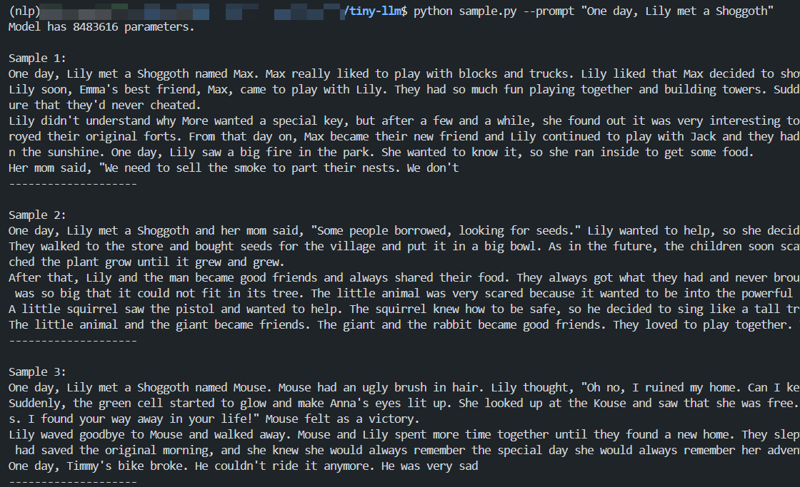
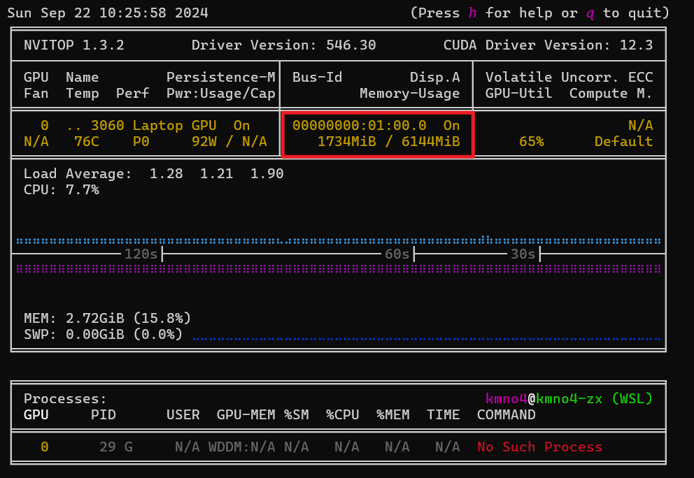

# Tiny-LLM

此项目在于实现一个简单的大语言模型，从训练tokenizer开始，到训练模型，再到使用模型生成文本。仅使用Numpy和Pytorch即可实现一个简单的大语言模型训练，显存使用2G左右。以下为项目效果展示。

<div align="center">
    
</div>

训练模型所需要的资源也是很少的，仅需要一个显卡即可，显存使用2G左右。训练模型的时间也不长，仅需要几个小时即可完成。

<div align="center">
    
</div>

## Usage

要使用本仓库也很容易，首先需要自行安装cuda版本的Pytorch，然后安装依赖库。

```bash
pip install -r requirements.txt
```

然后按照以下步骤进行训练。

1. 训练Tokenizer： `python train_vocab.py --download True --vocab_size 4096`
2. 数据预处理：`python preprocess.py`
3. 训练模型：`python train.py`
4. 使用模型生成文本：`python sample.py --prompt "One day, Lily met a Shoggoth"`

> One day, Lily met a Shoggoth and her mom said, "Some people borrowed, looking for seeds." Lily wanted to help, so she decided to help.
> They walked to the store and bought seeds for the village and put it in a big bowl. As in the future, the children soon scattered the seeds into the ground and the bird wore yellow paper. Lily added some yummy tastes like celery and watched the plant grow until it grew and grew.
> After that, Lily and the man became good friends and always shared their food. They always got what they had and never brought away seeds to something from the lonely garden. Once upon a time, there was a toy, a big, powerful animal. It was so big that it could not fit in its tree. The little animal was very scared because it wanted to be into the powerful animal to see the angel.
> A little squirrel saw the pistol and wanted to help. The squirrel knew how to be safe, so he decided to sing like a tall tree. The little animal sang his song. But the giant was not nice, and he was not nice.

## Blog

### Step 1: 训练Tokenizer

首先，我们需要为文本处理训练一个Tokenizer。Tokenizer的作用是将文本转换为数字序列，以便模型能够理解和处理。我们使用的数据集是 [TinyStory](https://www.modelscope.cn/datasets/AI-ModelScope/TinyStories) ，它是一个由GPT-3.5和GPT-4生成的小型故事数据集，包含简短的故事，且词汇量有限。在这个任务中，我们采用字符级Tokenizer，将文本中的每个字符映射为对应的数字。通过以下命令可以下载数据集并训练Tokenizer。

```bash
python train_vocab.py --download True --vocab_size 4096
```

LLaMA2 的词表大小为 32,000，但由于 TinyStory 数据集较小，词汇量有限，我们将词表大小设置为 4,096。训练完成后，我们得到的 Tokenizer 能够将文本转换为数字序列，也可以将数字序列还原为文本。

```python
def download_file(url: str, fname: str, chunk_size=1024):
    """发送HTTP GET请求以流式方式获取文件"""
    ···

def download():
    """执行 download_file 下载数据集"""
    ···

def train_vocab(vocab_size: int=32000, num_shards: int=20):
    """
    vocab_size: int, 词汇表的大小，决定分词器的词汇量。
    num_shards: int, 用于加快词汇表训练的效率，指定要处理的分片数量。
    """
    # 确保词汇表大小为正数
    assert vocab_size > 0, "Vocab size must be positive"

    # SentencePiece 模型的前缀路径，将用于保存分词器
    prefix = os.path.join(DATA_CACHE_DIR, f"tok{vocab_size}")

    # 1) 将多个分片中的文本导出为单个文本文件 tiny.txt
    tiny_file = os.path.join(DATA_CACHE_DIR, "tiny.txt")
    data_dir = os.path.join(DATA_CACHE_DIR, "TinyStories_all_data")
    shard_filenames = sorted(glob.glob(os.path.join(data_dir, "*.json")))

    # 创建 tiny.txt 文件并写入指定数量的分片中的文本
    print(f"Writing temporary file {tiny_file} with {num_shards} shards...")
    with open(tiny_file, "w", encoding="utf-8") as of:
        # 遍历前 num_shards 个分片
        for shard in tqdm(shard_filenames[:num_shards]):
            with open(shard, "r") as f:
                data = json.load(f)  # 读取分片中的JSON数据
            # 遍历每个例子，将其中的故事文本写入 tiny.txt 文件
            for example in data:
                text = example["story"]
                text = text.strip()  # 去除文本首尾的空白字符
                of.write(text + "\n")  # 每个文本写入一行

    # 输出生成的 tiny.txt 文件的大小
    print(f"Size is: {os.path.getsize(tiny_file) / 1024 / 1024:.2f} MB")

    # 2) 使用 SentencePiece 训练分词器
    print("Will now train the vocab...")
    spm.SentencePieceTrainer.train(
        input=tiny_file,         # 输入文件为之前生成的 tiny.txt
        model_prefix=prefix,     # 模型前缀路径
        model_type="bpe",        # 使用 Byte-Pair Encoding (BPE) 训练分词器
        vocab_size=vocab_size,   # 词汇表大小
        self_test_sample_size=0, # 自测样本大小设置为 0
        input_format="text",     # 输入文件格式为纯文本
        character_coverage=1.0,  # 覆盖所有字符（包括非常见字符）
        num_threads=os.cpu_count(),  # 使用 CPU 的线程数
        split_digits=True,       # 拆分数字
        allow_whitespace_only_pieces=True,  # 允许仅由空格组成的词元
        byte_fallback=True,      # 启用字节级回退
        unk_surface=r" \342\201\207 ",  # UNK token 表示未知字符的方式
        normalization_rule_name="identity"  # 使用“identity”归一化规则
    )

    # 3) 可选的清理操作，询问用户是否删除临时文件 tiny.txt
    dec = input(f"Delete the temporary file {tiny_file}? [y/N] ")
    if dec.lower() == "y":
        os.remove(tiny_file)  # 删除临时文件
        print(f"Deleted {tiny_file}")

    # 输出模型保存的路径
    print(f"Trained tokenizer is in {prefix}.model")
    print("Done.")
```

在本部分中，我们使用了 `SentencePiece` 库来训练自定义的 `Tokenizer`。首先，我们需要从 `TinyStory` 数据集中提取文本内容，作为训练的输入数据。`SentencePiece` 是一种基于子词单元的分词算法，能够有效处理不同语言中的词汇碎片化问题。

训练 `Tokenizer` 时，`SentencePiece` 会自动生成两个文件：`tok4096.model` 和 `tok4096.vocab`，其中 `tok4096.model` 是我们训练好的模型文件，位于 `data` 目录下。这个文件可以用于将文本数据转换为 `Token` 序列，也可以将 `Token` 序列还原为文本。

为了更便捷地使用这个 `Tokenizer`，我们还在 `tokenizer.py` 文件中定义了一个 `Tokenizer` 类。这个类封装了 `Tokenizer` 的常用操作，例如文本编码和解码功能，并支持加载我们训练好的模型文件。通过这个类，我们可以轻松地将文本转换为模型可接受的数字序列，或将预测结果转化为可读的文本。

具体的代码实现和细节可以在 `tokenizer.py` 文件中找到，接下来我们将进一步展示如何使用该类来处理 `TinyStory` 数据集中的故事文本。

```python
class Tokenizer:
    def __init__(self, tokenizer_model=None):
        """
        初始化分词器。加载预训练的SentencePiece模型，并设置一些特殊的token ID。

        参数:
        tokenizer_model: str, 可选，分词器模型的路径，如果不指定则使用默认路径 TOKENIZER_MODEL。
        """
        # 如果提供了分词器模型路径，使用该路径；否则使用默认模型路径
        model_path = tokenizer_model if tokenizer_model else TOKENIZER_MODEL
        # 确保模型文件存在
        assert os.path.isfile(model_path), model_path

        # 加载 SentencePiece 模型
        self.sp_model = SentencePieceProcessor(model_file=model_path)
        self.model_path = model_path

        # 获取分词器的特殊token和词汇表大小
        self.n_words: int = self.sp_model.vocab_size()  # 词汇表大小
        self.bos_id: int = self.sp_model.bos_id()       # 句子开头 (BOS) 的ID
        self.eos_id: int = self.sp_model.eos_id()       # 句子结尾 (EOS) 的ID
        self.pad_id: int = self.sp_model.pad_id()       # 填充 (PAD) 的ID

        # 验证分词器词汇表大小是否正确
        assert self.sp_model.vocab_size() == self.sp_model.get_piece_size()

    def encode(self, s: str, bos: bool, eos: bool) -> List[int]:
        """
        将字符串编码为词元ID列表。可以选择是否添加句子开头 (BOS) 和句子结尾 (EOS) 标记。

        参数:
        s: str, 要编码的字符串。
        bos: bool, 是否在编码的词元列表前添加 BOS 标记。
        eos: bool, 是否在编码的词元列表末尾添加 EOS 标记。

        返回:
        List[int]: 编码后的词元ID列表。
        """
        # 确保输入是字符串类型
        assert type(s) is str
        # 使用SentencePiece将字符串编码为词元ID
        t = self.sp_model.encode(s)
        # 如果需要BOS标记，将其添加到词元列表开头
        if bos:
            t = [self.bos_id] + t
        # 如果需要EOS标记，将其添加到词元列表末尾
        if eos:
            t = t + [self.eos_id]
        return t

    def decode(self, t: List[int]) -> str:
        """
        将词元ID列表解码为字符串。

        参数:
        t: List[int], 词元ID列表。

        返回:
        str: 解码后的字符串。s
        """
        return self.sp_model.decode(t)
```

在这个 `Tokenizer` 类中，我们首先初始化了一些特殊的 token ID，这些特殊 tokens 在自然语言处理任务中有着重要作用，分别用于填充、处理未识别的词汇、表示句子的开头和结尾等。在模型训练和推理过程中，正确处理这些特殊 tokens 对于提升模型性能至关重要。

接着，我们定义了两个关键方法：

1. encode 方法：该方法负责将输入文本转换为 token ID 序列。通过加载预训练的 Tokenizer 模型，我们可以对文本进行分词，将其拆解为词或子词，并将其映射为相应的数字表示。这个数字序列可以被模型接受用于训练和推理。

2. decode 方法：与 encode 方法相反，decode 方法用于将 token ID 序列还原为可读的文本。它将数字序列转换回对应的 tokens，并拼接成完整的文本，从而可以对模型的输出进行解释和展示。

这些方法的定义使得我们在使用过程中，可以非常方便地在文本与数字序列之间进行转换，为模型的输入与输出提供接口。大家可以使用以下代码测试 `Tokenizer` 的功能，验证其是否能够正确地将文本转换为数字序列，或者将数字序列还原为文本。

```python
# 测试 Tokenizer
enc = Tokenizer('./data/tok4096.model') # 加载分词器
tetx = 'Hello, world!' # 测试文本
print(enc.encode(text, bos=True, eos=True)) # 编码文本
print(enc.decode(enc.encode(text, bos=True, eos=True))) # 解码文本

OUTPUT:
[1, 346, 2233, 4010, 1475, 4021, 2]
Hello, world!
```

### Step 2: 数据预处理

在训练模型之前，首先需要对数据进行预处理。这一步的核心任务是将文本数据转换为模型能够理解的数字序列。具体来说，文本中的每个字符、单词或子词都需要被映射为一个唯一的数字 ID，这样模型才能处理这些数据。

```python
# 定义分片处理函数
def process_shard(args, vocab_size, tokenizer_model_path):
    """ 处理数据分片，将其中的文本进行分词并保存为二进制文件 """
    ···


# 定义预处理函数，用于对多个数据分片进行批量处理
def pretokenize(vocab_size):
    """ 预处理所有的数据分片，并将分词后的数据保存为二进制文件 """
    ···


class PretokDataset(torch.utils.data.IterableDataset):
    """从磁盘加载已预处理的分词数据，并将其以 PyTorch 张量的形式返回。"""

    def __init__(self, split, max_seq_len, vocab_size, vocab_source):
        """
        初始化数据集。

        参数:
        split: str, 数据集的分割方式（'train' 或 'test'）。
        max_seq_len: int, 最大序列长度，用于生成输入输出序列。
        vocab_size: int, 词汇表的大小。
        vocab_source: str, 词汇表的来源（'llama2' 或 'custom'）。
        """
        super().__init__()
        self.split = split  # 数据集划分（训练集或测试集）
        self.max_seq_len = max_seq_len  # 最大序列长度
        self.vocab_size = vocab_size  # 词汇表大小
        self.vocab_source = vocab_source  # 词汇表来源

    def __iter__(self):
        """
        返回迭代器，按批次加载数据并生成模型输入/输出。
        """
        # 获取DataLoader的worker信息（用于并行数据加载）
        worker_info = torch.utils.data.get_worker_info()
        worker_id = worker_info.id if worker_info else 0  # worker ID
        # 获取分布式训练的rank信息（用于多GPU训练）
        rank = dist.get_rank() if dist.is_initialized() else 0
        # 基于worker_id和rank生成唯一的随机数种子，确保数据在每个worker和rank之间是唯一的
        seed = 42 + worker_id + 1337 * rank
        rng = random.Random(seed)
        print(f"Created a PretokDataset with rng seed {seed}")

        # 根据词汇表来源决定数据路径
        if self.vocab_source == "llama2":
            # 如果使用 Llama 2 词汇表，.bin 文件和 .json 文件在同一目录下
            bin_dir = os.path.join(DATA_CACHE_DIR, "TinyStories_all_data")
            shard_filenames = sorted(glob.glob(os.path.join(bin_dir, "*.bin")))
        elif self.vocab_source == "custom":
            # 如果使用自定义词汇表，.bin 文件在 tok{N} 目录下
            bin_dir = os.path.join(DATA_CACHE_DIR, f"tok{self.vocab_size}")
            shard_filenames = sorted(glob.glob(os.path.join(bin_dir, "*.bin")))

        # 根据数据集划分使用不同的分片文件
        # 训练集使用所有分片文件，测试集只使用第一个分片
        shard_filenames = shard_filenames[1:] if self.split == "train" else shard_filenames[:1]
        assert len(shard_filenames) > 0, f"在 {bin_dir} 中未找到任何 .bin 文件"

        while True:
            # 随机打乱分片文件
            rng.shuffle(shard_filenames)
            for shard in shard_filenames:
                # 使用 memmap 读取文件，使得数据留在磁盘上，减少内存占用
                m = np.memmap(shard, dtype=np.uint16, mode="r")
                # 计算该分片中的批次数量
                num_batches = len(m) // self.max_seq_len
                num_batches -= 1  # 去掉最后一个不完整的批次
                assert num_batches > 0, "这个分片文件太小了？请检查。"
                # 随机打乱批次索引
                ixs = list(range(num_batches))
                rng.shuffle(ixs)
                # 对每个批次生成输入 x 和目标输出 y
                for ix in ixs:
                    start = ix * self.max_seq_len  # 批次起始索引
                    end = start + self.max_seq_len + 1  # 批次结束索引
                    # 将数据转换为 NumPy 数组并拷贝到 RAM 中
                    chunk = torch.from_numpy((m[start:end]).astype(np.int64))
                    # 模型输入 x 是当前批次的前 max_seq_len 个词元
                    x = chunk[:-1]
                    # 模型输出 y 是下一个词元
                    y = chunk[1:]
                    # 生成 x, y 对
                    yield x, y


class Task:
    @staticmethod
    def iter_batches(batch_size, device, num_workers=0, **dataset_kwargs):
        ds = PretokDataset(**dataset_kwargs)
        dl = torch.utils.data.DataLoader(
            ds, batch_size=batch_size, pin_memory=True, num_workers=num_workers
        )
        for x, y in dl:
            x = x.to(device, non_blocking=True)
            y = y.to(device, non_blocking=True)
            yield x, y
```

在这部分中，首先定义了 `process_shard` 函数，用于处理数据分片。该函数的主要功能是将文本数据分词后，转换为更高效的二进制文件格式，以便后续更快速地加载和处理数据。

接下来，我们定义了 `pretokenize` 函数，用于批量处理多个数据分片。通过这一函数，所有数据可以并行处理，进一步加快预处理的速度。

然后，我们设计了一个 `PretokDataset` 类，用于加载已预处理好的数据集。我们继承了 `torch.utils.data.IterableDataset` 来定义该数据集，这使得我们可以更灵活、高效地处理数据。在这个类中，核心是 `__iter__` 方法，它负责生成用于训练的数据批次。

最后，我们还定义了一个 `Task` 类，专门用于迭代数据集，并生成模型所需的输入和目标输出。这一部分的设计确保了数据流的顺畅对接，为模型训练提供了标准化的数据输入。可以通过以下代码来测试预处理后的数据集。

### Step 3: 训练模型

在数据预处理完成后，我们就可以开始训练模型了。我们使用的模型是一个和LLama2结构一样的 Decoder only Transformer模型，使用Pytorch实现。相关代码在`model.py`文件中。此处不再赘述，源码中有详细的中文注释，且我们在之前的文章中也有详细的介绍。

在模型这一部分可以重点看一下生成式模型是如何实现生成token的，可以查看`model.py`文件中的`Transforerm`类中的`generate`方法。

在完成数据预处理后，我们就可以开始训练模型了。我们使用的模型是一个与 LLaMA2 结构相同的 Decoder-only Transformer 模型，采用 PyTorch 实现。具体的实现细节已经包含在 `model.py` 文件中，在此不再赘述。该源码中包含详细的中文注释，此外我们在之前的文章中也对模型架构进行了深入介绍。

在模型部分，建议重点关注生成式模型如何生成 token 的过程。可以参考 `model.py` 文件中的 `Transformer` 类，尤其是 `generate` 方法的实现，它展示了模型如何基于已有的上下文生成后续 token 的机制。

```python
@torch.inference_mode()
    def generate(self, idx, max_new_tokens, temperature=1.0, top_k=None):
        """
        给定输入序列 idx（形状为 (bz,seq_len) 的长整型张量），通过多次生成新 token 来完成序列。
        在 model.eval() 模式下运行。效率较低的采样版本，没有使用键k/v cache。
        """
        for _ in range(max_new_tokens):
            # 如果序列上下文过长，截断它到最大长度
            idx_cond = idx if idx.size(1) <= self.args.max_seq_len else idx[:, -self.args.max_seq_len:]
            
            # 前向传播获取序列中最后一个位置的 logits
            logits = self(idx_cond)
            logits = logits[:, -1, :] # 只保留最后一个时间步的输出
            
            if temperature == 0.0:
                # 选择最有可能的索引
                _, idx_next = torch.topk(logits, k=1, dim=-1)
            else:
                # 缩放 logits 并应用 softmax
                logits = logits / temperature
                if top_k is not None:
                    v, _ = torch.topk(logits, min(top_k, logits.size(-1)))
                    logits[logits < v[:, [-1]]] = -float('Inf')
                probs = F.softmax(logits, dim=-1)
                idx_next = torch.multinomial(probs, num_samples=1)
            
            # 将采样的索引添加到序列中并继续
            idx = torch.cat((idx, idx_next), dim=1)

        return idx
```

在 generate 方法中，我们首先获取序列中最后一个位置的 logits，然后基于这些 logits 生成新的 token。接着，生成的新 token 会被添加到序列中，模型随后会继续生成下一个 token。通过这种迭代过程，我们能够生成完整的文本。接下来，您可以使用以下命令开始训练模型。

```bash
python train.py
```

在 `train.py` 中我们定义了很多超参数，包括但不限于模型的维度，层数，学习率等等。如下所示，更多的内容大家可以在源码中查看，源码加了很详细的中文注释，相信大家可以很容易看懂。

```python
# -----------------------------------------------------------------------------
# I/O 配置，用于定义输出目录和训练时的日志记录与评估设置
out_dir = "output"  # 模型输出保存路径
eval_interval = 2000  # 评估间隔步数
log_interval = 1  # 日志记录间隔步数
eval_iters = 100  # 每次评估时迭代的步数
eval_only = False  # 如果为True，脚本在第一次评估后立即退出
always_save_checkpoint = False  # 如果为True，在每次评估后总是保存检查点
init_from = "scratch"  # 可以选择从头开始训练（'scratch'）或从已有的检查点恢复（'resume'）

# 数据配置
batch_size = 8  # 每个微批次的样本数量，如果使用梯度累积，实际批次大小将更大
max_seq_len = 256  # 最大序列长度
vocab_size = 4096  # 自定义词汇表大小

# 模型配置
dim = 288  # 模型的隐藏层维度
n_layers = 8  # Transformer的层数
n_heads = 8  # 注意力头的数量
n_kv_heads = 4  # 模型分组
multiple_of = 32  # 在某些层的维度必须是该数的倍数
dropout = 0.0  # Dropout概率

# AdamW优化器配置
gradient_accumulation_steps = 4  # 梯度累积步数，用于模拟更大的批次
learning_rate = 5e-4  # 最大学习率
max_iters = 100000  # 总的训练迭代次数
weight_decay = 1e-1  # 权重衰减系数
beta1 = 0.9  # AdamW优化器的β1参数
beta2 = 0.95  # AdamW优化器的β2参数
grad_clip = 1.0  # 梯度裁剪阈值，0表示不裁剪

# 学习率衰减配置
decay_lr = True  # 是否启用学习率衰减
warmup_iters = 1000  # 学习率预热的步数

# 系统设置
device = "cuda:0"  # 设备选择：'cpu'，'cuda'，'cuda:0'等
dtype = "bfloat16"  # 数据类型：'float32'，'bfloat16'，'float16'
```

### Step 4: 使用模型生成文本

在模型训练完成后，会在`output`目录下生成一个`ckpt.pt`文件，这个文件就是我们训练好的模型。我们可以使用以下命令生成文本。

```bash
python sample.py --prompt "One day, Lily met a Shoggoth"
```

我们来看下`sample.py`文件中的代码，这个文件中定义了一个`TextGenerator`类，用于生成文本。

```python
class TextGenerator:
    def __init__(self, 
                 checkpoint='output/ckpt.pt',  # 模型检查点路径
                 tokenizer_model_path='tok4096.model',  # 分词器模型路径
                 seed=1337,  # 随机种子，确保可重复性
                 device=None,  # 设备，优先使用 CUDA，如果没有可用的 CUDA，则使用 CPU
                 dtype="float32"):  # 数据类型，默认为 float32，可以选择 float16 或 bfloat16
        """
        初始化 TextGenerator 类，加载模型、设置设备和分词器等。
        """
        # 模型加载配置
        self.checkpoint = checkpoint  # 保存的模型检查点路径
        self.tokenizer_model_path = tokenizer_model_path  # 分词器模型文件路径
        self.seed = seed  # 随机数种子，用于生成的可重复性
        self.device = device or ('cuda' if torch.cuda.is_available() else 'cpu')  # 根据硬件条件选择设备
        self.dtype = dtype  # 模型的浮点数类型
        self.device_type = 'cuda' if 'cuda' in self.device else 'cpu'  # 判断当前设备是否为 CUDA
        
        # 设置随机种子，确保生成的可重复性
        torch.manual_seed(seed)  # 设置 CPU 随机种子
        torch.cuda.manual_seed(seed)  # 设置 CUDA 随机种子
        torch.backends.cuda.matmul.allow_tf32 = True  # 允许 CUDA 使用 TF32 精度进行矩阵乘法运算
        torch.backends.cudnn.allow_tf32 = True  # 允许 cuDNN 使用 TF32 精度加速
        
        # 根据 dtype 选择适当的自动混合精度上下文
        ptdtype = {'float32': torch.float32, 'bfloat16': torch.bfloat16, 'float16': torch.float16}[self.dtype]
        self.ctx = nullcontext() if self.device_type == 'cpu' else torch.amp.autocast(device_type=self.device_type, dtype=ptdtype)
        
        # 加载模型检查点文件
        checkpoint_dict = torch.load(self.checkpoint, map_location=self.device)  # 加载模型参数
        gptconf = ModelArgs(**checkpoint_dict['model_args'])  # 初始化模型参数
        self.model = Transformer(gptconf)  # 实例化 Transformer 模型
        state_dict = checkpoint_dict['model']  # 获取模型状态字典
        
        # 去除状态字典中的不必要前缀
        unwanted_prefix = '_orig_mod.'  # 这个前缀在保存时可能被添加，现在要去除它
        for k, v in list(state_dict.items()):
            if k.startswith(unwanted_prefix):
                state_dict[k[len(unwanted_prefix):]] = state_dict.pop(k)  # 去除不必要的前缀
        
        # 加载模型参数到模型中
        self.model.load_state_dict(state_dict, strict=False)
        # 计算模型参数量
        num_params = sum(p.numel() for p in self.model.parameters() if p.requires_grad)
        print(f"Model has {num_params} parameters.")
        # 设置模型为评估模式（evaluation mode），防止训练模式下的 dropout 等操作影响结果
        self.model.eval()
        # 将模型放置到正确的设备上（GPU 或 CPU）
        self.model.to(self.device)
        # 初始化分词器
        self.tokenizer = Tokenizer(tokenizer_model=self.tokenizer_model_path)  # 根据指定的路径加载分词器

    def sample(self, 
               start="Hello!",  # 生成文本的起始提示词，可以是任意字符串
               num_samples=3,  # 生成样本的数量，默认生成 3 个样本
               max_new_tokens=256,  # 每个样本生成的最大 token 数，默认最多生成 256 个 token
               temperature=1.0,  # 控制生成的随机性，1.0 为标准，值越大越随机
               top_k=300):  # 保留概率最高的 top_k 个 token，限制生成时的选择范围
        """
        根据给定的起始文本生成样本。
        
        :param start: 生成文本的起始提示词
        :param num_samples: 要生成的文本样本数
        :param max_new_tokens: 每个样本生成的最大 token 数
        :param temperature: 控制生成的随机性，值越小生成越确定，值越大生成越随机
        :param top_k: 限制生成时选择的 token 范围
        :return: 生成的文本样本列表
        """
        # 如果 start 是以 'FILE:' 开头，表示从文件中读取起始文本
        if start.startswith('FILE:'):
            with open(start[5:], 'r', encoding='utf-8') as f:
                start = f.read()  # 读取文件内容作为起始文本
        
        # 将起始文本编码为 token id 序列
        start_ids = self.tokenizer.encode(start, bos=True, eos=False)  # bos=True 表示加上句首标记，eos=False 表示不加句尾标记
        x = (torch.tensor(start_ids, dtype=torch.long, device=self.device)[None, ...])  # 将编码后的 token id 转为 PyTorch 张量
        
        generated_texts = []  # 用于保存生成的文本样本
        with torch.no_grad():  # 禁用梯度计算，提升效率
            with self.ctx:  # 进入自动混合精度的上下文（如果是 GPU 并使用 float16 时）
                for k in range(num_samples):  # 循环生成指定数量的样本
                    y = self.model.generate(x, max_new_tokens, temperature=temperature, top_k=top_k)  # 生成文本
                    generated_texts.append(self.tokenizer.decode(y[0].tolist()))  # 解码生成的 token 序列为可读文本
        
        return generated_texts  # 返回生成的文本样本
```

#### 参考

- [llama2.c](https://github.com/karpathy/llama2.c)