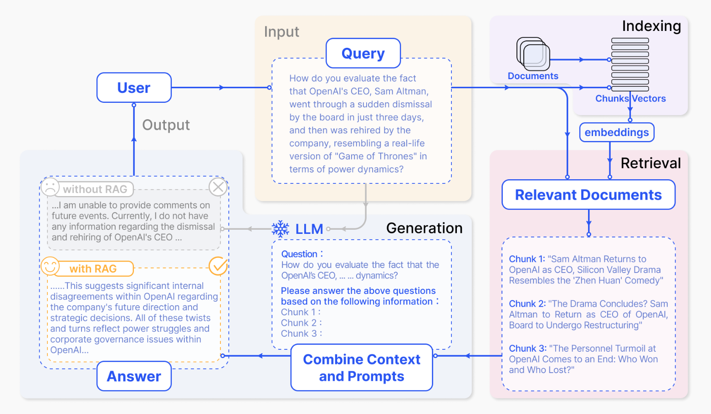

# TinyRAG
手搓RAG直播：[直播链接](https://meeting.tencent.com/v2/cloud-record/share?id=4306b90c-d772-4faa-baeb-1f4e0bf4569f&from=3&is-single=false&record_type=2)

接下来我会带领大家一步一步的实现一个简单的RAG模型，这个模型是基于RAG的一个简化版本，我们称之为Tiny-RAG。Tiny-RAG是一个基于RAG的简化版本，它只包含了RAG的核心功能，即Retrieval和Generation。Tiny-RAG的目的是为了帮助大家更好的理解RAG模型的原理和实现。

OK，让我们开始吧！

## 1. RAG 介绍

LLM会产生误导性的 “幻觉”，依赖的信息可能过时，处理特定知识时效率不高，缺乏专业领域的深度洞察，同时在推理能力上也有所欠缺。

正是在这样的背景下，检索增强生成技术（Retrieval-Augmented Generation，RAG）应时而生，成为 AI 时代的一大趋势。

RAG 通过在语言模型生成答案之前，先从广泛的文档数据库中检索相关信息，然后利用这些信息来引导生成过程，极大地提升了内容的准确性和相关性。RAG 有效地缓解了幻觉问题，提高了知识更新的速度，并增强了内容生成的可追溯性，使得大型语言模型在实际应用中变得更加实用和可信。

RAG的基本结构有哪些呢？

- 要有一个向量化模块，用来将文档片段向量化。
- 要有一个文档加载和切分的模块，用来加载文档并切分成文档片段。
- 要有一个数据库来存放文档片段和对应的向量表示。
- 要有一个检索模块，用来根据 Query （问题）检索相关的文档片段。
- 要有一个大模型模块，用来根据检索出来的文档回答用户的问题。

OK，那上述这些也就是 TinyRAG 仓库的所有模块内容。


那接下来，让我们梳理一下 RAG 的流程是什么样的呢？

- **索引**：将文档库分割成较短的 Chunk，并通过编码器构建向量索引。
- **检索**：根据问题和 chunks 的相似度检索相关文档片段。
- **生成**：以检索到的上下文为条件，生成问题的回答。

那也就是下图所示的流程，图片出处 ***[Retrieval-Augmented Generation for Large Language Models: A Survey](https://arxiv.org/pdf/2312.10997.pdf)***



## 2. 向量化

首先让我们来动手实现一个向量化的类，这是RAG架构的基础。向量化的类主要是用来将文档片段向量化，将一段文本映射为一个向量。

那首先我们要设置一个 `Embedding` 基类，这样我们再用其他的模型的时候，只需要继承这个基类，然后在此基础上进行修改即可，方便代码扩展。

```python
class BaseEmbeddings:
    """
    Base class for embeddings
    """
    def __init__(self, path: str, is_api: bool) -> None:
        self.path = path
        self.is_api = is_api
    
    def get_embedding(self, text: str, model: str) -> List[float]:
        raise NotImplementedError
    
    @classmethod
    def cosine_similarity(cls, vector1: List[float], vector2: List[float]) -> float:
        """
        calculate cosine similarity between two vectors
        """
        dot_product = np.dot(vector1, vector2)
        magnitude = np.linalg.norm(vector1) * np.linalg.norm(vector2)
        if not magnitude:
            return 0
        return dot_product / magnitude
```

观察一下`BaseEmbeddings`基类都有什么方法，首先有一个`get_embedding`方法，这个方法是用来获取文本的向量表示的，然后有一个`cosine_similarity`方法，这个方法是用来计算两个向量之间的余弦相似度的。其次在初始化类的时候设置了，模型的路径和是否是API模型。比如使用OpenAI的Embedding API的话就需要设置`self.is_api=Ture`。

继承`BaseEmbeddings`类的话，就只需要编写`get_embedding`方法即可，`cosine_similarity`方法会被继承下来，直接用就行。这就是编写基类的好处。

```python
class OpenAIEmbedding(BaseEmbeddings):
    """
    class for OpenAI embeddings
    """
    def __init__(self, path: str = '', is_api: bool = True) -> None:
        super().__init__(path, is_api)
        if self.is_api:
            from openai import OpenAI
            self.client = OpenAI()
            self.client.api_key = os.getenv("OPENAI_API_KEY")
            self.client.base_url = os.getenv("OPENAI_BASE_URL")
    
    def get_embedding(self, text: str, model: str = "text-embedding-3-large") -> List[float]:
        if self.is_api:
            text = text.replace("\n", " ")
            return self.client.embeddings.create(input=[text], model=model).data[0].embedding
        else:
            raise NotImplementedError
```

## 3. 文档加载和切分

接下来我们来实现一个文档加载和切分的类，这个类主要是用来加载文档并切分成文档片段。

那我们都需要切分什么文档呢？这个文档可以是一篇文章，一本书，一段对话，一段代码等等。这个文档的内容可以是任何的，只要是文本就行。比如：pdf文件、md文件、txt文件等等。

这里只展示一部分内容了，完整的代码可以在 ***[RAG/utils.py](./RAG/utils.py)*** 文件中找到。在这个代码中可以看到，能加载的文件类型有：pdf、md、txt，只需要编写对应的函数即可。

```python
def read_file_content(cls, file_path: str):
    # 根据文件扩展名选择读取方法
    if file_path.endswith('.pdf'):
        return cls.read_pdf(file_path)
    elif file_path.endswith('.md'):
        return cls.read_markdown(file_path)
    elif file_path.endswith('.txt'):
        return cls.read_text(file_path)
    else:
        raise ValueError("Unsupported file type")
```

那我们把文件内容都读取之后，还需要切分呀！那怎么切分呢，OK，接下来咱们就按 Token 的长度来切分文档。我们可以设置一个最大的 Token 长度，然后根据这个最大的 Token 长度来切分文档。这样切分出来的文档片段就是一个一个的差不多相同长度的文档片段了。

不过在切分的时候要注意，片段与片段之间最好要有一些重叠的内容，这样才能保证检索的时候能够检索到相关的文档片段。还有就是切分文档的时候最好以句子为单位，也就是按 `\n` 进行粗切分，这样可以基本保证句子内容是完整的。

```python
def get_chunk(cls, text: str, max_token_len: int = 600, cover_content: int = 150):
    chunk_text = []

    curr_len = 0
    curr_chunk = ''

    lines = text.split('\n')  # 假设以换行符分割文本为行

    for line in lines:
        line = line.replace(' ', '')
        line_len = len(enc.encode(line))
        if line_len > max_token_len:
            print('warning line_len = ', line_len)
        if curr_len + line_len <= max_token_len:
            curr_chunk += line
            curr_chunk += '\n'
            curr_len += line_len
            curr_len += 1
        else:
            chunk_text.append(curr_chunk)
            curr_chunk = curr_chunk[-cover_content:]+line
            curr_len = line_len + cover_content

    if curr_chunk:
        chunk_text.append(curr_chunk)

    return chunk_text
```

## 4. 数据库 && 向量检索

上面，我们做好了文档切分，也做好了 Embedding 模型的加载。那接下来就得设计一个向量数据库用来存放文档片段和对应的向量表示了。

还有就是也要设计一个检索模块，用来根据 Query （问题）检索相关的文档片段。OK，我们冲冲冲！

一个数据库对于最小RAG架构来说，需要实现几个功能呢？

- `persist`：数据库持久化，本地保存
- `load_vector`：从本地加载数据库
- `get_vector`：获得文档的向量表示
- `query`：根据问题检索相关的文档片段

嗯嗯，以上四个模块就是一个最小的RAG结构数据库需要实现的功能，具体代码可以在 ***[RAG/VectorBase.py](./RAG/VectorBase.py)*** 文件中找到。

```python
class VectorStore:
    def __init__(self, document: List[str] = ['']) -> None:
        self.document = document

    def get_vector(self, EmbeddingModel: BaseEmbeddings) -> List[List[float]]:
        # 获得文档的向量表示
        pass

    def persist(self, path: str = 'storage'):
        # 数据库持久化，本地保存
        pass

    def load_vector(self, path: str = 'storage'):
        # 从本地加载数据库
        pass

    def query(self, query: str, EmbeddingModel: BaseEmbeddings, k: int = 1) -> List[str]:
        # 根据问题检索相关的文档片段
        pass
```

那让我们来看一下， `query` 方法具体是怎么实现的呢？

首先先把用户提出的问题向量化，然后去数据库中检索相关的文档片段，最后返回检索到的文档片段。可以看到咱们在向量检索的时候仅使用 `Numpy` 进行加速，代码非常容易理解和修改。

主要是方便改写和大家理解，并没有使用成熟的数据库，这样可以更好的理解RAG的原理。

```python
def query(self, query: str, EmbeddingModel: BaseEmbeddings, k: int = 1) -> List[str]:
    query_vector = EmbeddingModel.get_embedding(query)
    result = np.array([self.get_similarity(query_vector, vector)
                        for vector in self.vectors])
    return np.array(self.document)[result.argsort()[-k:][::-1]].tolist()
```


## 5. 大模型模块

那就来到了最后一个模块了，大模型模块。这个模块主要是用来根据检索出来的文档回答用户的问题。

一样的，我们还是先实现一个基类，这样我们在遇到其他的自己感兴趣的模型就可以快速的扩展了。

```python
class BaseModel:
    def __init__(self, path: str = '') -> None:
        self.path = path

    def chat(self, prompt: str, history: List[dict], content: str) -> str:
        pass

    def load_model(self):
        pass
```

`BaseModel` 包含了两个方法，`chat`和`load_model`，如果使用API模型，比如OpenAI的话，那就不需要`load_model`方法，如果你要本地化运行的话，那还是会选择使用开源模型，那就需要`load_model`方法发啦。

这里咱们以 ***[InternLM2-chat-7B](https://huggingface.co/internlm/internlm2-chat-7b)*** 模型为例，大家可以给 ***[InternLM](https://github.com/InternLM/InternLM)*** 仓库点个star哦，还有也给我点个star！

```python
class InternLMChat(BaseModel):
    def __init__(self, path: str = '') -> None:
        super().__init__(path)
        self.load_model()

    def chat(self, prompt: str, history: List = [], content: str='') -> str:
        prompt = PROMPT_TEMPLATE['InternLM_PROMPT_TEMPALTE'].format(question=prompt, context=content)
        response, history = self.model.chat(self.tokenizer, prompt, history)
        return response


    def load_model(self):
        import torch
        from transformers import AutoTokenizer, AutoModelForCausalLM
        self.tokenizer = AutoTokenizer.from_pretrained(self.path, trust_remote_code=True)
        self.model = AutoModelForCausalLM.from_pretrained(self.path, torch_dtype=torch.float16, trust_remote_code=True).cuda()
```

可以用一个字典来保存所有的prompt，这样比较好维护。

```python
PROMPT_TEMPLATE = dict(
    InternLM_PROMPT_TEMPALTE="""先对上下文进行内容总结,再使用上下文来回答用户的问题。如果你不知道答案，就说你不知道。总是使用中文回答。
        问题: {question}
        可参考的上下文：
        ···
        {context}
        ···
        如果给定的上下文无法让你做出回答，请回答数据库中没有这个内容，你不知道。
        有用的回答:"""
)
```

那这样的话，我们就可以利用InternLM2模型来做RAG啦！

## 6.  LLM Tiny-RAG Demo

那接下来，我们就来看一下Tiny-RAG的Demo吧！

```python
from RAG.VectorBase import VectorStore
from RAG.utils import ReadFiles
from RAG.LLM import OpenAIChat, InternLMChat
from RAG.Embeddings import JinaEmbedding, ZhipuEmbedding


# 没有保存数据库
docs = ReadFiles('./data').get_content(max_token_len=600, cover_content=150) # 获得data目录下的所有文件内容并分割
vector = VectorStore(docs)
embedding = ZhipuEmbedding() # 创建EmbeddingModel
vector.get_vector(EmbeddingModel=embedding)
vector.persist(path='storage') # 将向量和文档内容保存到storage目录下，下次再用就可以直接加载本地的数据库

question = 'git的原理是什么？'

content = vector.query(question, model='zhipu', k=1)[0]
chat = InternLMChat(path='model_path')
print(chat.chat(question, [], content))
```

当然我们也可以从本地加载已经处理好的数据库，毕竟我们在上面的数据库环节已经写过这个功能啦。

```python
from RAG.VectorBase import VectorStore
from RAG.utils import ReadFiles
from RAG.LLM import OpenAIChat, InternLMChat
from RAG.Embeddings import JinaEmbedding, ZhipuEmbedding

# 保存数据库之后
vector = VectorStore()

vector.load_vector('./storage') # 加载本地的数据库

question = 'git的原理是什么？'

embedding = ZhipuEmbedding() # 创建EmbeddingModel

content = vector.query(question, EmbeddingModel=embedding, k=1)[0]
chat = InternLMChat(path='model_path')
print(chat.chat(question, [], content))
```

## 7. 总结

经过上面的学习，你是否学会了如何搭建一个最小RAG架构呢？相信你一定学会啦，哈哈哈。

那让我们再来复习一下，一个最小RAG应该包含哪些内容叭？（此处默写！）

- 向量化模块
- 文档加载和切分模块
- 数据库
- 向量检索
- 大模型模块

okk，你已经学会了，但别忘了给项目点个star哦！

## 8. 参考文献

- [When Large Language Models Meet Vector Databases: A Survey](http://arxiv.org/abs/2402.01763)
- [Retrieval-Augmented Generation for Large Language Models: A Survey](https://arxiv.org/abs/2312.10997)
- [Learning to Filter Context for Retrieval-Augmented Generation](http://arxiv.org/abs/2311.08377)
- [In-Context Retrieval-Augmented Language Models](https://arxiv.org/abs/2302.00083)
